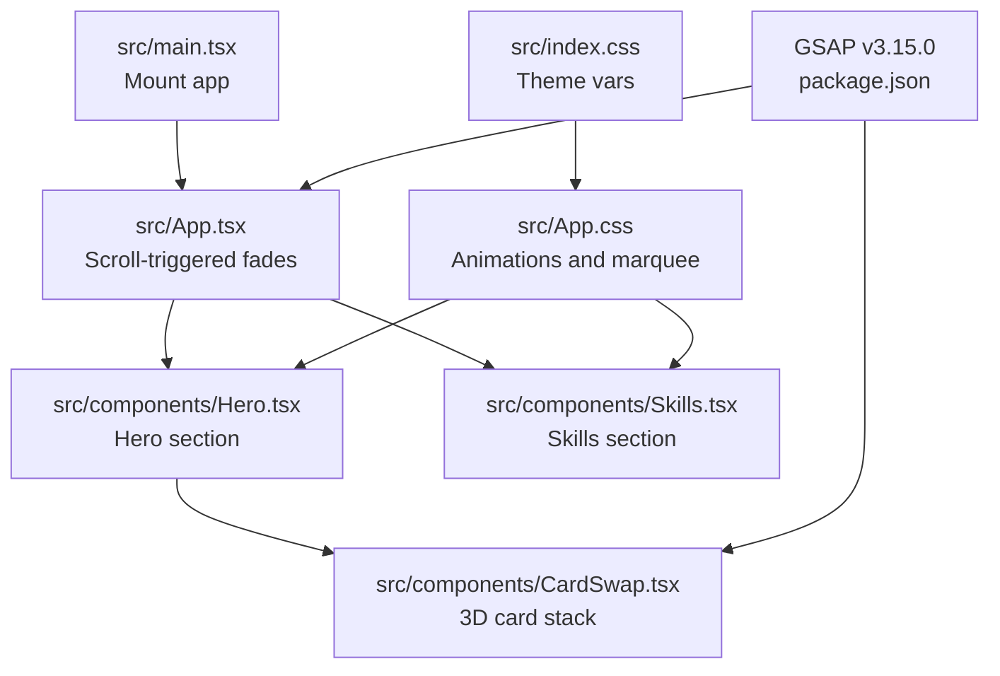
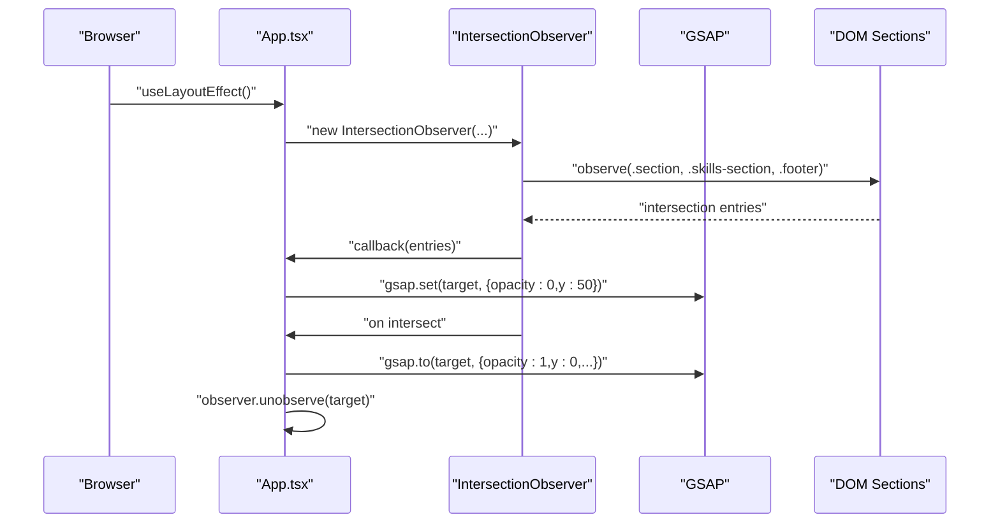
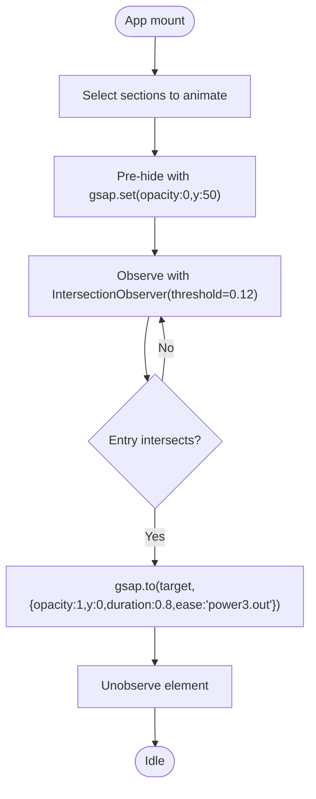
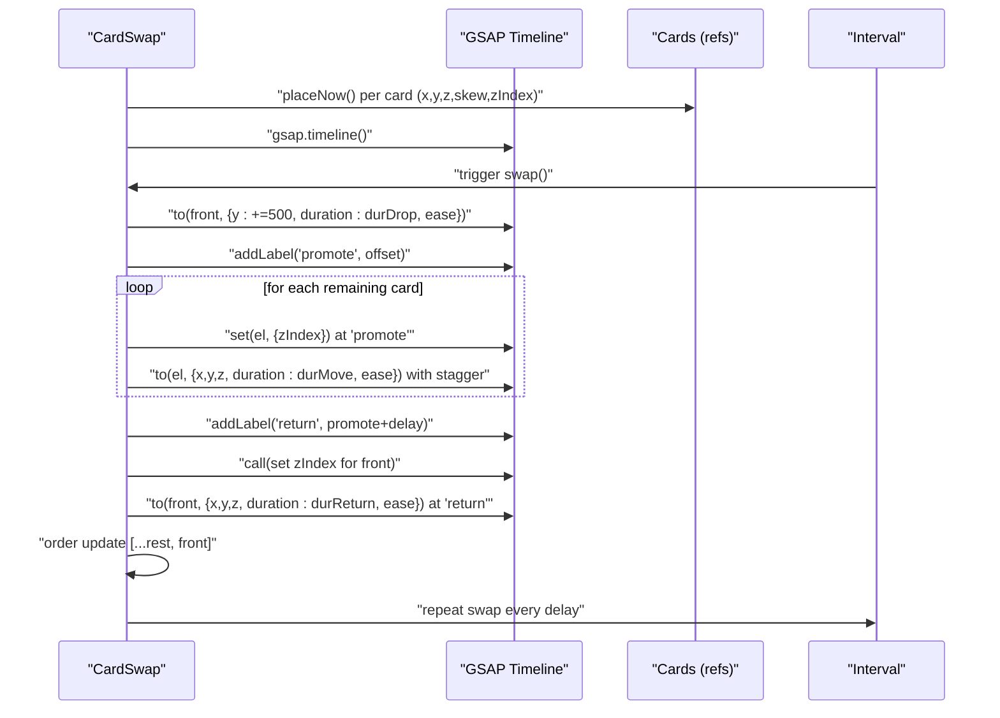
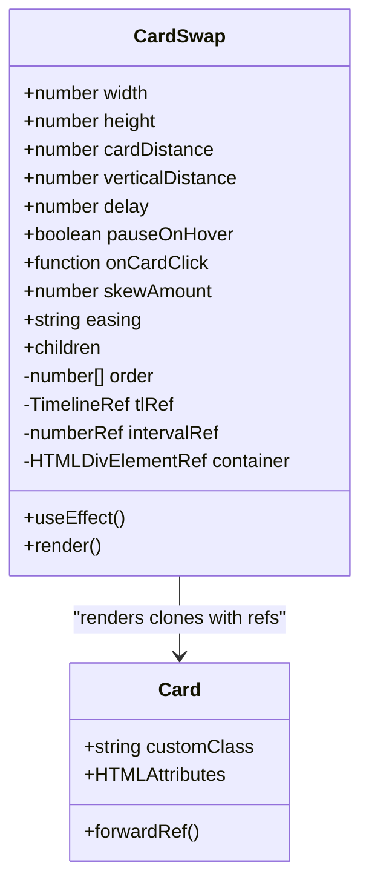
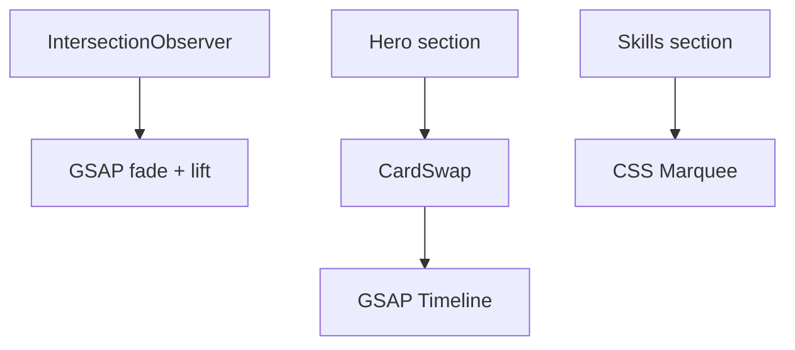
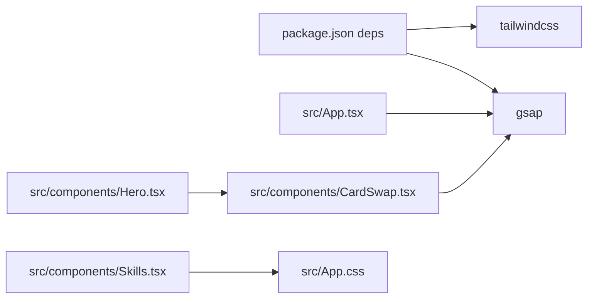

# Animation System

<cite>
**Referenced Files in This Document**
- [package.json](file://package.json)
- [src/main.tsx](file://src/main.tsx)
- [src/App.tsx](file://src/App.tsx)
- [src/App.css](file://src/App.css)
- [src/index.css](file://src/index.css)
- [src/components/CardSwap.tsx](file://src/components/CardSwap.tsx)
- [src/components/Hero.tsx](file://src/components/Hero.tsx)
- [src/components/Skills.tsx](file://src/components/Skills.tsx)
</cite>

## Table of Contents
1. [Introduction](#introduction)
2. [Project Structure](#project-structure)
3. [Core Components](#core-components)
4. [Architecture Overview](#architecture-overview)
5. [Detailed Component Analysis](#detailed-component-analysis)
6. [Dependency Analysis](#dependency-analysis)
7. [Performance Considerations](#performance-considerations)
8. [Troubleshooting Guide](#troubleshooting-guide)
9. [Conclusion](#conclusion)
10. [Appendices](#appendices)

## Introduction
This document explains the animation system powering the portfolio, with a focus on GSAP integration, scroll-triggered animations via Intersection Observer, 3D card transitions, and a performant infinite marquee. It covers timeline architecture, sequencing, timing controls, and how components coordinate to deliver smooth 60fps experiences across devices.

## Project Structure
The animation system spans a small set of focused modules:
- Global initialization and scroll-triggered fades in the root application shell
- A reusable 3D card stack component with GSAP-driven timelines
- A skills marquee implemented with pure CSS transforms for infinite looping
- Tailwind-based theming and global styles supporting animations



**Diagram sources**
- [src/main.tsx:1-12](file://src/main.tsx#L1-L12)
- [src/App.tsx:1-62](file://src/App.tsx#L1-L62)
- [src/components/Hero.tsx:1-84](file://src/components/Hero.tsx#L1-L84)
- [src/components/CardSwap.tsx:1-230](file://src/components/CardSwap.tsx#L1-L230)
- [src/components/Skills.tsx:1-55](file://src/components/Skills.tsx#L1-L55)
- [src/App.css:1-404](file://src/App.css#L1-L404)
- [src/index.css:1-87](file://src/index.css#L1-L87)
- [package.json:12-18](file://package.json#L12-L18)

**Section sources**
- [src/main.tsx:1-12](file://src/main.tsx#L1-L12)
- [src/App.tsx:1-62](file://src/App.tsx#L1-L62)
- [src/components/Hero.tsx:1-84](file://src/components/Hero.tsx#L1-L84)
- [src/components/CardSwap.tsx:1-230](file://src/components/CardSwap.tsx#L1-L230)
- [src/components/Skills.tsx:1-55](file://src/components/Skills.tsx#L1-L55)
- [src/App.css:294-315](file://src/App.css#L294-L315)
- [src/index.css:1-87](file://src/index.css#L1-L87)
- [package.json:12-18](file://package.json#L12-L18)

## Core Components
- GSAP Scroll Fades: Uses Intersection Observer to animate section visibility on first encounter.
- CardSwap 3D Stack: A GSAP-driven carousel of layered cards with 3D transforms and elastic/smooth easing.
- Skills Infinite Marquee: Pure CSS animation for seamless looping tech chips.

Key integration points:
- GSAP imported globally and used in App for scroll-triggered animations.
- CardSwap composes a reusable Card element with 3D-safe styles and GSAP-managed timelines.
- Skills duplicates its list to achieve infinite loop with a single CSS animation.

**Section sources**
- [src/App.tsx:13-42](file://src/App.tsx#L13-L42)
- [src/components/CardSwap.tsx:17-25](file://src/components/CardSwap.tsx#L17-L25)
- [src/components/CardSwap.tsx:106-202](file://src/components/CardSwap.tsx#L106-L202)
- [src/components/Skills.tsx:20-52](file://src/components/Skills.tsx#L20-L52)
- [src/App.css:294-315](file://src/App.css#L294-L315)

## Architecture Overview
The animation pipeline consists of three layers:
- Initialization: Mount the app and configure global observers.
- Scroll Triggers: On viewport intersection, animate section opacity and vertical offset.
- Interactive Timelines: CardSwap orchestrates multi-step 3D transitions with labeled segments and overlap timing.



**Diagram sources**
- [src/App.tsx:13-42](file://src/App.tsx#L13-L42)

## Detailed Component Analysis

### GSAP Scroll-Fade System
- Purpose: Fade and lift sections into view as they enter the viewport.
- Implementation:
  - Selects sections by class selectors and pre-hides them with GSAP set.
  - Configures an Intersection Observer with a low threshold to trigger early.
  - On first intersection, animates opacity and y, then stops observing that element.
- Timing controls:
  - Duration and easing are centralized in the observer callback.
  - Threshold tuned to balance anticipation vs. perceived responsiveness.



**Diagram sources**
- [src/App.tsx:13-42](file://src/App.tsx#L13-L42)

**Section sources**
- [src/App.tsx:13-42](file://src/App.tsx#L13-L42)

### CardSwap 3D Card Stack
- Purpose: Rotate through a deck of cards with 3D transforms and layered z-index promotion.
- Timeline architecture:
  - Drop phase: Front card moves downward rapidly.
  - Promote phase: Remaining cards slide into position with staggered delays and z-index updates.
  - Return phase: Front card slides back to the tail position with z-index reordering.
  - Loop: A scheduled interval repeats the sequence; optional hover pause toggles play/pause.
- Transform properties and 3D settings:
  - Cards use preserve-3d and backface-visibility to ensure proper 3D rendering.
  - Perspective is applied to the container to give depth.
  - Skew and z-axis offsets create layered depth; force3D ensures GPU acceleration.
- Easing and timing:
  - Two modes: elastic and smooth, each with distinct durations and overlaps.
  - Overlap timing aligns promote and return labels to create continuous motion.



**Diagram sources**
- [src/components/CardSwap.tsx:106-177](file://src/components/CardSwap.tsx#L106-L177)
- [src/components/CardSwap.tsx:36-47](file://src/components/CardSwap.tsx#L36-L47)
- [src/components/CardSwap.tsx:218-226](file://src/components/CardSwap.tsx#L218-L226)



**Diagram sources**
- [src/components/CardSwap.tsx:50-74](file://src/components/CardSwap.tsx#L50-L74)
- [src/components/CardSwap.tsx:17-25](file://src/components/CardSwap.tsx#L17-L25)

**Section sources**
- [src/components/CardSwap.tsx:17-25](file://src/components/CardSwap.tsx#L17-L25)
- [src/components/CardSwap.tsx:28-47](file://src/components/CardSwap.tsx#L28-L47)
- [src/components/CardSwap.tsx:50-92](file://src/components/CardSwap.tsx#L50-L92)
- [src/components/CardSwap.tsx:106-202](file://src/components/CardSwap.tsx#L106-L202)
- [src/components/CardSwap.tsx:218-226](file://src/components/CardSwap.tsx#L218-L226)
- [src/components/Hero.tsx:42-74](file://src/components/Hero.tsx#L42-L74)

### Skills Infinite Marquee
- Purpose: Display a continuously scrolling list of tech skills with seamless loop.
- Implementation:
  - Duplicates the skill list so the second half mirrors the first.
  - Single CSS animation translates the container to the left, creating an infinite loop.
  - Hover pauses the animation for interactivity.
- Performance:
  - Pure transform animation leverages GPU; no layout thrashing.
  - Minimal JS footprint—just duplication to enable seamless loop.

```mermaid
flowchart LR
Base["Original skills list"] --> Dup["Duplicate list"]
Dup --> Container["Container with width:max-content"]
Container --> |transform: translateX(-50%)| Loop["Seamless loop"]
Hover["hover"] --> Pause["animation-play-state:paused"]
```

**Diagram sources**
- [src/components/Skills.tsx:20-52](file://src/components/Skills.tsx#L20-L52)
- [src/App.css:294-315](file://src/App.css#L294-L315)

**Section sources**
- [src/components/Skills.tsx:20-52](file://src/components/Skills.tsx#L20-L52)
- [src/App.css:294-315](file://src/App.css#L294-L315)

### Conceptual Overview
- The portfolio blends declarative CSS animations (marquee) with programmatic GSAP timelines (cards).
- Intersection Observer decouples scroll events from animation logic, ensuring predictable performance.
- Perspective and 3D transforms are applied carefully to avoid unnecessary repaints.



[No sources needed since this diagram shows conceptual workflow, not actual code structure]

## Dependency Analysis
- Runtime dependencies:
  - GSAP is declared and used for both scroll-triggered and interactive animations.
- Build-time dependencies:
  - Tailwind CSS and related tooling support utility classes and responsive behavior.
- Coupling:
  - App.tsx depends on GSAP and DOM selectors; CardSwap encapsulates its own lifecycle and timers.
  - Skills relies on CSS animations and minimal JS duplication.



**Diagram sources**
- [package.json:12-18](file://package.json#L12-L18)
- [src/App.tsx:1-2](file://src/App.tsx#L1-L2)
- [src/components/CardSwap.tsx:10](file://src/components/CardSwap.tsx#L10)
- [src/components/Hero.tsx:1-2](file://src/components/Hero.tsx#L1-L2)
- [src/components/Skills.tsx:1-18](file://src/components/Skills.tsx#L1-L18)

**Section sources**
- [package.json:12-18](file://package.json#L12-L18)
- [src/App.tsx:1-2](file://src/App.tsx#L1-L2)
- [src/components/CardSwap.tsx:10](file://src/components/CardSwap.tsx#L10)
- [src/components/Hero.tsx:1-2](file://src/components/Hero.tsx#L1-L2)
- [src/components/Skills.tsx:1-18](file://src/components/Skills.tsx#L1-L18)

## Performance Considerations
- 3D Transforms and GPU Acceleration:
  - Cards use preserve-3d, backface-visibility, force3D, and transform-origin to keep animations composited.
  - Perspective is applied to the container to maintain depth perception without heavy recalculations.
- Intersection Observer:
  - Low threshold reduces perceived latency; unobserving after first use prevents redundant callbacks.
- CSS Marquee:
  - Single transform animation with hover pause avoids layout shifts and keeps frames smooth.
- Scheduling:
  - CardSwap intervals are cleared on unmount and during hover pause to prevent memory leaks and redundant work.
- Best Practices:
  - Prefer transform/opacity for animations; avoid layout-affecting properties.
  - Use will-change sparingly; rely on GSAP’s force3D and transform properties.
  - Keep easing curves lightweight; avoid overly complex curves on many targets.

[No sources needed since this section provides general guidance]

## Troubleshooting Guide
- Animations not triggering on scroll:
  - Verify selector specificity and initial hidden state via gsap.set.
  - Confirm IntersectionObserver threshold and container positioning.
- CardSwap not cycling:
  - Ensure refs are populated and placed before timeline creation.
  - Check interval cleanup on unmount and hover handlers.
- Z-index or stacking issues:
  - Confirm z-index calculations and promote labels align with intended layering.
- Marquee stutter:
  - Ensure the duplicated list equals exactly 50% of the original width to avoid visible seams.
  - Avoid heavy content inside chips; keep hover effects minimal.

**Section sources**
- [src/App.tsx:13-42](file://src/App.tsx#L13-L42)
- [src/components/CardSwap.tsx:106-202](file://src/components/CardSwap.tsx#L106-L202)
- [src/App.css:294-315](file://src/App.css#L294-L315)

## Conclusion
The portfolio’s animation system balances simplicity and impact:
- GSAP powers precise, performant scroll-triggered fades and complex 3D card sequences.
- Intersection Observer cleanly separates scroll logic from animation scheduling.
- CSS marquee delivers a smooth, infinite loop with minimal overhead.
By adhering to 3D-safe transforms, careful timing, and responsive thresholds, the system maintains 60fps performance across devices.

[No sources needed since this section summarizes without analyzing specific files]

## Appendices

### Practical Examples

- Add a new scroll-triggered animation:
  - Extend the selector list to include new sections.
  - Adjust duration/ease in the observer callback to match content rhythm.
  - Consider staggering animations for grouped elements.

  **Section sources**
  - [src/App.tsx:13-42](file://src/App.tsx#L13-L42)

- Modify CardSwap timing:
  - Adjust durations and overlap ratios in the config object.
  - Change easing mode to switch between elastic and smooth.
  - Tune skewAmount and distances for tighter or looser spacing.

  **Section sources**
  - [src/components/CardSwap.tsx:75-92](file://src/components/CardSwap.tsx#L75-L92)
  - [src/components/CardSwap.tsx:106-177](file://src/components/CardSwap.tsx#L106-L177)

- Enhance Skills marquee:
  - Increase/decrease animation speed by adjusting the animation-duration.
  - Add hover effects to individual chips while keeping the container animation paused.

  **Section sources**
  - [src/components/Skills.tsx:20-52](file://src/components/Skills.tsx#L20-L52)
  - [src/App.css:294-315](file://src/App.css#L294-L315)

### Browser Compatibility and Fallbacks
- GSAP 3.15.0 supports modern browsers; ensure polyfills if targeting legacy environments.
- CSS marquee relies on transform and animation; fallback to static list if unsupported.
- Intersection Observer is widely supported; consider a feature-detection guard for very old browsers.

**Section sources**
- [package.json:14](file://package.json#L14)
- [src/App.tsx:19-34](file://src/App.tsx#L19-L34)