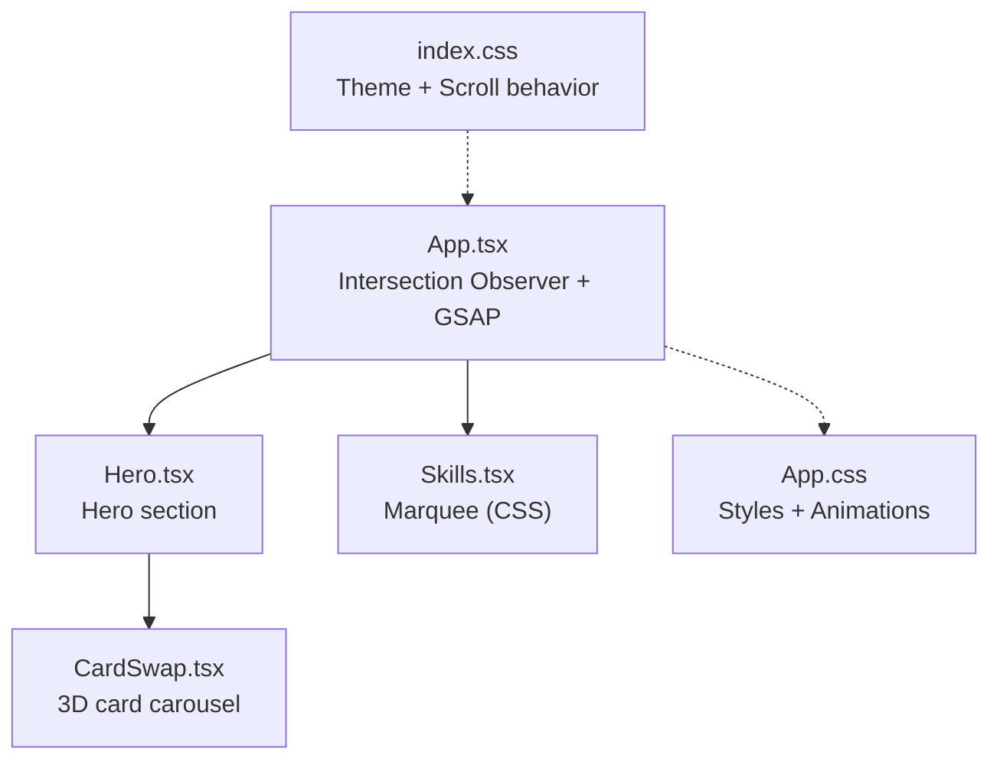
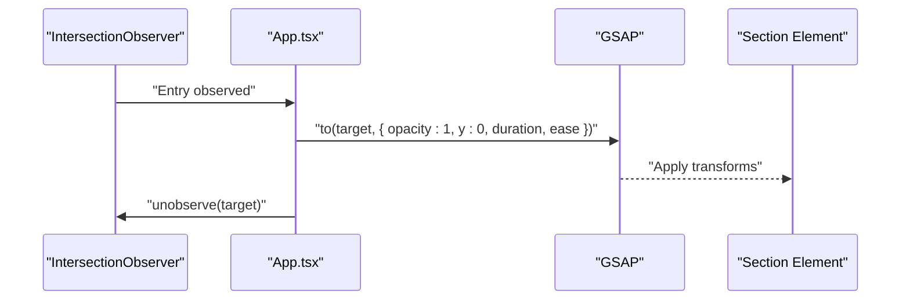
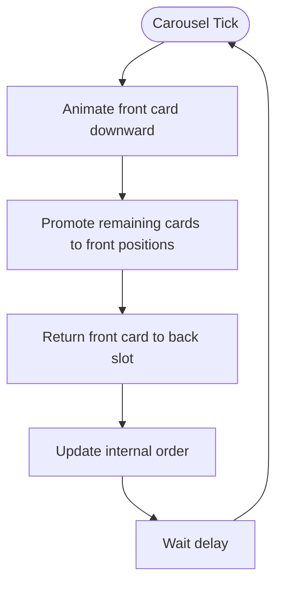
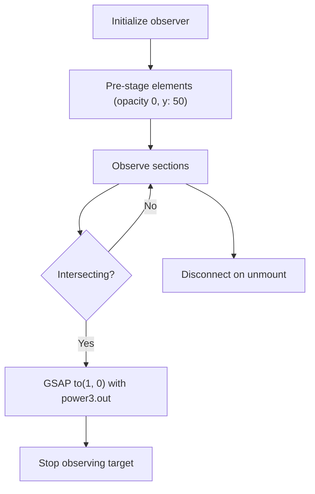
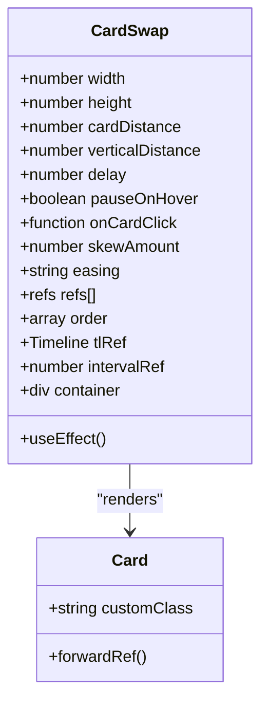
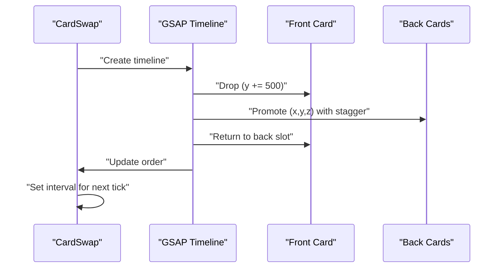
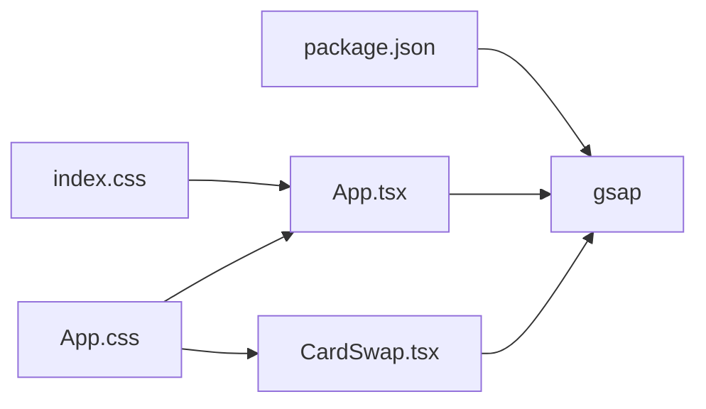

# Animation System

<cite>
**Referenced Files in This Document**
- [App.tsx](file://src/App.tsx)
- [CardSwap.tsx](file://src/components/CardSwap.tsx)
- [Hero.tsx](file://src/components/Hero.tsx)
- [Skills.tsx](file://src/components/Skills.tsx)
- [App.css](file://src/App.css)
- [index.css](file://src/index.css)
- [package.json](file://package.json)
</cite>

## Table of Contents
1. [Introduction](#introduction)
2. [Project Structure](#project-structure)
3. [Core Components](#core-components)
4. [Architecture Overview](#architecture-overview)
5. [Detailed Component Analysis](#detailed-component-analysis)
6. [Dependency Analysis](#dependency-analysis)
7. [Performance Considerations](#performance-considerations)
8. [Troubleshooting Guide](#troubleshooting-guide)
9. [Conclusion](#conclusion)

## Introduction
This document explains the animation system powering the portfolio website. It focuses on the GSAP-based architecture, the timeline management system coordinating scroll-triggered animations via the Intersection Observer API, and the 3D card carousel implementation. It also documents animation configuration patterns, timing/easing choices, scroll-driven triggers, synchronization across sections, performance optimizations, and browser compatibility considerations.

## Project Structure
The animation system spans a small set of focused components:
- App.tsx orchestrates scroll-triggered fade-ins using Intersection Observer and GSAP.
- CardSwap.tsx implements a 3D card carousel with GSAP timelines and sequencing.
- Hero.tsx composes CardSwap into the hero section.
- Skills.tsx provides a horizontally scrolling marquee (pure CSS).
- App.css and index.css define styles, gradients, and responsive behavior supporting animations.

**Diagram sources**
- [App.tsx:12-62](file://src/App.tsx#L12-L62)
- [Hero.tsx:4-84](file://src/components/Hero.tsx#L4-L84)
- [CardSwap.tsx:63-230](file://src/components/CardSwap.tsx#L63-L230)
- [Skills.tsx:20-55](file://src/components/Skills.tsx#L20-L55)
- [App.css:1-404](file://src/App.css#L1-L404)
- [index.css:1-87](file://src/index.css#L1-L87)

**Section sources**
- [App.tsx:12-62](file://src/App.tsx#L12-L62)
- [Hero.tsx:4-84](file://src/components/Hero.tsx#L4-L84)
- [CardSwap.tsx:63-230](file://src/components/CardSwap.tsx#L63-L230)
- [Skills.tsx:20-55](file://src/components/Skills.tsx#L20-L55)
- [App.css:1-404](file://src/App.css#L1-L404)
- [index.css:1-87](file://src/index.css#L1-L87)

## Core Components
- Scroll-triggered fade-ins: App.tsx initializes Intersection Observer to animate section visibility using GSAP with power-based easing.
- 3D card carousel: CardSwap.tsx builds a layered stack of cards, positions them in 3D space, and animates transitions using GSAP timelines with elastic or smooth easing.
- Hero composition: Hero.tsx embeds CardSwap with tuned spacing and hover pause behavior.
- Marquee: Skills.tsx uses a CSS animation for a seamless horizontal loop.

Key configuration highlights:
- Easing: power3.out for section fades; elastic.out or power1.inOut for carousel.
- Durations and overlaps: controlled via a configuration object keyed by easing mode.
- Cleanup: disconnect observer and clear intervals on unmount.

**Section sources**
- [App.tsx:13-42](file://src/App.tsx#L13-L42)
- [CardSwap.tsx:75-92](file://src/components/CardSwap.tsx#L75-L92)
- [Hero.tsx:42-74](file://src/components/Hero.tsx#L42-L74)
- [Skills.tsx:20-55](file://src/components/Skills.tsx#L20-L55)

## Architecture Overview
The animation architecture centers on two complementary systems:
- Scroll-triggered animations: Intersection Observer detects when sections enter viewport, then GSAP animates opacity and vertical offset.
- Carousel animations: GSAP timelines orchestrate drop, promotion, and return phases with precise timing and overlap controls.

**Diagram sources**
- [App.tsx:19-39](file://src/App.tsx#L19-L39)

**Diagram sources**
- [CardSwap.tsx:116-177](file://src/components/CardSwap.tsx#L116-L177)

## Detailed Component Analysis

### Scroll-Fade Timeline Management (App.tsx)
- Observes sections with a low intersection threshold to trigger animations early as users scroll toward them.
- Pre-stages elements offscreen (opacity 0, y offset) and resets observer after first trigger to avoid repeated animations.
- Uses power-based easing for natural deceleration.

**Diagram sources**
- [App.tsx:15-41](file://src/App.tsx#L15-L41)

**Section sources**
- [App.tsx:13-42](file://src/App.tsx#L13-L42)

### CardSwap 3D Carousel (CardSwap.tsx)
- Props configure spacing, timing, easing, and hover behavior.
- Cards are positioned in 3D space using transform-style and preserve-3d, with z-index and skew for depth.
- Timeline orchestration:
  - Drop phase moves the front card down.
  - Promotion phase repositions remaining cards with staggered delays and z-index updates.
  - Return phase places the front card behind others.
  - Order array rotation completes the cycle.
- Hover pause toggles timeline play/pause and clears/resets the interval.

**Diagram sources**
- [CardSwap.tsx:50-74](file://src/components/CardSwap.tsx#L50-L74)
- [CardSwap.tsx:17-26](file://src/components/CardSwap.tsx#L17-L26)

**Diagram sources**
- [CardSwap.tsx:116-177](file://src/components/CardSwap.tsx#L116-L177)

**Section sources**
- [CardSwap.tsx:63-230](file://src/components/CardSwap.tsx#L63-L230)

### Hero Composition (Hero.tsx)
- Embeds CardSwap with tuned spacing and hover pause.
- Provides gradient text and decorative blobs with separate CSS animations.

**Section sources**
- [Hero.tsx:42-74](file://src/components/Hero.tsx#L42-L74)

### Skills Marquee (Skills.tsx)
- Uses a duplicated skill list to create a seamless loop.
- CSS animation translates the container to achieve continuous horizontal movement.

**Section sources**
- [Skills.tsx:20-55](file://src/components/Skills.tsx#L20-L55)

## Dependency Analysis
- GSAP is imported and used in App.tsx and CardSwap.tsx.
- Tailwind utilities and theme variables in index.css support color and gradient animations.
- App.css defines section layouts, hero positioning, and CSS-driven animations.

**Diagram sources**
- [package.json:12-18](file://package.json#L12-L18)
- [App.tsx:1-3](file://src/App.tsx#L1-L3)
- [CardSwap.tsx:9-10](file://src/components/CardSwap.tsx#L9-L10)
- [index.css:1-30](file://src/index.css#L1-L30)
- [App.css:1-404](file://src/App.css#L1-L404)

**Section sources**
- [package.json:12-18](file://package.json#L12-L18)
- [App.tsx:1-3](file://src/App.tsx#L1-L3)
- [CardSwap.tsx:9-10](file://src/components/CardSwap.tsx#L9-L10)
- [index.css:1-30](file://src/index.css#L1-L30)
- [App.css:1-404](file://src/App.css#L1-L404)

## Performance Considerations
- Offscreen staging: Elements are pre-staged offscreen to prevent FOUC and unnecessary layout thrashing.
- Intersection Observer threshold: A modest threshold ensures animations trigger before full entry, reducing perceived latency.
- Force-3D and will-change: CardSwap leverages force3D and will-change hints to encourage GPU acceleration for transforms.
- Cleanup:
  - Disconnect IntersectionObserver on unmount to prevent leaks.
  - Clear intervals and pause timelines on hover exit to avoid redundant work.
- CSS fallbacks: Pure CSS animations (marquee, hero blobs) reduce JS overhead and provide graceful degradation.
- Scroll behavior: Smooth scrolling improves UX during navigation.

Recommendations:
- Debounce scroll events if extending with custom scroll-driven animations.
- Prefer transform/opacity for GPU-accelerated animations.
- Avoid animating layout-affecting properties frequently.
- Test on lower-powered devices and adjust durations/easing accordingly.

**Section sources**
- [App.tsx:19-41](file://src/App.tsx#L19-L41)
- [CardSwap.tsx:36-47](file://src/components/CardSwap.tsx#L36-L47)
- [CardSwap.tsx:182-200](file://src/components/CardSwap.tsx#L182-L200)
- [Skills.tsx:294-314](file://src/components/Skills.tsx#L294-L314)
- [index.css:29](file://src/index.css#L29)

## Troubleshooting Guide
Common issues and resolutions:
- Animations not triggering:
  - Verify IntersectionObserver targets match selectors used in initialization.
  - Confirm elements are visible in viewport or near viewport to meet threshold.
- Cards not moving:
  - Ensure refs are attached and children are valid React elements.
  - Check that easing configuration keys match the selected mode.
- Hover pause not resuming:
  - Confirm event listeners are removed on cleanup and intervals are reset on resume.
- Stuttering or jank:
  - Reduce animation count or simplify easing curves.
  - Ensure transform-style and preserve-3d are applied consistently.
- Browser compatibility:
  - GSAP supports modern browsers; verify ES modules availability.
  - Intersection Observer is widely supported; consider polyfills if targeting very old browsers.

**Section sources**
- [App.tsx:15-41](file://src/App.tsx#L15-L41)
- [CardSwap.tsx:182-200](file://src/components/CardSwap.tsx#L182-L200)

## Conclusion
The animation system blends GSAP’s robust timeline control with Intersection Observer for scroll-triggered effects, delivering smooth, performant, and visually engaging interactions. The CardSwap carousel demonstrates advanced sequencing and 3D positioning, while the scroll-fade mechanism ensures content reveals naturally as users navigate. With careful cleanup, GPU-friendly transforms, and CSS fallbacks, the system balances polish with reliability across devices.