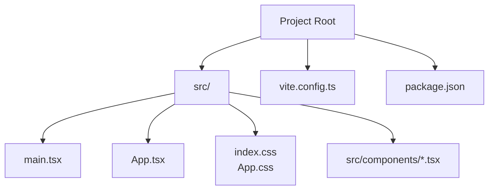
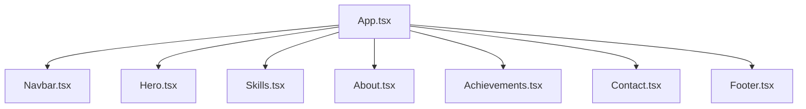
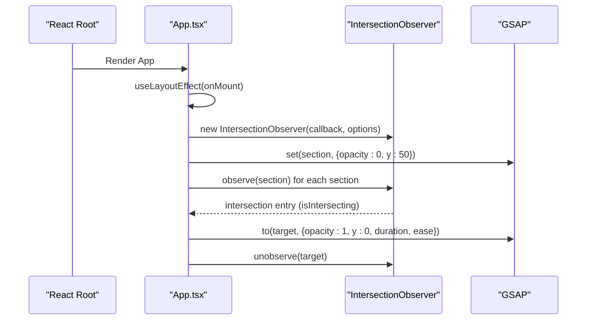
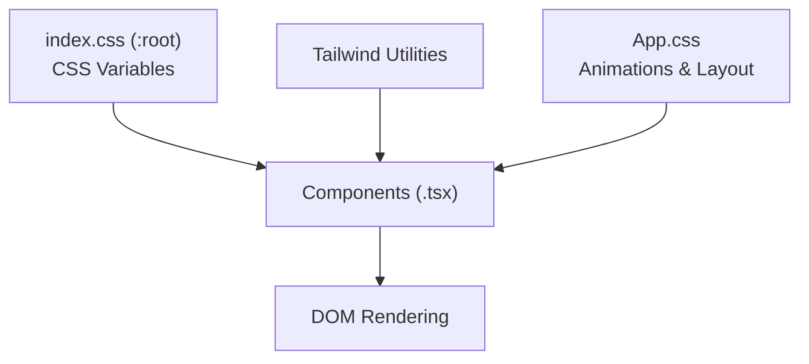
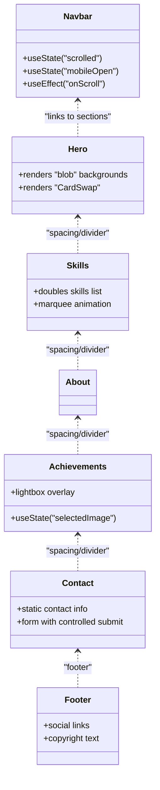
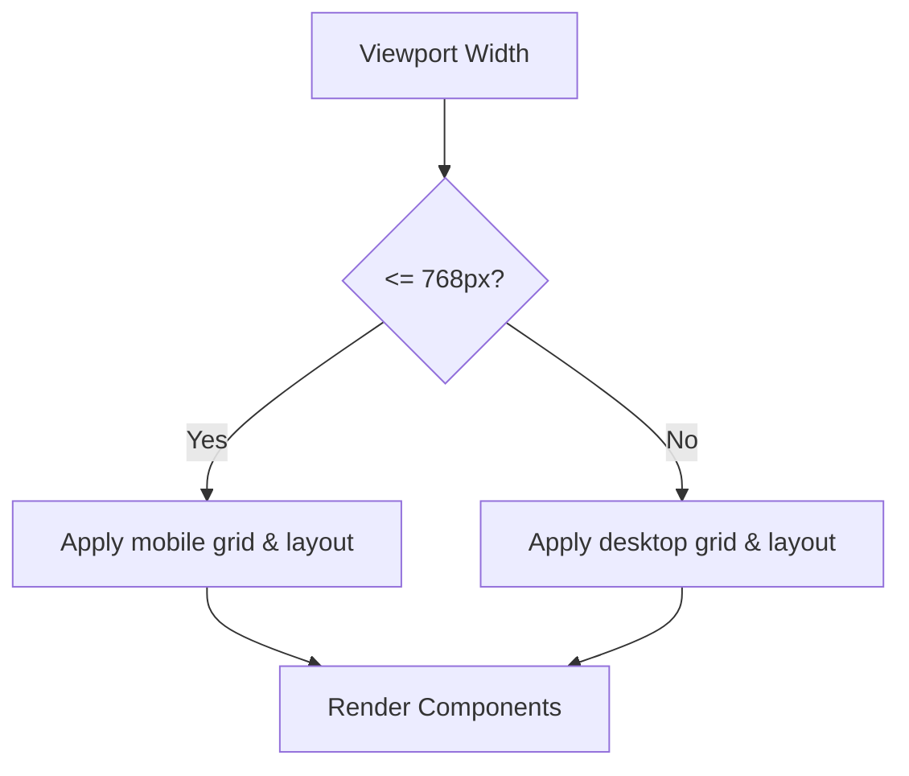
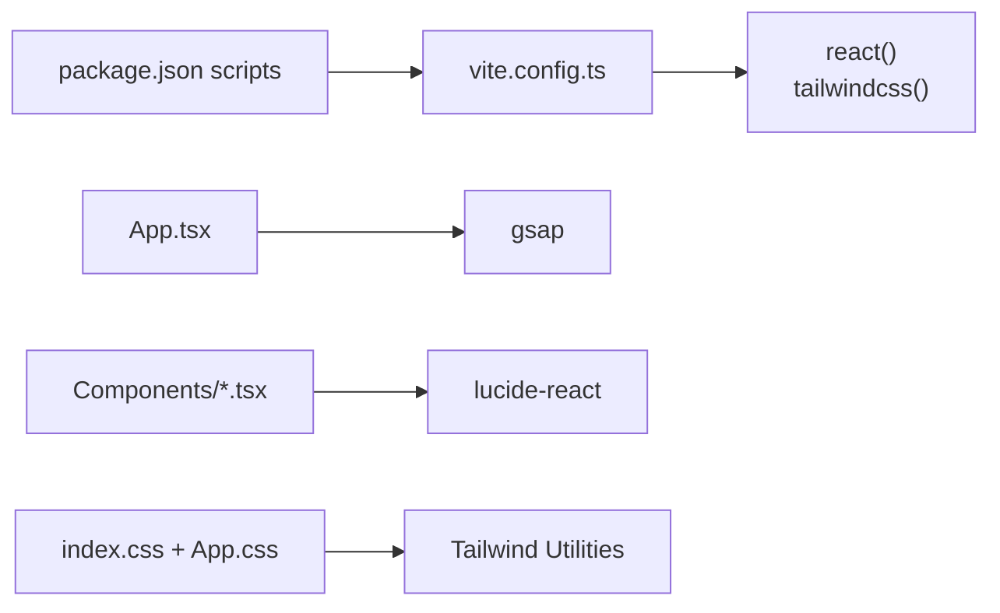

# Architecture Overview

<cite>
**Referenced Files in This Document**
- [App.tsx](file://src/App.tsx)
- [main.tsx](file://src/main.tsx)
- [Navbar.tsx](file://src/components/Navbar.tsx)
- [Hero.tsx](file://src/components/Hero.tsx)
- [About.tsx](file://src/components/About.tsx)
- [Achievements.tsx](file://src/components/Achievements.tsx)
- [Skills.tsx](file://src/components/Skills.tsx)
- [Contact.tsx](file://src/components/Contact.tsx)
- [Footer.tsx](file://src/components/Footer.tsx)
- [App.css](file://src/App.css)
- [index.css](file://src/index.css)
- [vite.config.ts](file://vite.config.ts)
- [package.json](file://package.json)
</cite>

## Table of Contents
1. [Introduction](#introduction)
2. [Project Structure](#project-structure)
3. [Core Components](#core-components)
4. [Architecture Overview](#architecture-overview)
5. [Detailed Component Analysis](#detailed-component-analysis)
6. [Dependency Analysis](#dependency-analysis)
7. [Performance Considerations](#performance-considerations)
8. [Troubleshooting Guide](#troubleshooting-guide)
9. [Conclusion](#conclusion)

## Introduction
This document describes the architecture of a personal portfolio website built with React, TypeScript, and Vite. The site follows a component-based design with clear separation of concerns, a cohesive styling strategy using Tailwind utilities and CSS variables, and a polished animation system powered by GSAP and Intersection Observer. The application orchestrates page sections (Hero, Skills, About, Achievements, Contact, Footer) with smooth entrance animations and responsive layouts.

## Project Structure
The project is organized around a small set of React components under src/components, with centralized styles in src/index.css and component-specific styles in src/App.css. The build system is configured via Vite with React and Tailwind plugins.

**Diagram sources**
- [main.tsx:1-12](file://src/main.tsx#L1-L12)
- [App.tsx:1-62](file://src/App.tsx#L1-L62)
- [index.css:1-87](file://src/index.css#L1-L87)
- [App.css:1-404](file://src/App.css#L1-L404)
- [vite.config.ts:1-9](file://vite.config.ts#L1-L9)
- [package.json:1-35](file://package.json#L1-L35)

**Section sources**
- [main.tsx:1-12](file://src/main.tsx#L1-L12)
- [vite.config.ts:1-9](file://vite.config.ts#L1-L9)
- [package.json:1-35](file://package.json#L1-L35)

## Core Components
The application’s runtime is orchestrated by App.tsx, which renders the navigation bar, hero, skill marquee, about section, achievements gallery, contact form, and footer. It initializes Intersection Observer-driven fade-in animations for sections and manages initial GSAP state.

Key responsibilities:
- Orchestrate component rendering order and section dividers
- Initialize Intersection Observer and GSAP animations on mount
- Clean up observers on unmount

**Section sources**
- [App.tsx:12-62](file://src/App.tsx#L12-L62)

## Architecture Overview
The application uses a flat, hierarchical component tree with a single root App container. Each section is a self-contained module that relies on shared CSS variables for theming and Tailwind utilities for responsive layout. Animations are coordinated centrally via GSAP and Intersection Observer hooks.

**Diagram sources**
- [App.tsx:44-58](file://src/App.tsx#L44-L58)
- [Navbar.tsx:11-50](file://src/components/Navbar.tsx#L11-L50)
- [Hero.tsx:4-79](file://src/components/Hero.tsx#L4-L79)
- [Skills.tsx:20-50](file://src/components/Skills.tsx#L20-L50)
- [About.tsx:3-119](file://src/components/About.tsx#L3-L119)
- [Achievements.tsx:64-111](file://src/components/Achievements.tsx#L64-L111)
- [Contact.tsx:19-125](file://src/components/Contact.tsx#L19-L125)
- [Footer.tsx:3-25](file://src/components/Footer.tsx#L3-L25)

## Detailed Component Analysis

### Animation System: GSAP Timelines and Intersection Observer
The animation pipeline is implemented in App.tsx:
- On mount, the component queries DOM nodes with specific section selectors and sets their initial opacity and vertical offset using GSAP.
- An Intersection Observer watches these nodes with a low threshold to trigger fade-in and upward slide transitions.
- Once a node becomes visible, the observer stops observing it to avoid repeated animations.

**Diagram sources**
- [App.tsx:13-42](file://src/App.tsx#L13-L42)

**Section sources**
- [App.tsx:13-42](file://src/App.tsx#L13-L42)

### Styling Strategy: TailwindCSS + Custom CSS Variables
Styling is split into two layers:
- Global theme variables in :root define dark-mode palette, gradients, borders, and typography.
- Component-specific styles in App.css encapsulate layout, animations, and responsive breakpoints.

Benefits:
- Consistent theming across components via CSS variables
- Utility-first layout with Tailwind for rapid prototyping
- Explicit overrides and animations in App.css for complex interactions

**Diagram sources**
- [index.css:3-30](file://src/index.css#L3-L30)
- [App.css:1-404](file://src/App.css#L1-L404)

**Section sources**
- [index.css:3-30](file://src/index.css#L3-L30)
- [App.css:1-404](file://src/App.css#L1-L404)

### Component Interaction Patterns and Data Flow
- Navigation: Navbar updates its scrolled state based on scroll events and exposes anchor links to sections.
- Hero: Renders animated background blobs and a CardSwap carousel; buttons link to sections.
- Skills: Duplicates the skills array to create a seamless horizontal marquee.
- Achievements: Maintains local state for lightbox selection and displays certificate metadata.
- Contact: Provides static contact info and a form with controlled submission behavior.
- Footer: Renders social links and a copyright notice.

**Diagram sources**
- [Navbar.tsx:11-50](file://src/components/Navbar.tsx#L11-L50)
- [Hero.tsx:4-79](file://src/components/Hero.tsx#L4-L79)
- [Skills.tsx:20-50](file://src/components/Skills.tsx#L20-L50)
- [Achievements.tsx:64-111](file://src/components/Achievements.tsx#L64-L111)
- [Contact.tsx:19-125](file://src/components/Contact.tsx#L19-L125)
- [Footer.tsx:3-25](file://src/components/Footer.tsx#L3-L25)

**Section sources**
- [Navbar.tsx:11-50](file://src/components/Navbar.tsx#L11-L50)
- [Hero.tsx:4-79](file://src/components/Hero.tsx#L4-L79)
- [Skills.tsx:20-50](file://src/components/Skills.tsx#L20-L50)
- [Achievements.tsx:64-111](file://src/components/Achievements.tsx#L64-L111)
- [Contact.tsx:19-125](file://src/components/Contact.tsx#L19-L125)
- [Footer.tsx:3-25](file://src/components/Footer.tsx#L3-L25)

### Responsive Design Approach
Responsiveness is achieved through:
- Tailwind’s responsive utilities for grid and spacing
- CSS media queries in App.css targeting tablet and mobile breakpoints
- Flexible hero layout that stacks content on smaller screens
- Auto-fill grids for achievements and stats that adapt to viewport width

**Diagram sources**
- [App.css:392-403](file://src/App.css#L392-L403)

**Section sources**
- [App.css:392-403](file://src/App.css#L392-L403)

## Dependency Analysis
External libraries and tooling:
- React and React DOM for UI rendering
- GSAP for advanced animations
- Lucide icons for lightweight SVG icons
- TailwindCSS and @tailwindcss/vite for utility-first styling
- Vite for fast dev server and optimized builds

**Diagram sources**
- [vite.config.ts:1-9](file://vite.config.ts#L1-L9)
- [package.json:12-18](file://package.json#L12-L18)
- [App.tsx:2](file://src/App.tsx#L2)

**Section sources**
- [vite.config.ts:1-9](file://vite.config.ts#L1-L9)
- [package.json:12-18](file://package.json#L12-L18)
- [package.json:6-11](file://package.json#L6-L11)

## Performance Considerations
- Intersection Observer reduces unnecessary re-renders by triggering animations only when sections enter the viewport.
- GSAP set() initializes offscreen state efficiently before animating.
- Marquee in Skills uses transform-based animation for GPU acceleration.
- Tailwind utilities minimize CSS bloat while enabling rapid layout iteration.
- Vite’s plugin architecture supports fast HMR and optimized production builds.

## Troubleshooting Guide
Common areas to inspect:
- Animation not firing: Verify section selectors and thresholds in the Intersection Observer initialization.
- Scroll position issues: Confirm that section IDs match Navbar anchor targets.
- Theming inconsistencies: Ensure CSS variable names in :root match usage in component styles.
- Build errors: Confirm Vite plugins and TypeScript configurations align with installed packages.

**Section sources**
- [App.tsx:13-42](file://src/App.tsx#L13-L42)
- [index.css:3-30](file://src/index.css#L3-L30)
- [vite.config.ts:1-9](file://vite.config.ts#L1-L9)

## Conclusion
The portfolio site employs a clean, modular React architecture with strong separation of concerns. GSAP and Intersection Observer deliver compelling entrance animations, Tailwind and CSS variables provide a consistent, themeable design system, and Vite streamlines development and build performance. The approach balances maintainability with visual polish, offering a solid foundation for future enhancements.