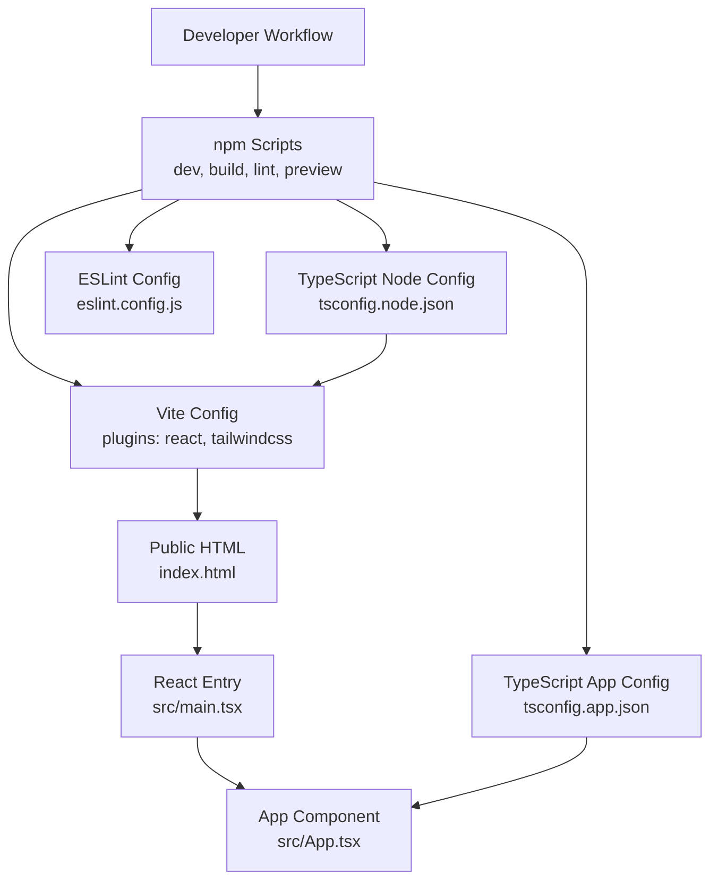
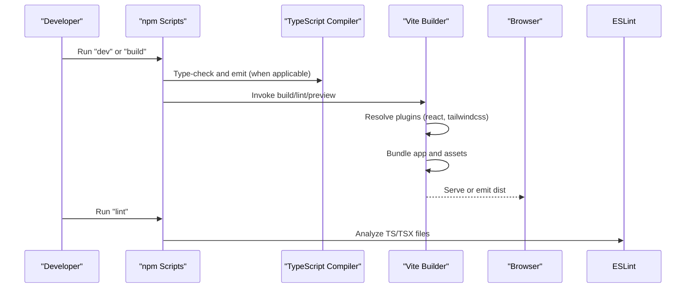
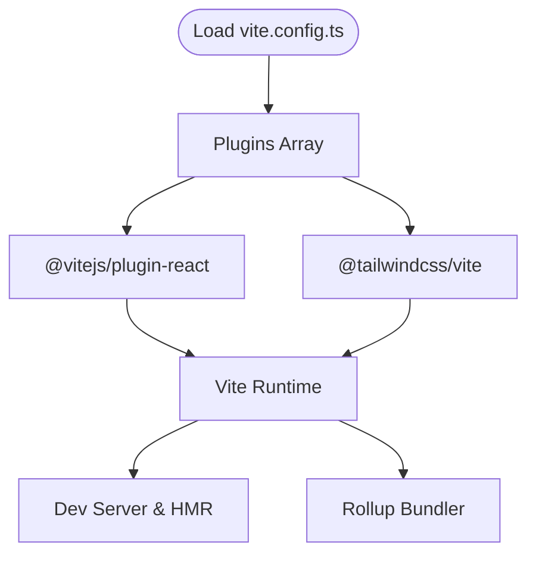
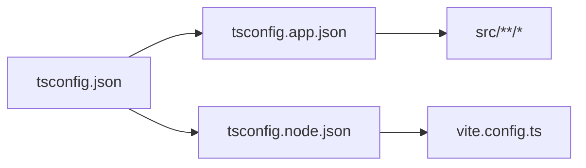
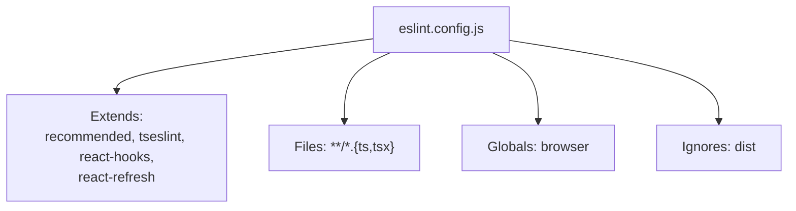
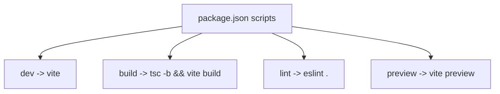
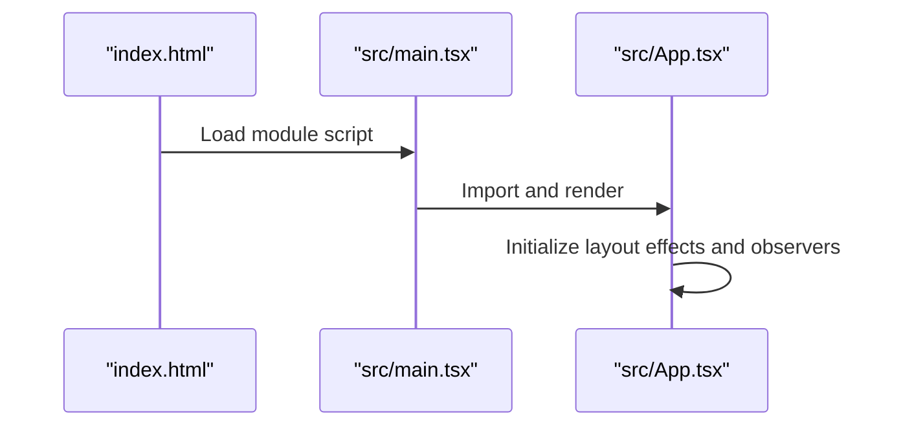
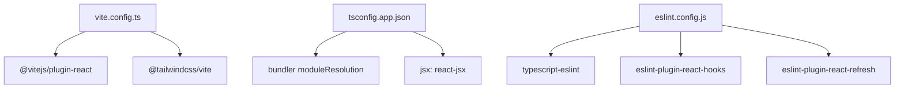

# Build Configuration

<cite>
**Referenced Files in This Document**
- [vite.config.ts](file://vite.config.ts)
- [package.json](file://package.json)
- [eslint.config.js](file://eslint.config.js)
- [tsconfig.json](file://tsconfig.json)
- [tsconfig.app.json](file://tsconfig.app.json)
- [tsconfig.node.json](file://tsconfig.node.json)
- [index.html](file://index.html)
- [src/main.tsx](file://src/main.tsx)
- [src/App.tsx](file://src/App.tsx)
- [README.md](file://README.md)
</cite>

## Table of Contents
1. [Introduction](#introduction)
2. [Project Structure](#project-structure)
3. [Core Components](#core-components)
4. [Architecture Overview](#architecture-overview)
5. [Detailed Component Analysis](#detailed-component-analysis)
6. [Dependency Analysis](#dependency-analysis)
7. [Performance Considerations](#performance-considerations)
8. [Troubleshooting Guide](#troubleshooting-guide)
9. [Conclusion](#conclusion)
10. [Appendices](#appendices)

## Introduction
This document explains the build configuration for the portfolio website, covering Vite setup, TypeScript configuration, ESLint rules, scripts, and deployment preparation. It focuses on how the development server, hot module replacement, and asset pipeline are configured, along with type-safe multi-project TypeScript setups and linting strategies.

## Project Structure
The project follows a conventional React + TypeScript + Vite structure with a single-page application entry and a public HTML shell. The build system is driven by Vite with React plugin integration and Tailwind CSS via the Tailwind Vite plugin. TypeScript compiles the application and Node tooling separately, and ESLint enforces code quality.

**Diagram sources**
- [vite.config.ts:1-9](file://vite.config.ts#L1-L9)
- [package.json:6-11](file://package.json#L6-L11)
- [tsconfig.app.json:1-26](file://tsconfig.app.json#L1-L26)
- [tsconfig.node.json:1-24](file://tsconfig.node.json#L1-L24)
- [eslint.config.js:1-23](file://eslint.config.js#L1-L23)
- [index.html:1-17](file://index.html#L1-L17)
- [src/main.tsx:1-12](file://src/main.tsx#L1-L12)
- [src/App.tsx:1-62](file://src/App.tsx#L1-L62)

**Section sources**
- [vite.config.ts:1-9](file://vite.config.ts#L1-L9)
- [package.json:6-11](file://package.json#L6-L11)
- [tsconfig.json:1-8](file://tsconfig.json#L1-L8)
- [tsconfig.app.json:1-26](file://tsconfig.app.json#L1-L26)
- [tsconfig.node.json:1-24](file://tsconfig.node.json#L1-L24)
- [eslint.config.js:1-23](file://eslint.config.js#L1-L23)
- [index.html:1-17](file://index.html#L1-L17)
- [src/main.tsx:1-12](file://src/main.tsx#L1-L12)
- [src/App.tsx:1-62](file://src/App.tsx#L1-L62)

## Core Components
- Vite configuration enables React and Tailwind CSS plugins. The configuration is minimal and relies on Vite’s defaults for bundling and development server.
- TypeScript multi-project setup separates browser app types from Node tooling types, ensuring accurate type checking and build isolation.
- ESLint flat config centralizes lint rules for TypeScript/React, including recommended rules and React-specific plugins.
- npm scripts orchestrate development, type-checking/build, preview, and linting.

**Section sources**
- [vite.config.ts:6-8](file://vite.config.ts#L6-L8)
- [tsconfig.json:3-6](file://tsconfig.json#L3-L6)
- [tsconfig.app.json:1-26](file://tsconfig.app.json#L1-L26)
- [tsconfig.node.json:1-24](file://tsconfig.node.json#L1-L24)
- [eslint.config.js:8-22](file://eslint.config.js#L8-L22)
- [package.json:6-11](file://package.json#L6-L11)

## Architecture Overview
The build pipeline integrates TypeScript compilation and Vite bundling. The app types are compiled in tandem with Vite builds, while the Node-side configuration ensures Vite config is type-checked. ESLint runs over the project to enforce style and correctness.

**Diagram sources**
- [package.json:6-11](file://package.json#L6-L11)
- [vite.config.ts:6-8](file://vite.config.ts#L6-L8)
- [eslint.config.js:8-22](file://eslint.config.js#L8-L22)

## Detailed Component Analysis

### Vite Configuration
- Plugins: React plugin for fast refresh and JSX transforms; Tailwind Vite plugin for CSS processing.
- Defaults: No explicit build.rollupOptions or server configuration implies Vite’s defaults for dev server and bundling.

**Diagram sources**
- [vite.config.ts:6-8](file://vite.config.ts#L6-L8)

**Section sources**
- [vite.config.ts:1-9](file://vite.config.ts#L1-L9)

### TypeScript Multi-Project Setup
- Root tsconfig.json references app and node configurations for isolated compilation.
- App configuration targets modern environments, uses bundler module resolution, and enforces strict unused checks.
- Node configuration targets Node runtime for Vite config and similar tooling.

**Diagram sources**
- [tsconfig.json:3-6](file://tsconfig.json#L3-L6)
- [tsconfig.app.json:24-25](file://tsconfig.app.json#L24-L25)
- [tsconfig.node.json:22-23](file://tsconfig.node.json#L22-L23)

**Section sources**
- [tsconfig.json:1-8](file://tsconfig.json#L1-L8)
- [tsconfig.app.json:1-26](file://tsconfig.app.json#L1-L26)
- [tsconfig.node.json:1-24](file://tsconfig.node.json#L1-L24)

### ESLint Configuration
- Flat config extends recommended sets for JS/TS and React hooks and refresh.
- Ignores built artifacts and targets TS/TSX files.
- Recommended guidance in the project README suggests enabling type-aware lint rules for production-grade projects.

**Diagram sources**
- [eslint.config.js:8-22](file://eslint.config.js#L8-L22)

**Section sources**
- [eslint.config.js:1-23](file://eslint.config.js#L1-L23)
- [README.md:14-45](file://README.md#L14-L45)

### npm Scripts
- dev: Starts Vite dev server.
- build: Runs TypeScript project references build followed by Vite build.
- lint: Executes ESLint across the project.
- preview: Serves the production build locally.

**Diagram sources**
- [package.json:6-11](file://package.json#L6-L11)

**Section sources**
- [package.json:6-11](file://package.json#L6-L11)

### Development Entry and HTML Shell
- index.html defines the document shell and mounts the React root.
- src/main.tsx renders the App component inside StrictMode.
- src/App.tsx composes page sections and applies animations.

**Diagram sources**
- [index.html:13-14](file://index.html#L13-L14)
- [src/main.tsx:7-11](file://src/main.tsx#L7-L11)
- [src/App.tsx:12-59](file://src/App.tsx#L12-L59)

**Section sources**
- [index.html:1-17](file://index.html#L1-L17)
- [src/main.tsx:1-12](file://src/main.tsx#L1-L12)
- [src/App.tsx:1-62](file://src/App.tsx#L1-L62)

## Dependency Analysis
- Vite depends on React plugin for JSX and fast refresh.
- Tailwind Vite plugin integrates CSS processing into the Vite pipeline.
- TypeScript app config targets modern JS environments and uses bundler module resolution.
- ESLint config depends on TS/ESLint and React plugins.

**Diagram sources**
- [vite.config.ts:6-8](file://vite.config.ts#L6-L8)
- [tsconfig.app.json:10-16](file://tsconfig.app.json#L10-L16)
- [eslint.config.js:1-6](file://eslint.config.js#L1-L6)

**Section sources**
- [vite.config.ts:1-9](file://vite.config.ts#L1-L9)
- [tsconfig.app.json:1-26](file://tsconfig.app.json#L1-L26)
- [eslint.config.js:1-23](file://eslint.config.js#L1-L23)

## Performance Considerations
- Use the Vite dev server for rapid iteration and hot module replacement.
- Keep TypeScript project references to minimize incremental rebuilds.
- Prefer tree-shaking by using ES modules and avoiding side-effectful imports.
- Consider enabling minification and asset inlining in production builds via Vite’s defaults.
- Monitor bundle sizes and split large components to reduce initial payload.

[No sources needed since this section provides general guidance]

## Troubleshooting Guide
- If TypeScript diagnostics fail during build, ensure project references are consistent and no conflicting types exist.
- If ESLint reports type-aware errors, align parserOptions.project with the multi-project setup.
- If Tailwind styles do not apply, verify Tailwind plugin registration and PostCSS/Tailwind configuration presence.
- If the dev server fails to start, confirm port availability and plugin compatibility.

**Section sources**
- [tsconfig.json:3-6](file://tsconfig.json#L3-L6)
- [eslint.config.js:36-42](file://eslint.config.js#L36-L42)
- [README.md:14-45](file://README.md#L14-L45)

## Conclusion
The build configuration leverages Vite with React and Tailwind plugins, a dual TypeScript project setup for app and Node tooling, and a centralized ESLint configuration. The npm scripts provide a streamlined developer experience for local development, type-checking, and previewing production builds. Following the recommendations herein will help maintain a fast, reliable, and type-safe build pipeline.

[No sources needed since this section summarizes without analyzing specific files]

## Appendices

### Environment Variables and Build Artifacts
- Environment variables are not explicitly configured in the repository files. For production builds, Vite exposes environment variables prefixed appropriately.
- Build artifacts are emitted by Vite according to its defaults; no custom output paths are configured.

**Section sources**
- [vite.config.ts:6-8](file://vite.config.ts#L6-L8)

### CI/CD Considerations
- Use the build script to compile TypeScript and produce optimized assets.
- Run linting in CI to enforce code quality.
- Preview the production build locally before deployment to catch runtime issues.

**Section sources**
- [package.json:6-11](file://package.json#L6-L11)