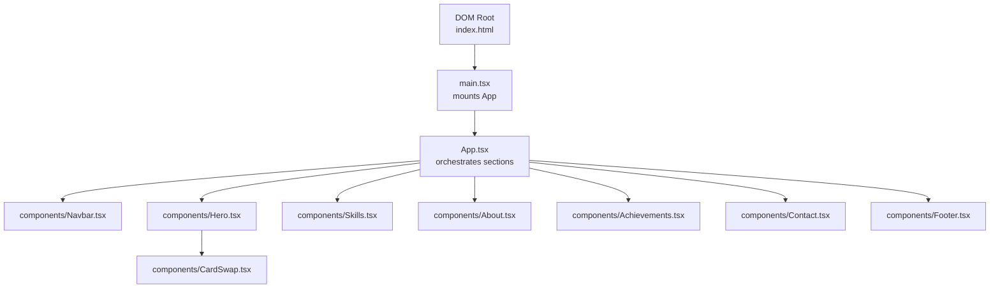
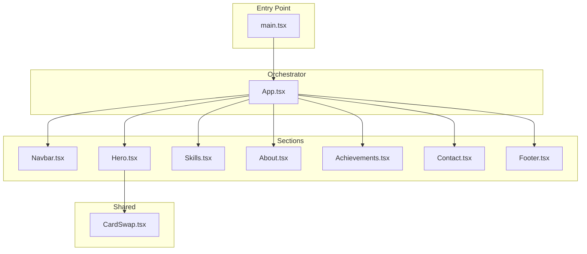
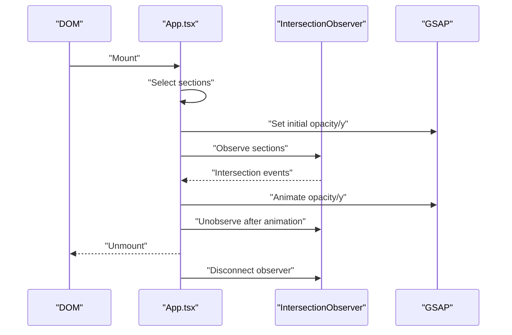
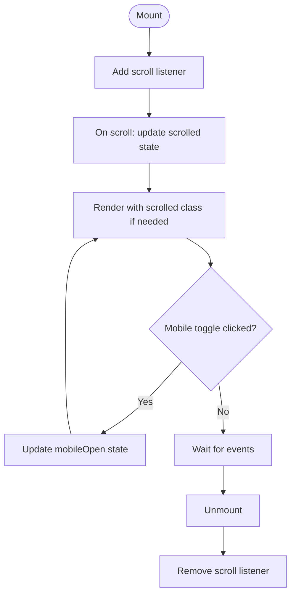
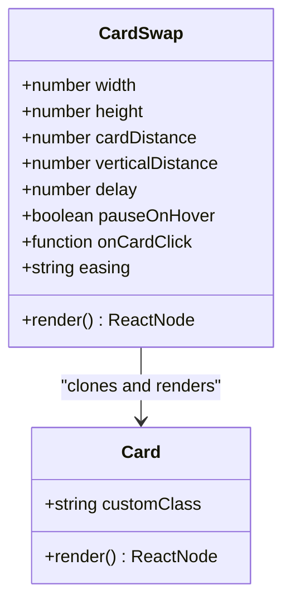
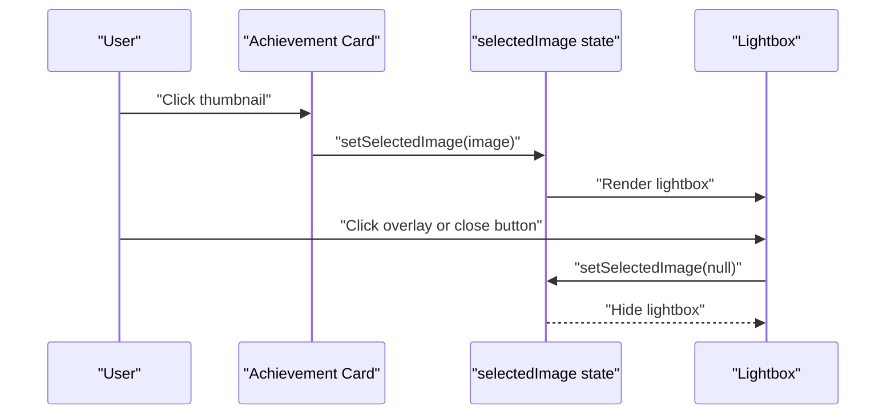
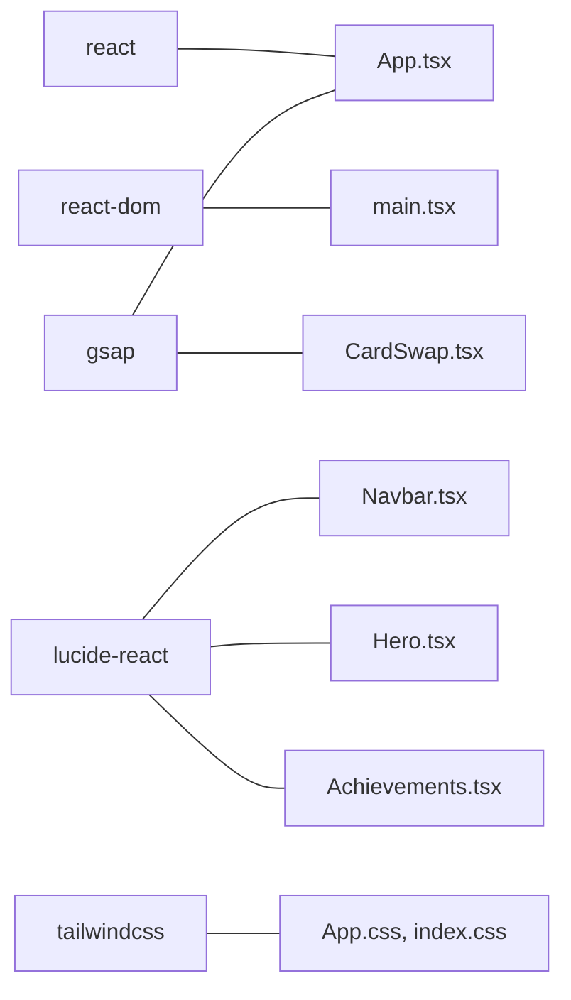

# Component Architecture

<cite>
**Referenced Files in This Document**
- [main.tsx](file://src/main.tsx)
- [App.tsx](file://src/App.tsx)
- [Navbar.tsx](file://src/components/Navbar.tsx)
- [Hero.tsx](file://src/components/Hero.tsx)
- [Skills.tsx](file://src/components/Skills.tsx)
- [About.tsx](file://src/components/About.tsx)
- [Achievements.tsx](file://src/components/Achievements.tsx)
- [Contact.tsx](file://src/components/Contact.tsx)
- [Footer.tsx](file://src/components/Footer.tsx)
- [CardSwap.tsx](file://src/components/CardSwap.tsx)
- [App.css](file://src/App.css)
- [index.css](file://src/index.css)
- [package.json](file://package.json)
</cite>

## Table of Contents
1. [Introduction](#introduction)
2. [Project Structure](#project-structure)
3. [Core Components](#core-components)
4. [Architecture Overview](#architecture-overview)
5. [Detailed Component Analysis](#detailed-component-analysis)
6. [Dependency Analysis](#dependency-analysis)
7. [Performance Considerations](#performance-considerations)
8. [Troubleshooting Guide](#troubleshooting-guide)
9. [Conclusion](#conclusion)

## Introduction
This document describes the component architecture of a personal portfolio website built with React, TypeScript, and Vite. The site follows a component-based design pattern with clear separation of concerns. The main orchestrator component manages section routing and animation coordination, while individual sections encapsulate distinct UI and interaction logic. The application emphasizes composability, reusability, and maintainability through modular components and shared styling.

## Project Structure
The project is organized around a small set of React components under src/components, with a single orchestrator App.tsx that composes the page sections. Styling is centralized in App.css and index.css, leveraging Tailwind CSS and CSS custom properties for theming. The entry point mounts the application into the DOM.

**Diagram sources**
- [main.tsx:1-12](file://src/main.tsx#L1-L12)
- [App.tsx:1-62](file://src/App.tsx#L1-L62)
- [Navbar.tsx:1-54](file://src/components/Navbar.tsx#L1-L54)
- [Hero.tsx:1-84](file://src/components/Hero.tsx#L1-L84)
- [Skills.tsx:1-55](file://src/components/Skills.tsx#L1-L55)
- [About.tsx:1-124](file://src/components/About.tsx#L1-L124)
- [Achievements.tsx:1-116](file://src/components/Achievements.tsx#L1-L116)
- [Contact.tsx:1-130](file://src/components/Contact.tsx#L1-L130)
- [Footer.tsx:1-30](file://src/components/Footer.tsx#L1-L30)
- [CardSwap.tsx:1-230](file://src/components/CardSwap.tsx#L1-L230)

**Section sources**
- [main.tsx:1-12](file://src/main.tsx#L1-L12)
- [App.tsx:1-62](file://src/App.tsx#L1-L62)
- [App.css:1-404](file://src/App.css#L1-L404)
- [index.css:1-87](file://src/index.css#L1-L87)

## Core Components
- Orchestrator: App.tsx coordinates page sections and applies scroll-triggered animations using GSAP and IntersectionObserver.
- Navigation: Navbar.tsx handles scroll effects and mobile toggle state.
- Hero: Hero.tsx renders animated hero content and integrates CardSwap.tsx for interactive card stacks.
- Skills: Skills.tsx displays a horizontally scrolling marquee of tech skills.
- About: About.tsx presents personal information, feature highlights, and statistics.
- Achievements: Achievements.tsx lists certificates with a lightbox modal for images.
- Contact: Contact.tsx provides contact information and a form with hover effects.
- Footer: Footer.tsx renders social links and copyright text.
- Shared Component: CardSwap.tsx is a reusable animated card carousel with configurable behavior.

Key patterns:
- Composition: App.tsx composes sections declaratively.
- Minimal props: Components receive minimal props, mostly relying on CSS and local state.
- Local state: Components manage their own state (e.g., Navbar scroll, Achievements lightbox).
- Event handling: Inline handlers for clicks and hover effects; scroll listeners for Navbar.

**Section sources**
- [App.tsx:12-62](file://src/App.tsx#L12-L62)
- [Navbar.tsx:11-54](file://src/components/Navbar.tsx#L11-L54)
- [Hero.tsx:4-84](file://src/components/Hero.tsx#L4-L84)
- [Skills.tsx:20-55](file://src/components/Skills.tsx#L20-L55)
- [About.tsx:3-124](file://src/components/About.tsx#L3-L124)
- [Achievements.tsx:64-116](file://src/components/Achievements.tsx#L64-L116)
- [Contact.tsx:19-130](file://src/components/Contact.tsx#L19-L130)
- [Footer.tsx:3-30](file://src/components/Footer.tsx#L3-L30)
- [CardSwap.tsx:63-230](file://src/components/CardSwap.tsx#L63-L230)

## Architecture Overview
The application follows a unidirectional data flow with local state inside components. App.tsx acts as the coordinator, managing cross-section animations and layout. Each section is self-contained with its own styling and interactions.

**Diagram sources**
- [main.tsx:1-12](file://src/main.tsx#L1-L12)
- [App.tsx:1-62](file://src/App.tsx#L1-L62)
- [Navbar.tsx:1-54](file://src/components/Navbar.tsx#L1-L54)
- [Hero.tsx:1-84](file://src/components/Hero.tsx#L1-L84)
- [Skills.tsx:1-55](file://src/components/Skills.tsx#L1-L55)
- [About.tsx:1-124](file://src/components/About.tsx#L1-L124)
- [Achievements.tsx:1-116](file://src/components/Achievements.tsx#L1-L116)
- [Contact.tsx:1-130](file://src/components/Contact.tsx#L1-L130)
- [Footer.tsx:1-30](file://src/components/Footer.tsx#L1-L30)
- [CardSwap.tsx:1-230](file://src/components/CardSwap.tsx#L1-L230)

## Detailed Component Analysis

### App.tsx: Orchestrator and Animation Coordinator
Responsibilities:
- Declares and renders all page sections.
- Applies scroll-triggered fade-in animations using GSAP and IntersectionObserver.
- Manages initial state for section visibility and cleanup on unmount.

Animation flow:
- On mount, sets initial opacity and vertical offset for targeted sections.
- Observes sections; on intersection, animates opacity and Y position.
- Disconnects observer on unmount.

**Diagram sources**
- [App.tsx:13-42](file://src/App.tsx#L13-L42)

**Section sources**
- [App.tsx:12-62](file://src/App.tsx#L12-L62)

### Navbar.tsx: Scroll-aware Navigation
Responsibilities:
- Tracks scroll position to apply a “scrolled” class.
- Provides a mobile toggle button with controlled state.
- Renders navigation links and a call-to-action.

State and effects:
- Uses a scroll effect to update a local state flag.
- Adds/removes scroll listener on mount/unmount.

**Diagram sources**
- [Navbar.tsx:15-19](file://src/components/Navbar.tsx#L15-L19)

**Section sources**
- [Navbar.tsx:11-54](file://src/components/Navbar.tsx#L11-L54)

### Hero.tsx: Hero Section with CardSwap
Responsibilities:
- Renders hero content including badges, headline, subtitle, and buttons.
- Integrates CardSwap.tsx to display animated rotating cards.
- Provides scroll indicator.

Composition:
- Uses CardSwap with props controlling distances, delay, and hover behavior.
- Cards are passed as children with custom classes.

**Section sources**
- [Hero.tsx:4-84](file://src/components/Hero.tsx#L4-L84)
- [CardSwap.tsx:63-74](file://src/components/CardSwap.tsx#L63-L74)

### CardSwap.tsx: Reusable Animated Carousel
Responsibilities:
- Accepts child cards and positions them in a 3D stack.
- Animates transitions between cards using GSAP timelines.
- Supports elastic/smooth easing modes and hover pausing.

Implementation highlights:
- Uses React.forwardRef to expose refs to parent components.
- Clones children and attaches refs and click handlers.
- Manages intervals and timeline lifecycles with useEffect cleanup.
- Exposes onCardClick callback to parents.

**Diagram sources**
- [CardSwap.tsx:50-61](file://src/components/CardSwap.tsx#L50-L61)
- [CardSwap.tsx:17-26](file://src/components/CardSwap.tsx#L17-L26)

**Section sources**
- [CardSwap.tsx:63-230](file://src/components/CardSwap.tsx#L63-L230)

### Skills.tsx: Tech Stack Marquee
Responsibilities:
- Displays a horizontal marquee of skill chips.
- Duplicates the list to create a seamless loop.
- Uses inline styles for dynamic chip icons.

**Section sources**
- [Skills.tsx:20-55](file://src/components/Skills.tsx#L20-L55)

### About.tsx: Personal Information and Stats
Responsibilities:
- Presents avatar placeholder, headline, and paragraphs.
- Renders feature cards with icons.
- Displays statistics in a responsive grid.

**Section sources**
- [About.tsx:3-124](file://src/components/About.tsx#L3-L124)

### Achievements.tsx: Certificates Grid with Lightbox
Responsibilities:
- Renders a grid of achievement cards with images and metadata.
- Implements a lightbox modal for certificate previews.
- Uses local state to track selected image.

**Diagram sources**
- [Achievements.tsx:65-111](file://src/components/Achievements.tsx#L65-L111)

**Section sources**
- [Achievements.tsx:64-116](file://src/components/Achievements.tsx#L64-L116)

### Contact.tsx: Contact Information and Form
Responsibilities:
- Displays contact links with icons and hover effects.
- Provides a styled contact form with focus states.
- Uses inline styles for hover transitions on social links.

**Section sources**
- [Contact.tsx:19-130](file://src/components/Contact.tsx#L19-L130)

### Footer.tsx: Social Links and Copyright
Responsibilities:
- Renders social media links and a copyright notice.
- Uses icons and hover transitions.

**Section sources**
- [Footer.tsx:3-30](file://src/components/Footer.tsx#L3-L30)

## Dependency Analysis
External dependencies:
- React and React DOM for rendering.
- GSAP for animations.
- lucide-react for icons.
- Tailwind CSS for utility-first styling.

Internal dependencies:
- App.tsx depends on all section components.
- Hero.tsx depends on CardSwap.tsx.
- Achievements.tsx depends on local state and image assets.
- Navbar.tsx depends on scroll events and local state.

**Diagram sources**
- [package.json:12-18](file://package.json#L12-L18)
- [App.tsx:1-10](file://src/App.tsx#L1-L10)
- [CardSwap.tsx:10](file://src/components/CardSwap.tsx#L10)
- [Navbar.tsx:1-2](file://src/components/Navbar.tsx#L1-L2)
- [Hero.tsx:1](file://src/components/Hero.tsx#L1)
- [Achievements.tsx:1-2](file://src/components/Achievements.tsx#L1-L2)
- [App.css:1](file://src/App.css#L1)
- [index.css:1](file://src/index.css#L1)

**Section sources**
- [package.json:12-18](file://package.json#L12-L18)

## Performance Considerations
- IntersectionObserver and GSAP: Efficiently animate only visible sections; disconnect observer on unmount to prevent memory leaks.
- Marquee animation: Pauses on hover to reduce CPU load during interaction.
- Local state: Prefer local state for UI toggles to minimize unnecessary re-renders.
- CSS custom properties: Centralized theming reduces duplication and improves maintainability.
- Lazy loading: Images in achievements use lazy loading to improve initial load performance.

## Troubleshooting Guide
Common issues and resolutions:
- Animations not triggering:
  - Verify IntersectionObserver thresholds and section selectors match the DOM.
  - Ensure GSAP is loaded and initialized before animations.
- Scroll listener leaks:
  - Confirm scroll listeners are removed on component unmount.
- Hover pause not working:
  - Check mouseenter/mouseleave event bindings and timeline pause/play logic.
- Styling inconsistencies:
  - Review CSS custom property definitions and Tailwind configuration.
- Build errors:
  - Ensure TypeScript and Vite configurations are aligned with installed packages.

**Section sources**
- [App.tsx:19-42](file://src/App.tsx#L19-L42)
- [Navbar.tsx:15-19](file://src/components/Navbar.tsx#L15-L19)
- [CardSwap.tsx:182-200](file://src/components/CardSwap.tsx#L182-L200)
- [index.css:3-30](file://src/index.css#L3-L30)

## Conclusion
The portfolio site demonstrates a clean, modular React architecture with a clear separation of concerns. App.tsx orchestrates sections and animations, while each section component encapsulates its UI and interactions. The design favors composition, local state, and reusable components like CardSwap. With thoughtful performance considerations and a consistent styling approach, the architecture supports maintainability and scalability.