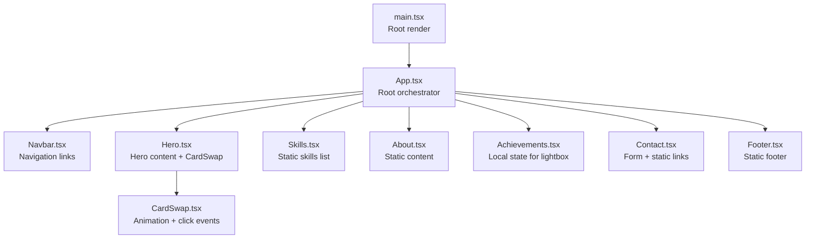
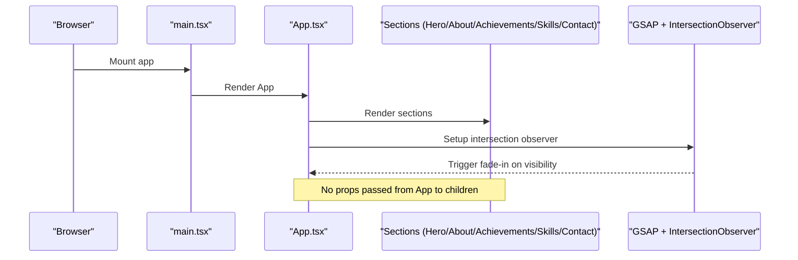
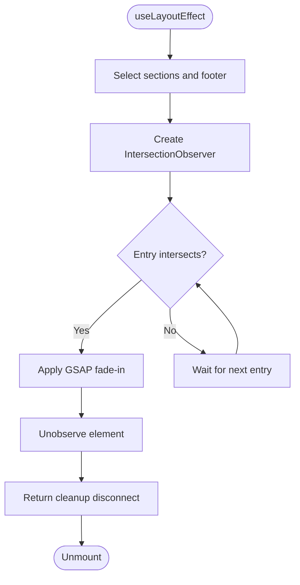
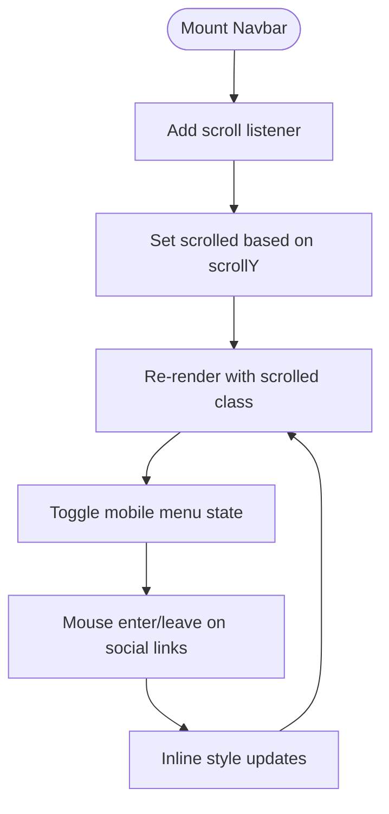
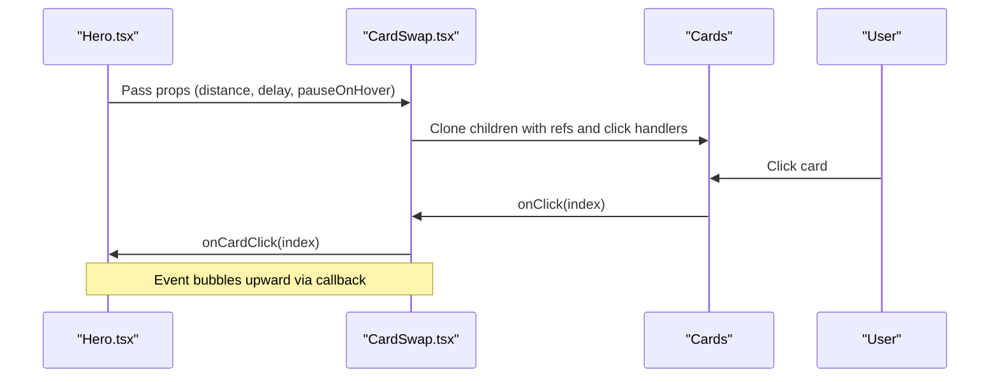
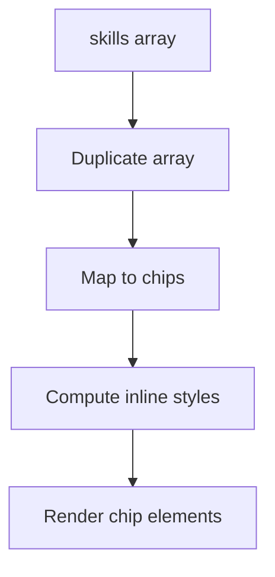
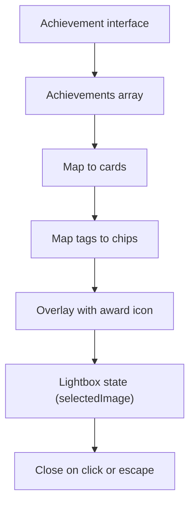
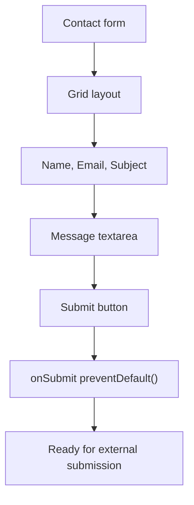
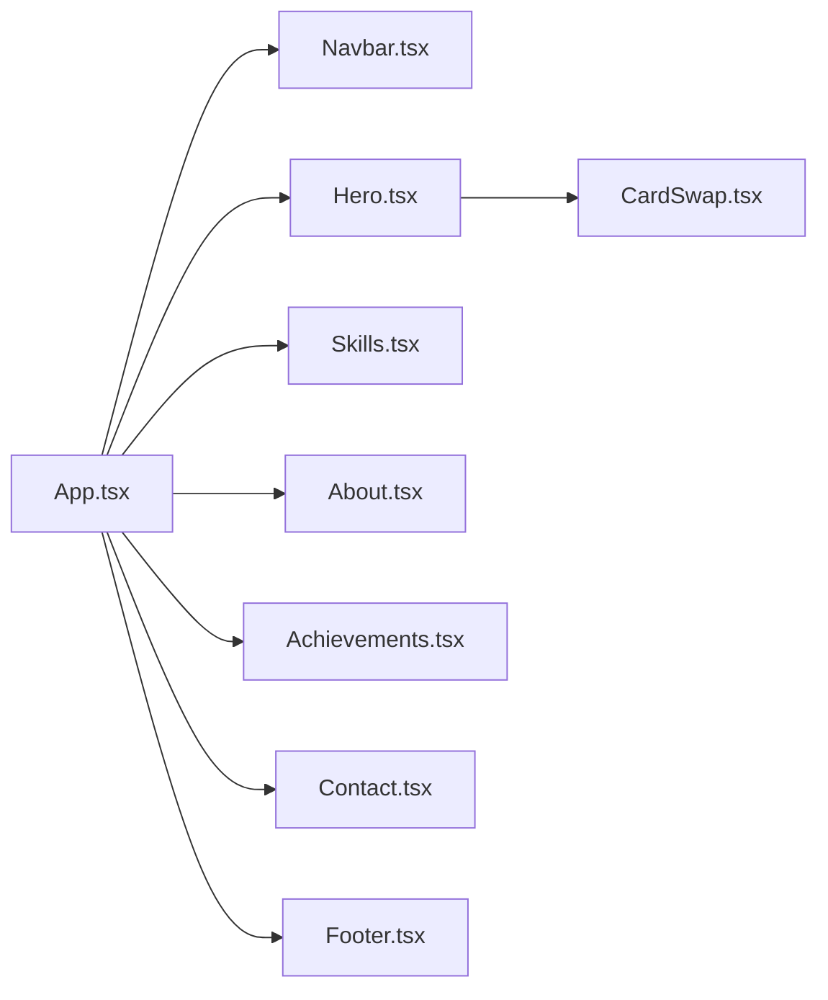

# Data Flow Patterns

<cite>
**Referenced Files in This Document**
- [main.tsx](file://src/main.tsx)
- [App.tsx](file://src/App.tsx)
- [Navbar.tsx](file://src/components/Navbar.tsx)
- [Hero.tsx](file://src/components/Hero.tsx)
- [About.tsx](file://src/components/About.tsx)
- [Achievements.tsx](file://src/components/Achievements.tsx)
- [Skills.tsx](file://src/components/Skills.tsx)
- [Contact.tsx](file://src/components/Contact.tsx)
- [Footer.tsx](file://src/components/Footer.tsx)
- [CardSwap.tsx](file://src/components/CardSwap.tsx)
- [index.css](file://src/index.css)
- [App.css](file://src/App.css)
</cite>

## Table of Contents
1. [Introduction](#introduction)
2. [Project Structure](#project-structure)
3. [Core Components](#core-components)
4. [Architecture Overview](#architecture-overview)
5. [Detailed Component Analysis](#detailed-component-analysis)
6. [Dependency Analysis](#dependency-analysis)
7. [Performance Considerations](#performance-considerations)
8. [Troubleshooting Guide](#troubleshooting-guide)
9. [Conclusion](#conclusion)

## Introduction
This document explains the data flow architecture and state management patterns of the portfolio website. It focuses on how data propagates through the component hierarchy, how props are passed from the root App component to child components, and how local state is managed within individual components. Special attention is given to:
- Prop drilling patterns from App.tsx to child components
- Skill data structure and rendering pipeline
- Achievement data management and nested object handling for certificate display
- Navigation data flow and scroll-position coordination
- Form data handling patterns for contact functionality
- Event propagation cascading through the component hierarchy
- Data validation, type safety with TypeScript interfaces, and state management best practices

## Project Structure
The application follows a straightforward component-driven architecture with a single root entry point. The App component orchestrates the page sections and passes no props downward; most data is embedded locally within components. Styling is centralized via Tailwind and CSS variables for theme consistency.

**Diagram sources**
- [main.tsx:7-11](file://src/main.tsx#L7-L11)
- [App.tsx:44-58](file://src/App.tsx#L44-L58)
- [Hero.tsx:43-73](file://src/components/Hero.tsx#L43-L73)
- [CardSwap.tsx:63-227](file://src/components/CardSwap.tsx#L63-L227)

**Section sources**
- [main.tsx:1-12](file://src/main.tsx#L1-L12)
- [App.tsx:12-62](file://src/App.tsx#L12-L62)

## Core Components
This section outlines the primary components and their roles in the data flow:

- App.tsx: Orchestrates page sections and applies scroll-triggered animations using IntersectionObserver and GSAP. It does not pass props to children; animations are configured via DOM selectors.
- Navbar.tsx: Renders navigation links with local state for scroll-aware styling and mobile menu toggling.
- Hero.tsx: Presents hero content and hosts the animated CardSwap carousel.
- Skills.tsx: Renders a static skills list with a duplicated marquee for seamless looping.
- About.tsx: Displays static biographical content and feature highlights.
- Achievements.tsx: Manages local state for certificate lightbox display and renders nested arrays of tags.
- Contact.tsx: Provides static contact information and a form with controlled input placeholders.
- Footer.tsx: Renders static footer content.

Key data flow characteristics:
- Props: Minimal prop passing; most data is embedded within components.
- Local state: Used selectively (e.g., Navbar scroll state, Achievements lightbox).
- Event propagation: Click handlers and hover effects propagate through the component tree.

**Section sources**
- [App.tsx:12-62](file://src/App.tsx#L12-L62)
- [Navbar.tsx:11-51](file://src/components/Navbar.tsx#L11-L51)
- [Hero.tsx:4-84](file://src/components/Hero.tsx#L4-L84)
- [Skills.tsx:1-55](file://src/components/Skills.tsx#L1-L55)
- [About.tsx:1-124](file://src/components/About.tsx#L1-L124)
- [Achievements.tsx:64-113](file://src/components/Achievements.tsx#L64-L113)
- [Contact.tsx:19-127](file://src/components/Contact.tsx#L19-L127)
- [Footer.tsx:1-30](file://src/components/Footer.tsx#L1-L30)

## Architecture Overview
The architecture is a unidirectional data flow with:
- Top-down rendering from App.tsx to child components
- Local state encapsulation within components that require it
- Event-driven interactions that bubble up and are handled at the nearest handler
- Static data embedded within components for simplicity and performance

**Diagram sources**
- [main.tsx:7-11](file://src/main.tsx#L7-L11)
- [App.tsx:13-42](file://src/App.tsx#L13-L42)

## Detailed Component Analysis

### App.tsx: Page Orchestration and Scroll Animations
- Uses useLayoutEffect to configure IntersectionObserver for fade-in animations on scroll.
- Selects DOM nodes with class selectors for sections and footer to apply GSAP transitions.
- Does not pass props to child components; relies on CSS class names and IDs for coordination.

**Diagram sources**
- [App.tsx:13-42](file://src/App.tsx#L13-L42)

**Section sources**
- [App.tsx:12-62](file://src/App.tsx#L12-L62)

### Navbar.tsx: Navigation Links and Local State
- Defines navLinks statically and renders anchor elements with href attributes.
- Maintains local state for scroll awareness and mobile menu toggle.
- Uses effect to listen to scroll events and update state accordingly.

**Diagram sources**
- [Navbar.tsx:11-51](file://src/components/Navbar.tsx#L11-L51)

**Section sources**
- [Navbar.tsx:11-51](file://src/components/Navbar.tsx#L11-L51)

### Hero.tsx and CardSwap.tsx: Carousel Animation and Event Propagation
- Hero renders CardSwap with several Card children and forwards props like distance and timing.
- CardSwap manages internal animation timelines with GSAP, handles hover pausing, and exposes onCardClick callback.
- Events propagate from CardSwap to parent components through callbacks.

**Diagram sources**
- [Hero.tsx:43-73](file://src/components/Hero.tsx#L43-L73)
- [CardSwap.tsx:63-227](file://src/components/CardSwap.tsx#L63-L227)

**Section sources**
- [Hero.tsx:4-84](file://src/components/Hero.tsx#L4-L84)
- [CardSwap.tsx:17-26](file://src/components/CardSwap.tsx#L17-L26)
- [CardSwap.tsx:63-227](file://src/components/CardSwap.tsx#L63-L227)

### Skills.tsx: Static Data Rendering Pipeline
- Declares a static skills array with name and color fields.
- Duplicates the array to create a seamless marquee effect.
- Renders chips with dynamic inline styles derived from data.

**Diagram sources**
- [Skills.tsx:1-55](file://src/components/Skills.tsx#L1-L55)

**Section sources**
- [Skills.tsx:1-55](file://src/components/Skills.tsx#L1-L55)

### Achievements.tsx: Nested Object Management and Lightbox State
- Defines an Achievement interface with nested fields: title, issuer, date, image, tags (string[]), description.
- Renders a grid of achievement cards with tag chips and overlay.
- Manages local state for selectedImage to show a lightbox modal.

**Diagram sources**
- [Achievements.tsx:4-11](file://src/components/Achievements.tsx#L4-L11)
- [Achievements.tsx:64-113](file://src/components/Achievements.tsx#L64-L113)

**Section sources**
- [Achievements.tsx:4-11](file://src/components/Achievements.tsx#L4-L11)
- [Achievements.tsx:64-113](file://src/components/Achievements.tsx#L64-L113)

### Contact.tsx: Form Data Handling Patterns
- Contains static contact links and social media quick links.
- Includes a form with controlled input placeholders (no bound state).
- Prevents default submission behavior to defer actual submission logic.

**Diagram sources**
- [Contact.tsx:19-127](file://src/components/Contact.tsx#L19-L127)

**Section sources**
- [Contact.tsx:19-127](file://src/components/Contact.tsx#L19-L127)

### About.tsx and Footer.tsx: Static Content Components
- About.tsx renders static content with icons and feature cards.
- Footer.tsx renders static social links and copyright text.

**Section sources**
- [About.tsx:1-124](file://src/components/About.tsx#L1-L124)
- [Footer.tsx:1-30](file://src/components/Footer.tsx#L1-L30)

## Dependency Analysis
The component dependencies are primarily import-time relationships with no runtime prop injection from App.tsx. Hero depends on CardSwap, which is self-contained with its own animation logic and event handling.

**Diagram sources**
- [App.tsx:3-9](file://src/App.tsx#L3-L9)
- [Hero.tsx:1-3](file://src/components/Hero.tsx#L1-L3)
- [CardSwap.tsx:1-10](file://src/components/CardSwap.tsx#L1-L10)

**Section sources**
- [App.tsx:3-9](file://src/App.tsx#L3-L9)
- [Hero.tsx:1-3](file://src/components/Hero.tsx#L1-L3)
- [CardSwap.tsx:1-10](file://src/components/CardSwap.tsx#L1-L10)

## Performance Considerations
- Static data rendering: Skills and About components render static lists without re-renders, minimizing unnecessary computations.
- Local state scope: Achievements and Navbar keep state localized, reducing cross-component coupling.
- Event delegation: Click handlers are attached at the card level and bubble up via callbacks, avoiding heavy event listener overhead.
- Animation strategy: GSAP animations are scoped to intersection events, limiting CPU usage to visible sections.

[No sources needed since this section provides general guidance]

## Troubleshooting Guide
Common issues and resolutions:
- Scroll animations not triggering: Verify section class names and IDs match the selectors used in the IntersectionObserver configuration.
- Lightbox not closing: Ensure the close button and overlay click handlers are present and that event.stopPropagation is used to prevent unintended closure.
- Form submission not working: Confirm that the form’s submit handler prevents default behavior and that external submission logic is wired appropriately.
- Hover effects not applying: Check inline style updates and ensure mouse enter/leave handlers are attached to interactive elements.

**Section sources**
- [App.tsx:13-42](file://src/App.tsx#L13-L42)
- [Achievements.tsx:103-111](file://src/components/Achievements.tsx#L103-L111)
- [Contact.tsx:98-123](file://src/components/Contact.tsx#L98-L123)
- [Navbar.tsx:81-88](file://src/components/Navbar.tsx#L81-L88)

## Conclusion
The portfolio website employs a clean, unidirectional data flow with minimal prop drilling. Data is largely static and embedded within components, while local state is used sparingly for UI interactions. Event propagation is handled through explicit callbacks and inline handlers, ensuring predictable behavior. Type safety is enforced via TypeScript interfaces for nested data structures, and styling is centralized through CSS variables and Tailwind utilities. This approach balances simplicity, performance, and maintainability.