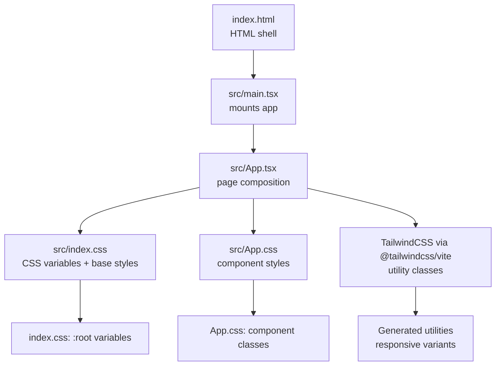
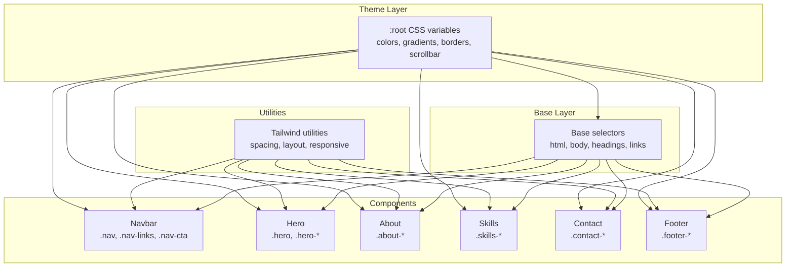
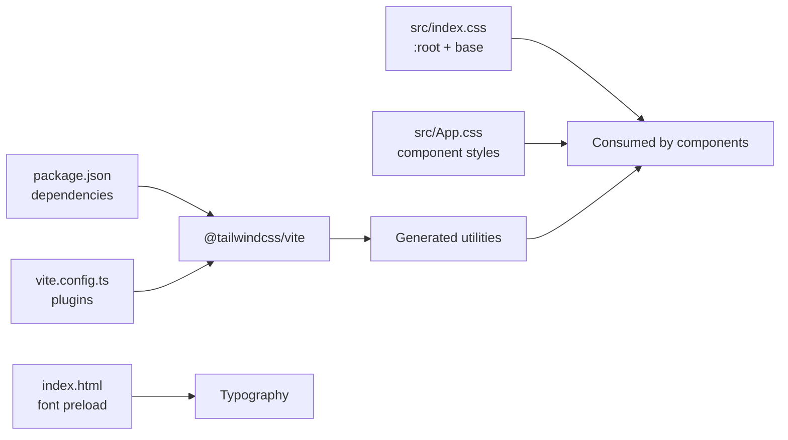

# Styling and Theming

<cite>
**Referenced Files in This Document**
- [index.css](file://src/index.css)
- [App.css](file://src/App.css)
- [index.html](file://index.html)
- [package.json](file://package.json)
- [vite.config.ts](file://vite.config.ts)
- [main.tsx](file://src/main.tsx)
- [App.tsx](file://src/App.tsx)
- [Navbar.tsx](file://src/components/Navbar.tsx)
- [Hero.tsx](file://src/components/Hero.tsx)
- [About.tsx](file://src/components/About.tsx)
- [Skills.tsx](file://src/components/Skills.tsx)
- [Contact.tsx](file://src/components/Contact.tsx)
- [Footer.tsx](file://src/components/Footer.tsx)
- [CardSwap.tsx](file://src/components/CardSwap.tsx)
</cite>

## Table of Contents
1. [Introduction](#introduction)
2. [Project Structure](#project-structure)
3. [Core Components](#core-components)
4. [Architecture Overview](#architecture-overview)
5. [Detailed Component Analysis](#detailed-component-analysis)
6. [Dependency Analysis](#dependency-analysis)
7. [Performance Considerations](#performance-considerations)
8. [Troubleshooting Guide](#troubleshooting-guide)
9. [Conclusion](#conclusion)

## Introduction
This document describes the styling and theming system of the portfolio website. It explains how CSS custom properties define a cohesive color scheme, typography, and spacing; how TailwindCSS is integrated via Vite; how global styles, component-specific styles, and utility classes collaborate; and how the dark theme is implemented using CSS variables and gradient schemes. It also documents responsive design patterns, accessibility considerations, and performance optimization strategies for CSS delivery.

## Project Structure
The styling system is organized around three pillars:
- Global baseline and theme variables in a single stylesheet
- Component-scoped styles in a dedicated stylesheet
- Utility-first layout and responsive helpers from TailwindCSS

**Diagram sources**
- [index.html:1-17](file://index.html#L1-L17)
- [main.tsx:1-12](file://src/main.tsx#L1-L12)
- [App.tsx:1-62](file://src/App.tsx#L1-L62)
- [index.css:1-87](file://src/index.css#L1-L87)
- [App.css:1-404](file://src/App.css#L1-L404)
- [vite.config.ts:1-9](file://vite.config.ts#L1-L9)
- [package.json:1-35](file://package.json#L1-L35)

**Section sources**
- [index.html:1-17](file://index.html#L1-L17)
- [main.tsx:1-12](file://src/main.tsx#L1-L12)
- [App.tsx:1-62](file://src/App.tsx#L1-L62)
- [index.css:1-87](file://src/index.css#L1-L87)
- [App.css:1-404](file://src/App.css#L1-L404)
- [vite.config.ts:1-9](file://vite.config.ts#L1-L9)
- [package.json:1-35](file://package.json#L1-L35)

## Core Components
- CSS custom properties in :root define the theme tokens for backgrounds, text, accents, gradients, borders, and scrollbars. These variables are consumed throughout the app to keep a consistent look-and-feel.
- TailwindCSS is configured via Vite and the official Tailwind plugin, enabling utility classes for responsive layouts, spacing, and interactive states.
- Component-specific styles live in a separate stylesheet and leverage CSS variables for dynamic theming and gradients for visual emphasis.
- Typography and spacing are standardized using CSS custom properties and clamp-based sizing for fluid responsiveness.

Key implementation anchors:
- Theme variables and base styles: [index.css:3-30](file://src/index.css#L3-L30)
- Component styles and responsive overrides: [App.css:1-404](file://src/App.css#L1-L404)
- Tailwind integration and plugin configuration: [vite.config.ts:1-9](file://vite.config.ts#L1-L9), [package.json:12-18](file://package.json#L12-L18)
- Font loading and viewport meta: [index.html:6-9](file://index.html#L6-L9)

**Section sources**
- [index.css:1-87](file://src/index.css#L1-L87)
- [App.css:1-404](file://src/App.css#L1-L404)
- [vite.config.ts:1-9](file://vite.config.ts#L1-L9)
- [package.json:12-18](file://package.json#L12-L18)
- [index.html:6-9](file://index.html#L6-L9)

## Architecture Overview
The styling architecture blends a dark theme foundation with utility-first layout and component-scoped visuals:

**Diagram sources**
- [index.css:3-30](file://src/index.css#L3-L30)
- [index.css:36-87](file://src/index.css#L36-L87)
- [App.css:1-404](file://src/App.css#L1-L404)
- [Navbar.tsx:21-50](file://src/components/Navbar.tsx#L21-L50)
- [Hero.tsx:4-80](file://src/components/Hero.tsx#L4-L80)
- [About.tsx:4-120](file://src/components/About.tsx#L4-L120)
- [Skills.tsx:20-52](file://src/components/Skills.tsx#L20-L52)
- [Contact.tsx:19-126](file://src/components/Contact.tsx#L19-L126)
- [Footer.tsx:3-26](file://src/components/Footer.tsx#L3-L26)

## Detailed Component Analysis

### Color Palette and Gradients
- Backgrounds: primary and secondary dark tones form the base layer; card backgrounds offer elevated surfaces with subtle borders.
- Text: headings use a bright accent tone; secondary text balances readability against the dark background.
- Accent: a vibrant purple hue and light/dark variants provide consistent highlights for links, buttons, and decorative elements.
- Gradients: three distinct linear gradients are defined and reused across logos, buttons, and text to create visual continuity.

Implementation references:
- Variables and gradients: [index.css:3-18](file://src/index.css#L3-L18)
- Links and selection: [index.css:56-69](file://src/index.css#L56-L69)
- Scrollbar styling: [index.css:71-86](file://src/index.css#L71-L86)
- Component usage of gradients and borders: [App.css:14-29](file://src/App.css#L14-L29), [App.css:68-70](file://src/App.css#L68-L70), [App.css:125-141](file://src/App.css#L125-L141), [App.css:224-227](file://src/App.css#L224-L227), [App.css:330-333](file://src/App.css#L330-L333), [App.css:354-365](file://src/App.css#L354-L365)

**Section sources**
- [index.css:3-18](file://src/index.css#L3-L18)
- [index.css:56-69](file://src/index.css#L56-L69)
- [index.css:71-86](file://src/index.css#L71-L86)
- [App.css:14-29](file://src/App.css#L14-L29)
- [App.css:68-70](file://src/App.css#L68-L70)
- [App.css:125-141](file://src/App.css#L125-L141)
- [App.css:224-227](file://src/App.css#L224-L227)
- [App.css:330-333](file://src/App.css#L330-L333)
- [App.css:354-365](file://src/App.css#L354-L365)

### Typography Hierarchy
- Base font stack and rendering optimizations are set at the root level.
- Headings receive a consistent color and weight treatment, while body copy uses a readable line height and secondary color.
- Fluid scaling is applied to headings and subtitles using clamp to ensure legibility across breakpoints.

References:
- Root font and rendering: [index.css:20-29](file://src/index.css#L20-L29)
- Headings: [index.css:50-54](file://src/index.css#L50-L54)
- Hero title and subtitle: [App.css:105-120](file://src/App.css#L105-L120)
- Section labels and titles: [App.css:158-177](file://src/App.css#L158-L177)

**Section sources**
- [index.css:20-29](file://src/index.css#L20-L29)
- [index.css:50-54](file://src/index.css#L50-L54)
- [App.css:105-120](file://src/App.css#L105-L120)
- [App.css:158-177](file://src/App.css#L158-L177)

### Spacing Conventions
- Consistent use of rem-based gutters and paddings across sections and components.
- Utilities from Tailwind are used alongside custom spacing to maintain rhythm and alignment.

References:
- Section padding and max widths: [App.css:158-161](file://src/App.css#L158-L161)
- Component spacing (buttons, stats, grids): [App.css:125-141](file://src/App.css#L125-L141), [App.css:197-212](file://src/App.css#L197-L212), [App.css:215-270](file://src/App.css#L215-L270)

**Section sources**
- [App.css:158-161](file://src/App.css#L158-L161)
- [App.css:125-141](file://src/App.css#L125-L141)
- [App.css:197-212](file://src/App.css#L197-L212)
- [App.css:215-270](file://src/App.css#L215-L270)

### Dark Theme Implementation
- The entire theme is built around a dark palette with carefully chosen contrast ratios for readability.
- CSS variables enable easy switching of colors at the root level; gradients are pre-defined for consistent brand expression.
- Interactive states (hover, focus) use accent colors and subtle shadows to reinforce depth without sacrificing legibility.

References:
- Root theme tokens: [index.css:3-18](file://src/index.css#L3-L18)
- Scrollbar glow and hover states: [index.css:71-86](file://src/index.css#L71-L86)
- Button and link hover effects: [App.css:125-141](file://src/App.css#L125-L141), [App.css:354-365](file://src/App.css#L354-L365)

**Section sources**
- [index.css:3-18](file://src/index.css#L3-L18)
- [index.css:71-86](file://src/index.css#L71-L86)
- [App.css:125-141](file://src/App.css#L125-L141)
- [App.css:354-365](file://src/App.css#L354-L365)

### Responsive Design Patterns
- Mobile-first approach: base styles target small screens; media queries layer enhancements for larger viewports.
- Breakpoint strategy: a single major breakpoint governs layout shifts for navigation, hero, grids, and contact sections.
- Fluid typography and flexible grids ensure content remains readable and balanced across devices.

References:
- Mobile-first base: [index.css:36-48](file://src/index.css#L36-L48)
- Major breakpoint: [App.css:392-403](file://src/App.css#L392-L403)
- Fluid headings and subtitles: [App.css:105-120](file://src/App.css#L105-L120), [App.css:171-177](file://src/App.css#L171-L177)

**Section sources**
- [index.css:36-48](file://src/index.css#L36-L48)
- [App.css:392-403](file://src/App.css#L392-L403)
- [App.css:105-120](file://src/App.css#L105-L120)
- [App.css:171-177](file://src/App.css#L171-L177)

### TailwindCSS Integration and Utility Classes
- TailwindCSS is enabled via the official Vite plugin and imported at the top of the global stylesheet.
- Utility classes are used extensively for responsive layouts, spacing, borders, and interactive states, complementing component-specific styles.

References:
- Tailwind import and plugin: [index.css:1](file://src/index.css#L1), [vite.config.ts:3](file://vite.config.ts#L3), [package.json:12-18](file://package.json#L12-L18)
- Utility usage in components: [Navbar.tsx:22](file://src/components/Navbar.tsx#L22), [Hero.tsx:13-39](file://src/components/Hero.tsx#L13-L39), [About.tsx:7-104](file://src/components/About.tsx#L7-L104), [Skills.tsx:24-50](file://src/components/Skills.tsx#L24-L50), [Contact.tsx:28-124](file://src/components/Contact.tsx#L28-L124), [Footer.tsx:4-25](file://src/components/Footer.tsx#L4-L25)

**Section sources**
- [index.css:1](file://src/index.css#L1)
- [vite.config.ts:3](file://vite.config.ts#L3)
- [package.json:12-18](file://package.json#L12-L18)
- [Navbar.tsx:22](file://src/components/Navbar.tsx#L22)
- [Hero.tsx:13-39](file://src/components/Hero.tsx#L13-L39)
- [About.tsx:7-104](file://src/components/About.tsx#L7-L104)
- [Skills.tsx:24-50](file://src/components/Skills.tsx#L24-L50)
- [Contact.tsx:28-124](file://src/components/Contact.tsx#L28-L124)
- [Footer.tsx:4-25](file://src/components/Footer.tsx#L4-L25)

### Component Styling Architecture
- Global baseline: root variables and base selectors establish fonts, colors, and defaults.
- Component classes: scoped styles encapsulate layout, colors, and animations per section.
- Utilities: Tailwind utilities handle responsive spacing, alignment, and interactive states.

References:
- Global baseline: [index.css:3-30](file://src/index.css#L3-L30), [index.css:36-87](file://src/index.css#L36-L87)
- Component classes: [App.css:1-404](file://src/App.css#L1-L404)
- Utilities: [Navbar.tsx:22](file://src/components/Navbar.tsx#L22), [Hero.tsx:13-39](file://src/components/Hero.tsx#L13-L39), [About.tsx:7-104](file://src/components/About.tsx#L7-L104), [Skills.tsx:24-50](file://src/components/Skills.tsx#L24-L50), [Contact.tsx:28-124](file://src/components/Contact.tsx#L28-L124), [Footer.tsx:4-25](file://src/components/Footer.tsx#L4-L25)

**Section sources**
- [index.css:3-30](file://src/index.css#L3-L30)
- [index.css:36-87](file://src/index.css#L36-L87)
- [App.css:1-404](file://src/App.css#L1-L404)
- [Navbar.tsx:22](file://src/components/Navbar.tsx#L22)
- [Hero.tsx:13-39](file://src/components/Hero.tsx#L13-L39)
- [About.tsx:7-104](file://src/components/About.tsx#L7-L104)
- [Skills.tsx:24-50](file://src/components/Skills.tsx#L24-L50)
- [Contact.tsx:28-124](file://src/components/Contact.tsx#L28-L124)
- [Footer.tsx:4-25](file://src/components/Footer.tsx#L4-L25)

### Accessibility Considerations
- Color contrast: The dark theme prioritizes sufficient contrast for text and interactive elements against the dark backgrounds.
- Focus states: Inputs and buttons include visible focus rings and transitions to ensure keyboard navigation usability.
- Reduced motion: Animations are subtle and can be paused or reduced by users who prefer minimal motion.

References:
- Contrast and readability: [index.css:20-29](file://src/index.css#L20-L29)
- Focus styling: [App.css:354-356](file://src/App.css#L354-L356)
- Motion considerations: [App.tsx:13-42](file://src/App.tsx#L13-L42)

**Section sources**
- [index.css:20-29](file://src/index.css#L20-L29)
- [App.css:354-356](file://src/App.css#L354-L356)
- [App.tsx:13-42](file://src/App.tsx#L13-L42)

## Dependency Analysis
The styling pipeline depends on:
- TailwindCSS plugin for Vite to generate utilities
- Global CSS variables for theme tokens
- Component styles for layout and visual behavior
- Font loading for typography

**Diagram sources**
- [package.json:12-18](file://package.json#L12-L18)
- [vite.config.ts:3](file://vite.config.ts#L3)
- [index.css:1](file://src/index.css#L1)
- [App.css:1](file://src/App.css#L1)
- [index.html:7-9](file://index.html#L7-L9)

**Section sources**
- [package.json:12-18](file://package.json#L12-L18)
- [vite.config.ts:3](file://vite.config.ts#L3)
- [index.css:1](file://src/index.css#L1)
- [App.css:1](file://src/App.css#L1)
- [index.html:7-9](file://index.html#L7-L9)

## Performance Considerations
- Single global stylesheet: Consolidating theme variables and base styles reduces HTTP requests.
- Tailwind purging: Configure Tailwind to remove unused utilities in production builds to minimize CSS size.
- Font optimization: Preconnecting fonts and using system font stacks improves First Contentful Paint.
- Minimize repaints: Prefer transform and opacity for animations; avoid layout-affecting properties.
- CSS variable usage: Centralized theming avoids duplication and enables efficient updates.

[No sources needed since this section provides general guidance]

## Troubleshooting Guide
- Theme inconsistencies: Verify that component classes consume CSS variables and that :root variables are defined before usage.
- Responsive issues: Confirm media queries are placed after base styles and that Tailwind utilities are not overriding critical styles unintentionally.
- Animation performance: Ensure hardware-accelerated properties are used for smoother transitions and consider pausing animations on low-power devices.
- Accessibility regressions: Test color contrast ratios and keyboard navigation after adding new interactive elements.

[No sources needed since this section provides general guidance]

## Conclusion
The portfolio’s styling system combines a robust CSS custom property theme, TailwindCSS utilities, and component-scoped styles to deliver a cohesive, accessible, and performant design. The dark theme leverages carefully curated gradients and contrast ratios, while mobile-first responsive patterns and fluid typography ensure adaptability across devices. By centralizing theme tokens and integrating Tailwind via Vite, the system remains maintainable and scalable.