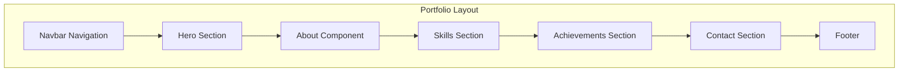
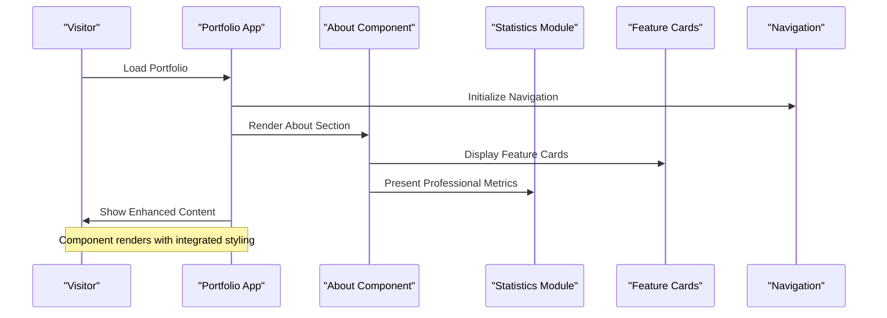
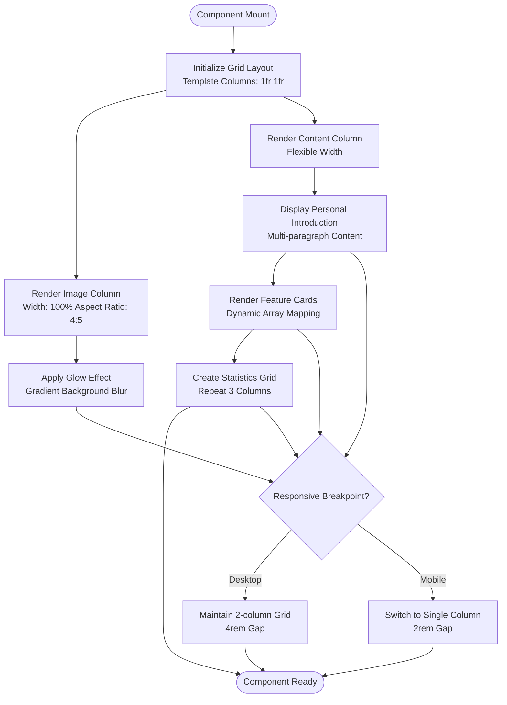
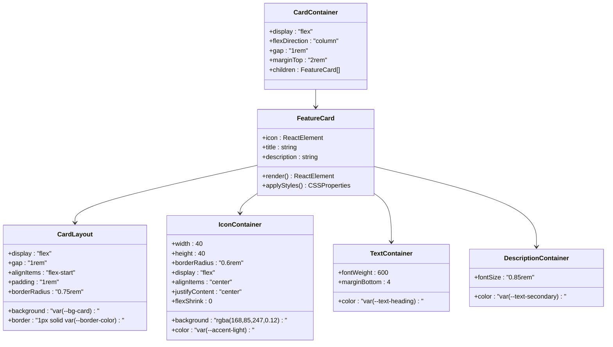
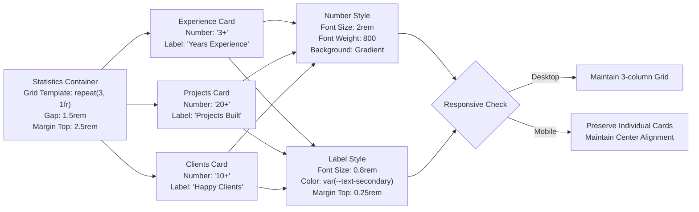
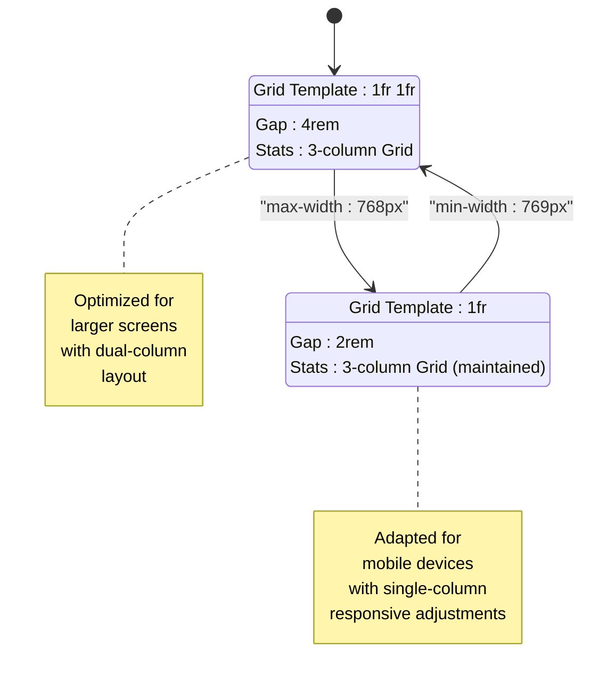
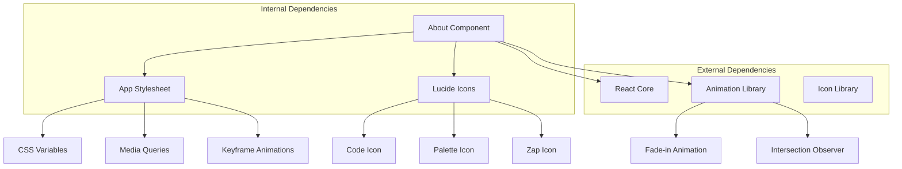

# About Component

<cite>
**Referenced Files in This Document**
- [About.tsx](file://src/components/About.tsx)
- [App.tsx](file://src/App.tsx)
- [App.css](file://src/App.css)
- [Navbar.tsx](file://src/components/Navbar.tsx)
- [Skills.tsx](file://src/components/Skills.tsx)
- [Achievements.tsx](file://src/components/Achievements.tsx)
</cite>

## Table of Contents
1. [Introduction](#introduction)
2. [Project Structure](#project-structure)
3. [Core Components](#core-components)
4. [Architecture Overview](#architecture-overview)
5. [Detailed Component Analysis](#detailed-component-analysis)
6. [Dependency Analysis](#dependency-analysis)
7. [Performance Considerations](#performance-considerations)
8. [Troubleshooting Guide](#troubleshooting-guide)
9. [Conclusion](#conclusion)

## Introduction
The About component serves as the cornerstone of personal branding within the portfolio, presenting a compelling narrative of professional identity while showcasing key competencies and achievements. This component establishes the foundation for visitor engagement by combining personal introduction content with structured feature presentations and quantifiable professional statistics. Through its strategic layout and design patterns, the About component transforms raw professional information into a cohesive storytelling experience that communicates expertise, personality, and value proposition to potential clients and collaborators.

The component's dual-purpose design addresses both emotional connection and rational evaluation—first capturing attention through a compelling personal story, then reinforcing credibility through measurable accomplishments and technical capabilities. This balance ensures visitors not only feel connected to the professional's personality but also understand their technical competence and track record.

## Project Structure
The About component integrates seamlessly within the portfolio's modular architecture, positioned strategically between the Hero and Skills sections to create a natural narrative flow. The component follows a grid-based layout system that adapts responsively across device sizes, ensuring optimal presentation of personal content alongside professional statistics.

**Diagram sources**
- [App.tsx:44-58](file://src/App.tsx#L44-L58)
- [Navbar.tsx:4-9](file://src/components/Navbar.tsx#L4-L9)

The component utilizes a CSS Grid layout system that divides the content area into two primary columns: a prominent image and profile area, complemented by a detailed content section containing personal introduction, feature cards, and professional statistics. This structure ensures visual hierarchy while maintaining content flexibility for future enhancements.

**Section sources**
- [About.tsx:5-120](file://src/components/About.tsx#L5-L120)
- [App.css:179-213](file://src/App.css#L179-L213)

## Core Components
The About component consists of three primary structural elements that work together to establish professional identity and communicate value effectively.

### Personal Introduction Area
The left-side column houses the visual representation and basic professional information, featuring a stylized avatar placeholder with gradient background, professional title, and brief positioning statement. This area establishes immediate visual recognition and professional context, utilizing the portfolio's established design language with gradient accents and subtle glow effects.

### Feature Cards System
The central content area presents three specialized feature cards that encapsulate core professional competencies. Each card combines a relevant icon, descriptive title, and explanatory text to communicate specific skill areas and value propositions. The implementation uses a dynamic mapping approach that allows for easy modification and extension of feature offerings.

### Professional Statistics Display
The statistics section provides quantifiable evidence of professional capability through three key metrics: years of experience, projects completed, and satisfied clients. This numerical approach reinforces credibility and demonstrates proven track record in delivering successful outcomes.

**Section sources**
- [About.tsx:8-119](file://src/components/About.tsx#L8-L119)
- [App.css:197-211](file://src/App.css#L197-L211)

## Architecture Overview
The About component operates within a broader portfolio architecture that emphasizes smooth transitions, consistent styling, and responsive design patterns. Its integration with surrounding components creates a cohesive user experience that guides visitors through a logical narrative flow from discovery to engagement.

**Diagram sources**
- [App.tsx:12-62](file://src/App.tsx#L12-L62)
- [About.tsx:3-124](file://src/components/About.tsx#L3-L124)

The component's architecture leverages React's composition patterns while maintaining strict separation of concerns between presentation, styling, and interactive elements. This approach ensures maintainability and scalability as the portfolio evolves.

**Section sources**
- [App.tsx:44-58](file://src/App.tsx#L44-L58)
- [About.tsx:1-124](file://src/components/About.tsx#L1-L124)

## Detailed Component Analysis

### Layout Structure and Grid System
The About component employs a sophisticated CSS Grid layout that optimally distributes content across desktop and mobile form factors. The grid system utilizes flexible column ratios and adaptive spacing to ensure content readability and visual appeal across all devices.

**Diagram sources**
- [About.tsx:7-104](file://src/components/About.tsx#L7-L104)
- [App.css:180-183](file://src/App.css#L180-L183)

The layout system incorporates advanced CSS techniques including aspect-ratio calculations, gradient backgrounds, and blur effects to create depth and visual interest. These implementations demonstrate modern web design practices while maintaining performance optimization.

**Section sources**
- [About.tsx:7-104](file://src/components/About.tsx#L7-L104)
- [App.css:180-196](file://src/App.css#L180-L196)

### Feature Cards Implementation
The feature cards system represents a sophisticated implementation of dynamic content rendering that balances visual appeal with functional effectiveness. Each card encapsulates a specific professional competency through a standardized structure that promotes consistency and scalability.

**Diagram sources**
- [About.tsx:59-102](file://src/components/About.tsx#L59-L102)

The implementation utilizes React's mapping functionality to iterate over predefined feature data, dynamically generating card components with consistent styling and behavior. This approach enables easy modification of feature offerings without altering the underlying component structure.

**Section sources**
- [About.tsx:59-102](file://src/components/About.tsx#L59-L102)

### Professional Statistics Display
The statistics module provides quantifiable evidence of professional capability through a carefully designed grid system that emphasizes key metrics while maintaining visual balance. Each statistic card combines numerical data with descriptive labeling to communicate professional achievements effectively.

**Diagram sources**
- [About.tsx:107-119](file://src/components/About.tsx#L107-L119)
- [App.css:197-211](file://src/App.css#L197-L211)

The statistics implementation leverages CSS Grid for responsive layout management while incorporating gradient text effects to enhance visual appeal. The modular design allows for easy addition or modification of statistical metrics without affecting the overall component structure.

**Section sources**
- [About.tsx:107-119](file://src/components/About.tsx#L107-L119)
- [App.css:197-211](file://src/App.css#L197-L211)

### Responsive Design Patterns
The About component implements comprehensive responsive design strategies that ensure optimal presentation across all device categories. The responsive architecture adapts the grid layout, typography scaling, and spacing adjustments based on viewport dimensions.

**Diagram sources**
- [App.css:392-403](file://src/App.css#L392-L403)

The responsive implementation utilizes CSS media queries to trigger layout modifications at specific breakpoints, ensuring content remains readable and visually appealing across all screen sizes. Typography scales appropriately using clamp functions, while spacing adjusts proportionally to maintain visual balance.

**Section sources**
- [App.css:392-403](file://src/App.css#L392-L403)

## Dependency Analysis
The About component maintains minimal external dependencies while leveraging essential libraries for enhanced functionality and user experience.

**Diagram sources**
- [About.tsx:1](file://src/components/About.tsx#L1)
- [App.tsx:1-62](file://src/App.tsx#L1-L62)

The component's dependency structure reflects a clean architectural approach that separates concerns between presentation, styling, and interaction logic. This separation facilitates testing, maintenance, and future enhancements while minimizing potential conflicts between components.

**Section sources**
- [About.tsx:1](file://src/components/About.tsx#L1)
- [App.tsx:1-62](file://src/App.tsx#L1-L62)

## Performance Considerations
The About component implements several performance optimization strategies that ensure efficient rendering and smooth user experience across various device configurations.

### Rendering Optimization
The component utilizes React's built-in optimization patterns through static content rendering and minimal state management. The feature cards and statistics sections employ array mapping with stable keys, reducing re-render cycles and improving update performance.

### CSS Performance
The styling implementation leverages CSS custom properties and hardware-accelerated animations to minimize layout thrashing and ensure smooth transitions. Gradient effects and blur filters utilize GPU acceleration where supported by browsers.

### Asset Management
The avatar placeholder uses inline styling rather than external images, eliminating additional HTTP requests and reducing page load times. This approach maintains visual consistency while optimizing performance.

## Troubleshooting Guide
Common issues and solutions for the About component implementation:

### Layout Issues
**Problem**: Content misalignment on smaller screens
**Solution**: Verify CSS media query breakpoints and ensure grid template adjustments are properly configured

**Problem**: Icon rendering inconsistencies
**Solution**: Confirm lucide-react library installation and verify icon component imports

### Styling Problems
**Problem**: Gradient effects not displaying correctly
**Solution**: Check CSS custom property definitions and browser compatibility for gradient support

**Problem**: Responsive grid not adapting properly
**Solution**: Validate media query syntax and ensure viewport meta tag is properly configured

### Performance Concerns
**Problem**: Slow initial render times
**Solution**: Consider lazy loading for heavy content or implementing skeleton loading states

**Problem**: Animation stuttering on mobile devices
**Solution**: Optimize animation properties and consider reduced motion preferences

**Section sources**
- [About.tsx:1-124](file://src/components/About.tsx#L1-L124)
- [App.css:179-403](file://src/App.css#L179-L403)

## Conclusion
The About component represents a masterful synthesis of personal branding and professional communication, establishing a strong foundation for portfolio identity while maintaining technical excellence. Through its thoughtful combination of visual elements, structured content presentation, and responsive design principles, the component successfully bridges the gap between personal connection and professional credibility.

The component's modular architecture ensures maintainability and scalability, while its integration with the broader portfolio ecosystem creates a cohesive user experience that guides visitors through a logical journey from discovery to engagement. The careful balance between aesthetic appeal and functional effectiveness demonstrates advanced web development practices that serve as a model for professional portfolio construction.

Future enhancements could include dynamic content loading, interactive elements, and expanded customization options while maintaining the component's core focus on clear communication of professional value and capabilities.