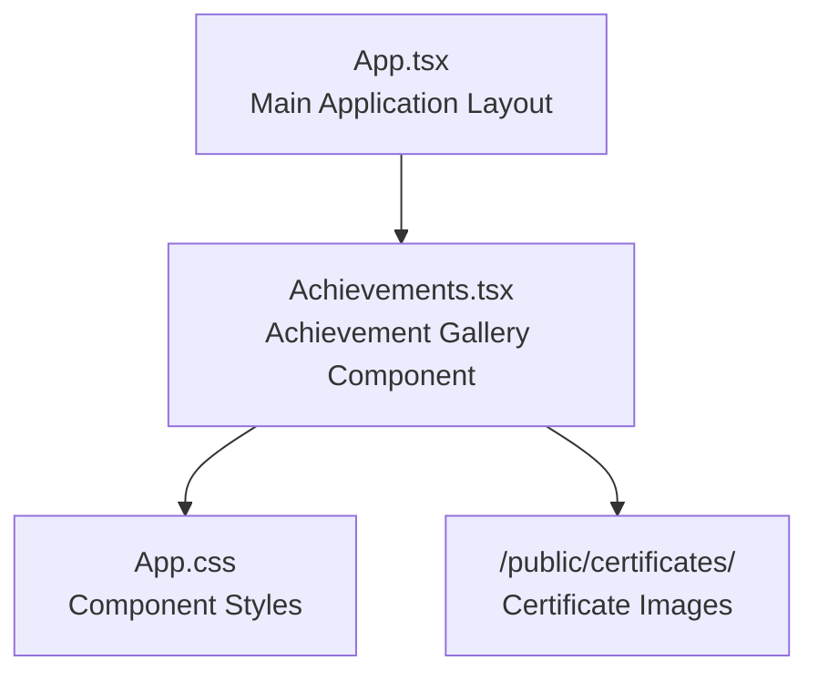
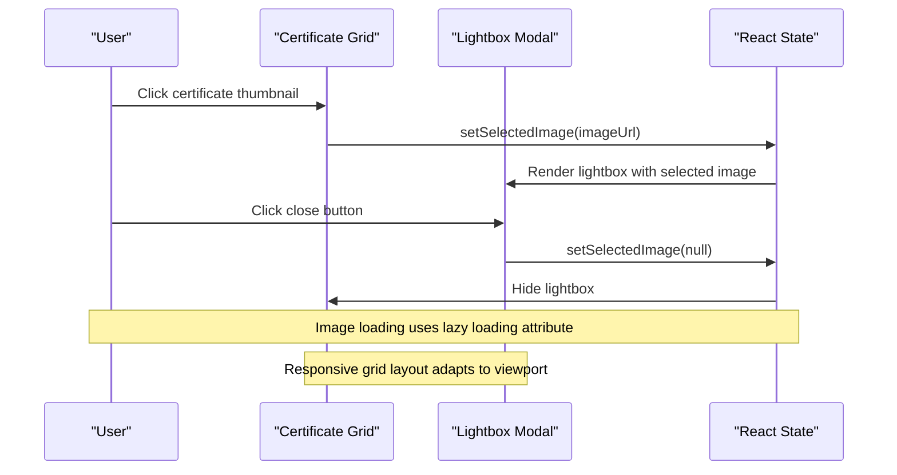
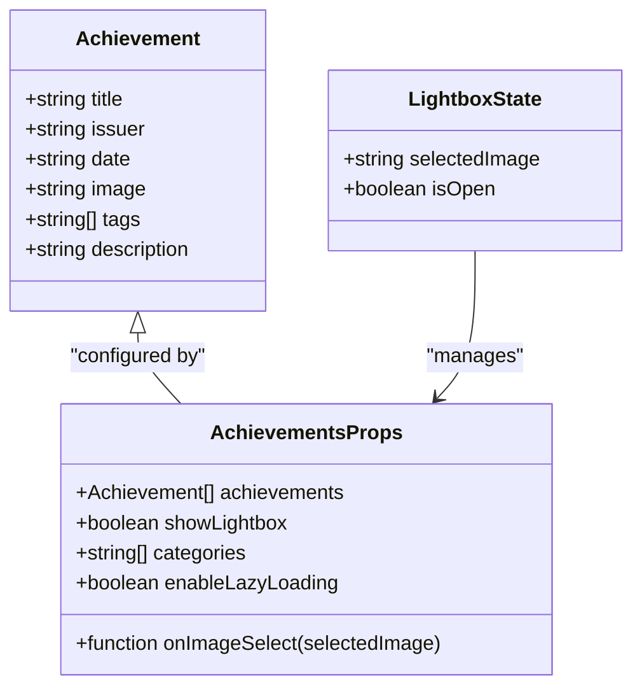
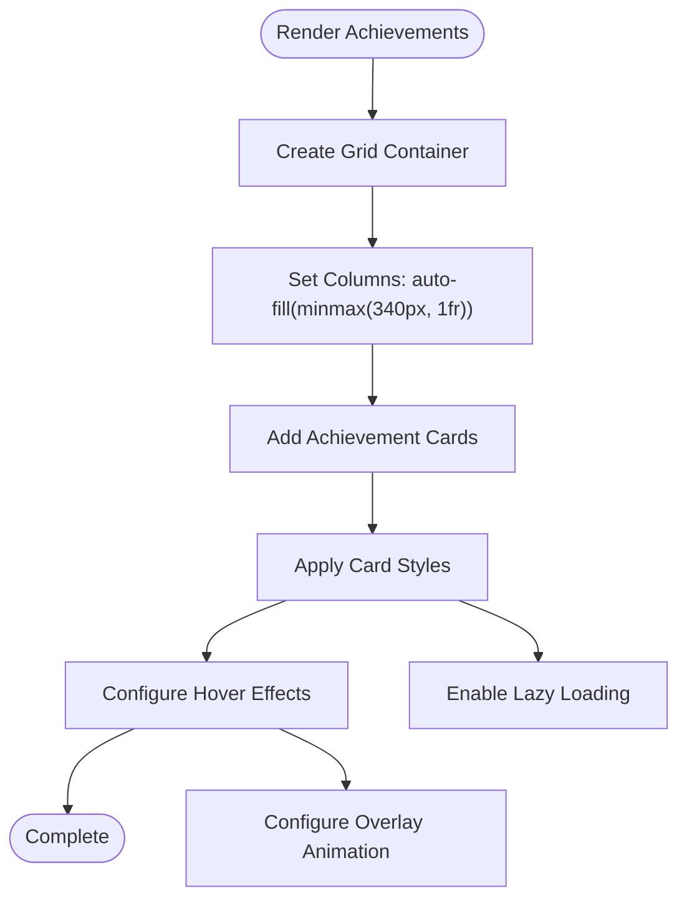
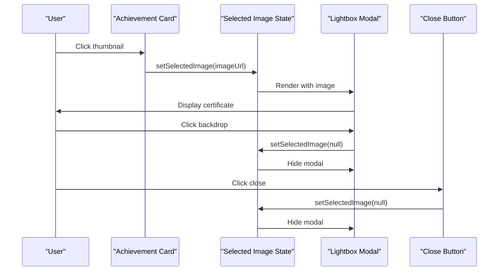
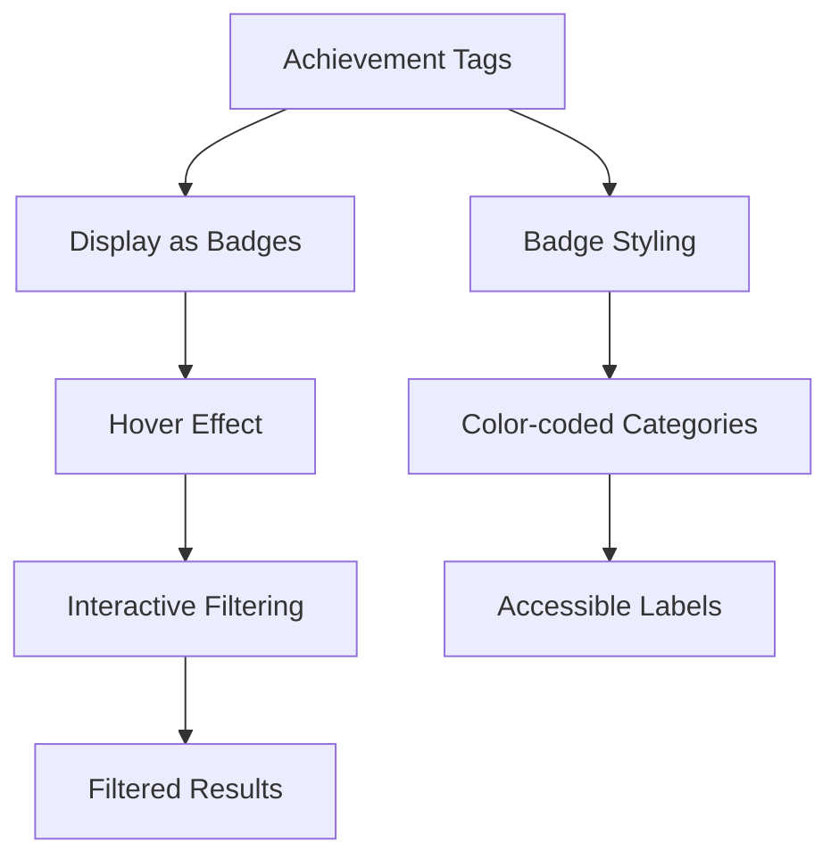
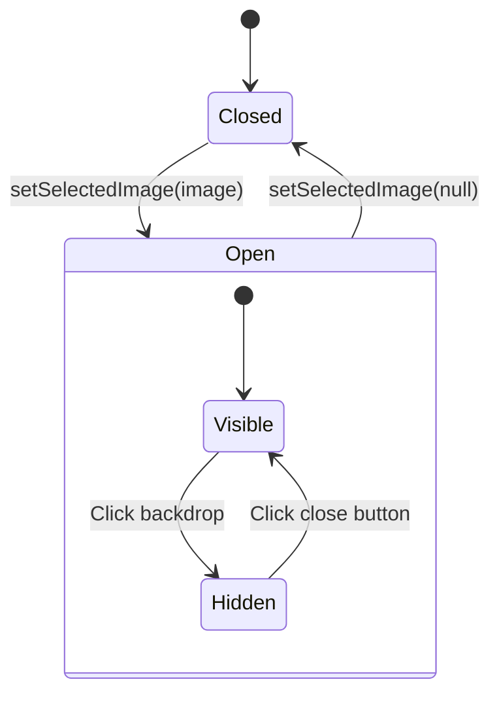
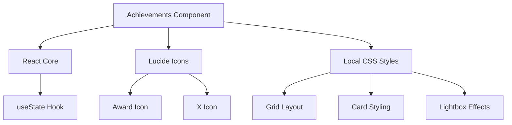

# Achievements Component

<cite>
**Referenced Files in This Document**
- [Achievements.tsx](file://src/components/Achievements.tsx)
- [App.css](file://src/App.css)
- [App.tsx](file://src/App.tsx)
</cite>

## Table of Contents
1. [Introduction](#introduction)
2. [Project Structure](#project-structure)
3. [Core Components](#core-components)
4. [Architecture Overview](#architecture-overview)
5. [Detailed Component Analysis](#detailed-component-analysis)
6. [Dependency Analysis](#dependency-analysis)
7. [Performance Considerations](#performance-considerations)
8. [Troubleshooting Guide](#troubleshooting-guide)
9. [Conclusion](#conclusion)
10. [Appendices](#appendices)

## Introduction
This document provides comprehensive documentation for the Achievements component responsible for displaying a certificate gallery and badge system. It covers the certificate grid display, lightbox modal functionality, tag-based categorization, state management for modal interactions, image loading optimizations, responsive grid layouts, props interface for adding certificates, category configuration, and modal customization. It also includes examples for organizing certificate collections, adding new achievements, implementing custom filtering systems, integrating with external certificate hosting, and accessibility features for image galleries.

## Project Structure
The Achievements component is implemented as a standalone React functional component with integrated CSS styling. It is rendered within the main application layout and styled using a dedicated CSS module.

**Diagram sources**
- [App.tsx:44-58](file://src/App.tsx#L44-L58)
- [Achievements.tsx:64-113](file://src/components/Achievements.tsx#L64-L113)
- [App.css:214-292](file://src/App.css#L214-L292)

**Section sources**
- [App.tsx:44-58](file://src/App.tsx#L44-L58)
- [Achievements.tsx:64-113](file://src/components/Achievements.tsx#L64-L113)
- [App.css:214-292](file://src/App.css#L214-L292)

## Core Components
The Achievements component consists of:
- Certificate grid display with hover effects and overlay actions
- Lightbox modal for expanded certificate viewing
- Tag-based categorization system for filtering and organization
- Responsive grid layout with automatic column sizing
- Lazy image loading for performance optimization

Key implementation patterns:
- State-driven modal management using React hooks
- CSS Grid for responsive certificate layout
- Hover-triggered overlay animations
- Click-to-expand lightbox functionality

**Section sources**
- [Achievements.tsx:4-11](file://src/components/Achievements.tsx#L4-L11)
- [Achievements.tsx:64-113](file://src/components/Achievements.tsx#L64-L113)
- [App.css:214-292](file://src/App.css#L214-L292)

## Architecture Overview
The component follows a unidirectional data flow pattern with local state management for modal interactions.

**Diagram sources**
- [Achievements.tsx:64-113](file://src/components/Achievements.tsx#L64-L113)
- [App.css:214-292](file://src/App.css#L214-L292)

## Detailed Component Analysis

### Props Interface and Data Model
The component currently uses a hardcoded dataset but follows a structured interface for achievement data:

**Diagram sources**
- [Achievements.tsx:4-11](file://src/components/Achievements.tsx#L4-L11)
- [Achievements.tsx:64-66](file://src/components/Achievements.tsx#L64-L66)

### Certificate Grid Display
The grid system utilizes CSS Grid with automatic column sizing:

**Diagram sources**
- [App.css:214-227](file://src/App.css#L214-L227)
- [App.css:228-250](file://src/App.css#L228-L250)

### Lightbox Modal Functionality
The lightbox modal provides an immersive viewing experience with controlled interactions:

**Diagram sources**
- [Achievements.tsx:64-113](file://src/components/Achievements.tsx#L64-L113)
- [App.css:272-292](file://src/App.css#L272-L292)

### Tag-Based Categorization System
The component implements a flexible tagging system for certificate organization:

**Diagram sources**
- [Achievements.tsx:88-97](file://src/components/Achievements.tsx#L88-L97)
- [App.css:253-258](file://src/App.css#L253-L258)

### State Management for Modal Interactions
The component uses React's useState hook for managing modal state:

**Diagram sources**
- [Achievements.tsx:64-66](file://src/components/Achievements.tsx#L64-L66)

**Section sources**
- [Achievements.tsx:4-11](file://src/components/Achievements.tsx#L4-L11)
- [Achievements.tsx:64-113](file://src/components/Achievements.tsx#L64-L113)
- [App.css:214-292](file://src/App.css#L214-L292)

## Dependency Analysis
The component has minimal external dependencies and follows a clean architecture pattern:

**Diagram sources**
- [Achievements.tsx:1-2](file://src/components/Achievements.tsx#L1-L2)
- [App.css:214-292](file://src/App.css#L214-L292)

**Section sources**
- [Achievements.tsx:1-2](file://src/components/Achievements.tsx#L1-L2)
- [App.css:214-292](file://src/App.css#L214-L292)

## Performance Considerations
The component implements several performance optimizations:

- **Lazy Image Loading**: Uses the `loading="lazy"` attribute for efficient image loading
- **CSS Grid Optimization**: Automatic column sizing reduces layout thrashing
- **Minimal Re-renders**: Single state variable controls modal visibility
- **Efficient Animations**: CSS transitions for hover effects and modal animations
- **Aspect Ratio Preservation**: Maintains consistent card dimensions

Best practices for optimization:
- Preload critical images using the `<link rel="preload">` technique
- Implement intersection observer for lazy loading additional images
- Use responsive image formats (WebP) for better compression
- Consider implementing virtual scrolling for large certificate collections

**Section sources**
- [Achievements.tsx:82](file://src/components/Achievements.tsx#L82)
- [App.css:214-227](file://src/App.css#L214-L227)

## Troubleshooting Guide
Common issues and solutions:

### Lightbox Not Closing
- **Issue**: Lightbox remains open after clicking outside
- **Solution**: Verify click handler prevents event propagation
- **Reference**: [Achievements.tsx:104-108](file://src/components/Achievements.tsx#L104-L108)

### Images Not Loading
- **Issue**: Certificate images fail to load
- **Solution**: Check image paths and ensure files exist in `/public/certificates/`
- **Reference**: [Achievements.tsx:18, 26, 34, 42, 50, 58](file://src/components/Achievements.tsx#L18,L26,L34,L42,L50,L58)

### Grid Layout Issues
- **Issue**: Cards not resizing properly on mobile
- **Solution**: Verify responsive CSS media queries
- **Reference**: [App.css:392-403](file://src/App.css#L392-L403)

### Hover Effects Not Working
- **Issue**: Overlay animations not triggering
- **Solution**: Check CSS hover selectors and z-index stacking
- **Reference**: [App.css:240-250](file://src/App.css#L240-L250)

**Section sources**
- [Achievements.tsx:104-108](file://src/components/Achievements.tsx#L104-L108)
- [Achievements.tsx:18, 26, 34, 42, 50, 58](file://src/components/Achievements.tsx#L18,L26,L34,L42,L50,L58)
- [App.css:392-403](file://src/App.css#L392-L403)
- [App.css:240-250](file://src/App.css#L240-L250)

## Conclusion
The Achievements component provides a robust foundation for displaying certificate collections with modern web practices. Its clean architecture, performance optimizations, and responsive design make it suitable for portfolio websites and professional showcases. The component's modular design allows for easy extension with additional features like filtering, pagination, and external integration capabilities.

## Appendices

### Props Interface Reference
Current implementation uses a hardcoded dataset with the following structure:

| Property | Type | Description |
|----------|------|-------------|
| title | string | Certificate title/name |
| issuer | string | Organization that issued the certificate |
| date | string | Issue date or completion date |
| image | string | Path to certificate image |
| tags | string[] | Category tags for filtering |
| description | string | Detailed description of achievement |

### Integration Examples

#### Adding New Certificates
To add new certificates, extend the existing dataset with additional achievement objects following the established interface pattern.

#### Custom Filtering Implementation
Implement category-based filtering by:
1. Creating a filter state variable
2. Adding category selection UI
3. Filtering the achievement array based on selected categories
4. Updating the grid rendering logic

#### External Hosting Integration
For external certificate hosting:
1. Replace local image paths with remote URLs
2. Implement error handling for failed image loads
3. Add loading placeholders for better UX
4. Consider implementing CDN caching strategies

#### Accessibility Features
Current accessibility considerations:
- Proper alt text for all images
- Keyboard navigation support
- Screen reader friendly labels
- Sufficient color contrast ratios
- Focus management for modal interactions

Future enhancements could include ARIA attributes, keyboard shortcuts, and improved screen reader announcements.

**Section sources**
- [Achievements.tsx:4-11](file://src/components/Achievements.tsx#L4-L11)
- [Achievements.tsx:13-62](file://src/components/Achievements.tsx#L13-L62)