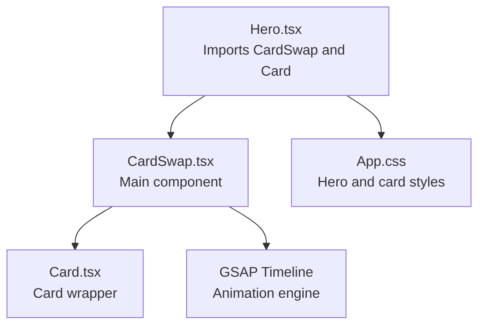
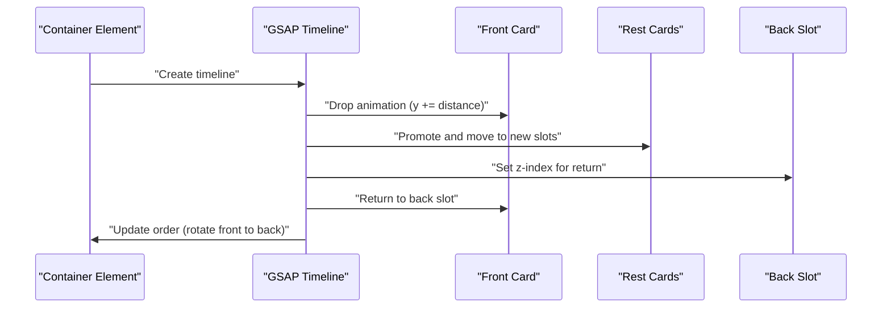
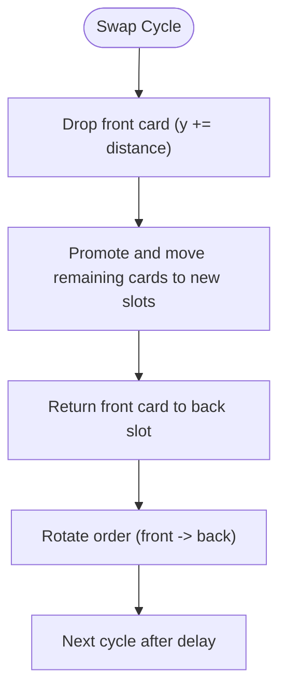
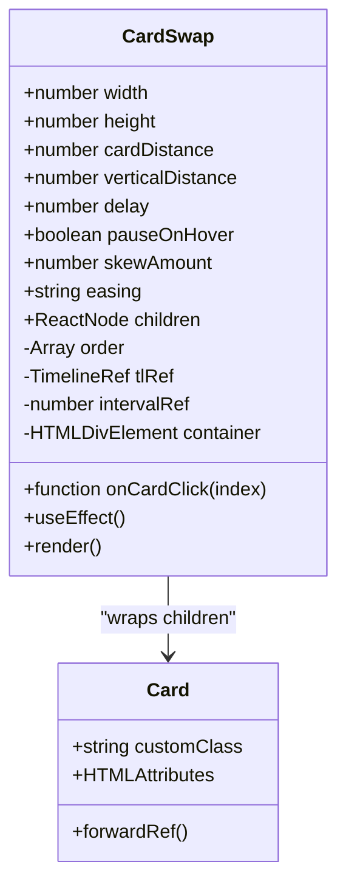
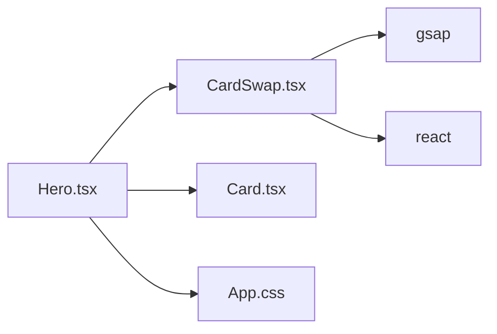

# CardSwap Component

<cite>
**Referenced Files in This Document**
- [CardSwap.tsx](file://src/components/CardSwap.tsx)
- [Hero.tsx](file://src/components/Hero.tsx)
- [App.css](file://src/App.css)
- [package.json](file://package.json)
</cite>

## Table of Contents
1. [Introduction](#introduction)
2. [Project Structure](#project-structure)
3. [Core Components](#core-components)
4. [Architecture Overview](#architecture-overview)
5. [Detailed Component Analysis](#detailed-component-analysis)
6. [Dependency Analysis](#dependency-analysis)
7. [Performance Considerations](#performance-considerations)
8. [Troubleshooting Guide](#troubleshooting-guide)
9. [Conclusion](#conclusion)
10. [Appendices](#appendices)

## Introduction
The CardSwap component is a sophisticated 3D animated card carousel designed to deliver smooth, visually appealing transitions using GSAP timelines. It positions multiple cards in 3D space with precise transforms, manages an automatic rotation loop, and integrates seamlessly into the Hero section to enhance visual appeal. The component exposes a flexible props interface for customization, including animation timing, easing modes, hover behavior, and card styling hooks.

## Project Structure
The CardSwap component resides under the components directory alongside other UI building blocks. It is integrated into the Hero section to showcase animated cards on the right side of the hero layout. Tailwind utility classes and custom CSS define responsive positioning and card visuals.

**Diagram sources**
- [Hero.tsx:1-84](file://src/components/Hero.tsx#L1-L84)
- [CardSwap.tsx:1-230](file://src/components/CardSwap.tsx#L1-L230)
- [App.css:31-70](file://src/App.css#L31-L70)

**Section sources**
- [Hero.tsx:1-84](file://src/components/Hero.tsx#L1-L84)
- [CardSwap.tsx:1-230](file://src/components/CardSwap.tsx#L1-L230)
- [App.css:31-70](file://src/App.css#L31-L70)

## Core Components
- CardSwap: Orchestrates the 3D card animation loop, manages GSAP timelines, and handles automatic rotation and hover pausing.
- Card: A lightweight wrapper around HTML divs that applies 3D-related CSS classes and preserves 3D context for transforms.

Key capabilities:
- 3D transformations using GSAP set and to tweens with x, y, z coordinates and skew.
- Automatic rotation with configurable delay and easing mode.
- Hover pause/resume behavior for enhanced UX.
- Click event propagation to underlying cards and a global onCardClick callback.
- Responsive sizing and perspective-based positioning.

**Section sources**
- [CardSwap.tsx:13-26](file://src/components/CardSwap.tsx#L13-L26)
- [CardSwap.tsx:50-61](file://src/components/CardSwap.tsx#L50-L61)
- [CardSwap.tsx:106-202](file://src/components/CardSwap.tsx#L106-L202)

## Architecture Overview
The component architecture centers on a GSAP-driven timeline that sequences three phases per cycle: drop, promote/move, and return. Cards are positioned in 3D space using helper functions and placed with GSAP.set. The component maintains an internal order array to rotate the front card and updates z-indexes to ensure proper stacking during animations.

**Diagram sources**
- [CardSwap.tsx:116-177](file://src/components/CardSwap.tsx#L116-L177)

## Detailed Component Analysis

### Props Interface and Defaults
The CardSwap component accepts the following props:
- width: Number; default 500
- height: Number; default 400
- cardDistance: Number; default 60
- verticalDistance: Number; default 70
- delay: Number; default 2000
- pauseOnHover: Boolean; default false
- onCardClick: Function; receives index
- skewAmount: Number; default 6
- easing: Enum 'elastic' | 'smooth'; default 'elastic'
- children: React.ReactNode

These props control:
- Layout and spacing (width, height, cardDistance, verticalDistance)
- Timing and pacing (delay, easing)
- Interaction behavior (pauseOnHover, onCardClick)
- Visual skew for depth perception (skewAmount)

**Section sources**
- [CardSwap.tsx:50-61](file://src/components/CardSwap.tsx#L50-L61)
- [CardSwap.tsx:63-74](file://src/components/CardSwap.tsx#L63-L74)

### 3D Transformation Techniques
- Perspective container: The parent element sets a perspective for 3D depth.
- Preserve-3d: Cards use preserve-3d to maintain 3D context for child transforms.
- Will-change and force3D: Optimizations to improve GPU acceleration.
- Backface-visibility: Hidden to prevent flickering during flips.
- GSAP.set: Positions cards in 3D space using x, y, z coordinates and skew.
- Skew effect: Adds perceived depth and dynamic feel.

**Section sources**
- [CardSwap.tsx:18-26](file://src/components/CardSwap.tsx#L18-L26)
- [CardSwap.tsx:36-47](file://src/components/CardSwap.tsx#L36-L47)
- [CardSwap.tsx:221](file://src/components/CardSwap.tsx#L221)

### GSAP Timeline Integration
- Configurations: Two easing modes define durations and overlaps for drop, move, and return phases.
- Timeline creation: A new timeline is created per swap cycle.
- Labels and offsets: Promote and return labels coordinate overlapping animations.
- Callbacks: z-index adjustments and order updates occur at precise timeline moments.

**Diagram sources**
- [CardSwap.tsx:75-92](file://src/components/CardSwap.tsx#L75-L92)
- [CardSwap.tsx:116-177](file://src/components/CardSwap.tsx#L116-L177)

**Section sources**
- [CardSwap.tsx:75-92](file://src/components/CardSwap.tsx#L75-L92)
- [CardSwap.tsx:116-177](file://src/components/CardSwap.tsx#L116-L177)

### Animation State Management
- Internal order: Tracks the current front card index and rotates it each cycle.
- Timeline reference: Stores the current GSAP timeline for pause/resume.
- Interval reference: Manages the automatic rotation loop.
- Hover handling: Pauses the timeline and clears intervals on mouse enter, resumes on mouse leave.

**Section sources**
- [CardSwap.tsx:101-104](file://src/components/CardSwap.tsx#L101-L104)
- [CardSwap.tsx:182-199](file://src/components/CardSwap.tsx#L182-L199)

### Automatic Card Rotation
- Initial placement: Cards are positioned immediately upon mount using GSAP.set.
- Loop scheduling: A setInterval triggers the swap function at the configured delay.
- Dynamic updates: The effect re-runs when key props change, recalculating placements and restarting the loop.

**Section sources**
- [CardSwap.tsx:106-114](file://src/components/CardSwap.tsx#L106-L114)
- [CardSwap.tsx:179-180](file://src/components/CardSwap.tsx#L179-L180)
- [CardSwap.tsx:202](file://src/components/CardSwap.tsx#L202)

### Integration into the Hero Section
The Hero component demonstrates how to integrate CardSwap:
- Passes configuration props such as cardDistance, verticalDistance, delay, and pauseOnHover.
- Wraps custom Card components with distinct visual classes for gradients and inner content.
- Uses responsive CSS to position the CardSwap container appropriately on larger screens and scale down on smaller devices.

**Section sources**
- [Hero.tsx:43-73](file://src/components/Hero.tsx#L43-L73)
- [App.css:42-46](file://src/App.css#L42-L46)
- [App.css:393-403](file://src/App.css#L393-L403)

### Customization and Styling
- Card wrapper: The Card component accepts a customClass prop to apply gradient backgrounds and other styles.
- Inner content: Each Card can contain structured content like labels and large glyphs.
- CSS gradients: Three predefined gradient classes are used in the Hero example.

**Section sources**
- [CardSwap.tsx:13-26](file://src/components/CardSwap.tsx#L13-L26)
- [Hero.tsx:49-72](file://src/components/Hero.tsx#L49-L72)
- [App.css:68-70](file://src/App.css#L68-L70)

### Standalone Reusability
CardSwap is designed as a reusable component:
- Self-contained: Encapsulates all animation logic and 3D positioning.
- Props-driven: Allows external customization without altering internals.
- Event callbacks: Exposes onCardClick for consumer interaction.
- Responsive container: Includes responsive classes for various viewport sizes.

**Section sources**
- [CardSwap.tsx:218-226](file://src/components/CardSwap.tsx#L218-L226)
- [CardSwap.tsx:204-216](file://src/components/CardSwap.tsx#L204-L216)

## Architecture Overview
The CardSwap component’s architecture combines React rendering with GSAP-driven 3D animations. It manages lifecycle events, maintains state for ordering and timing, and exposes a clean API for consumers.

**Diagram sources**
- [CardSwap.tsx:50-74](file://src/components/CardSwap.tsx#L50-L74)
- [CardSwap.tsx:13-26](file://src/components/CardSwap.tsx#L13-L26)

## Detailed Component Analysis

### Props Interface for Customization
- width: Controls the container width for card sizing.
- height: Controls the container height for card sizing.
- cardDistance: Horizontal spacing between cards in the stack.
- verticalDistance: Vertical offset for the stacking effect.
- delay: Time between automatic swaps.
- pauseOnHover: Enables pausing the animation on hover.
- onCardClick: Callback invoked with the clicked card index.
- skewAmount: Amount of skew applied to cards for depth perception.
- easing: Selects between elastic and smooth easing modes.

**Section sources**
- [CardSwap.tsx:50-61](file://src/components/CardSwap.tsx#L50-L61)

### 3D Transformation Implementation
- makeSlot: Computes x, y, z positions and z-index for each card based on index and distances.
- placeNow: Applies initial 3D placement using GSAP.set with transform-origin, skew, and force3D.
- preserve-3d and backface-visibility: Ensures correct 3D rendering and prevents back faces from showing during transforms.

**Section sources**
- [CardSwap.tsx:29-47](file://src/components/CardSwap.tsx#L29-L47)

### GSAP Timeline Phases
- Drop phase: Moves the front card downward to reveal the next card.
- Promote/move phase: Shifts remaining cards into their new positions with staggered timing.
- Return phase: Sends the front card back to the last position with z-index adjustments.
- Overlap and delays: Configurable overlap ratios and return delays fine-tune the perceived motion.

**Section sources**
- [CardSwap.tsx:116-177](file://src/components/CardSwap.tsx#L116-L177)
- [CardSwap.tsx:75-92](file://src/components/CardSwap.tsx#L75-L92)

### Animation State and Lifecycle
- Initialization: Builds refs for each child, computes initial positions, and starts the rotation loop.
- Hover handling: Pauses the timeline and clears intervals on mouse enter; resumes on mouse leave.
- Cleanup: Clears intervals and removes event listeners on unmount.

**Section sources**
- [CardSwap.tsx:106-202](file://src/components/CardSwap.tsx#L106-L202)

### Integration Patterns
- Hero section usage: Demonstrates passing props and wrapping custom Card components with gradient classes.
- Responsive behavior: Uses Tailwind utilities to adjust translation and scaling on smaller screens.

**Section sources**
- [Hero.tsx:43-73](file://src/components/Hero.tsx#L43-L73)
- [App.css:393-403](file://src/App.css#L393-L403)

## Dependency Analysis
- GSAP: Used for timeline creation, set and to tweens, and animation sequencing.
- React: Hooks for state, refs, and effects; forwardRef for Card component.
- Tailwind: Utility classes for responsive positioning and scaling.
- lucide-react: Icons used within the Hero section.

**Diagram sources**
- [package.json:12-18](file://package.json#L12-L18)
- [CardSwap.tsx:1-10](file://src/components/CardSwap.tsx#L1-L10)
- [Hero.tsx:1-2](file://src/components/Hero.tsx#L1-L2)

**Section sources**
- [package.json:12-18](file://package.json#L12-L18)
- [CardSwap.tsx:1-10](file://src/components/CardSwap.tsx#L1-L10)
- [Hero.tsx:1-2](file://src/components/Hero.tsx#L1-L2)

## Performance Considerations
- GPU acceleration: force3D and will-change hints help browsers optimize transforms.
- Backface-visibility: Prevents rendering artifacts during flips.
- Staggered animations: Using timeline labels and offsets reduces jank.
- Hover pause: Pausing the timeline on hover conserves resources while maintaining interactivity.
- Responsive scaling: Scaling down on small screens reduces computational load.

[No sources needed since this section provides general guidance]

## Troubleshooting Guide
Common issues and resolutions:
- Cards not visible: Ensure the container has sufficient width/height and perspective is applied.
- Jittery animations: Verify that force3D and will-change are present; reduce skewAmount if needed.
- Hover pause not working: Confirm that pauseOnHover is enabled and event listeners are attached.
- Misaligned cards: Adjust cardDistance and verticalDistance to balance the stack.
- Click events not firing: Ensure onCardClick is passed and child components forward click handlers.

**Section sources**
- [CardSwap.tsx:221](file://src/components/CardSwap.tsx#L221)
- [CardSwap.tsx:182-199](file://src/components/CardSwap.tsx#L182-L199)
- [CardSwap.tsx:204-216](file://src/components/CardSwap.tsx#L204-L216)

## Conclusion
CardSwap delivers a polished, performant 3D card animation system built on GSAP. Its modular design, comprehensive props interface, and seamless integration into the Hero section make it a versatile component for enhancing visual storytelling. By tuning timing, easing, and spacing, developers can achieve smooth, engaging transitions tailored to diverse contexts and screen sizes.

[No sources needed since this section summarizes without analyzing specific files]

## Appendices

### Example Integrations
- Hero section: Configure cardDistance, verticalDistance, delay, and pauseOnHover; wrap custom Card components with gradient classes.
- Other sections: Use CardSwap as a standalone component by passing desired props and wrapping content cards with Card wrappers.

**Section sources**
- [Hero.tsx:43-73](file://src/components/Hero.tsx#L43-L73)
- [CardSwap.tsx:204-216](file://src/components/CardSwap.tsx#L204-L216)

### Customizing Card Designs
- Apply customClass to Card for gradient backgrounds and additional styles.
- Structure inner content with labels and large glyphs for visual impact.
- Use SVG icons inside cards for varied imagery.

**Section sources**
- [CardSwap.tsx:13-26](file://src/components/CardSwap.tsx#L13-L26)
- [Hero.tsx:49-72](file://src/components/Hero.tsx#L49-L72)

### Optimizing for Different Screen Sizes
- Use responsive Tailwind utilities to adjust translation and scale on smaller screens.
- Consider reducing delay and easing duration for mobile to maintain smoothness.
- Test skewAmount to ensure readability and visual comfort across devices.

**Section sources**
- [App.css:393-403](file://src/App.css#L393-L403)
- [CardSwap.tsx:221](file://src/components/CardSwap.tsx#L221)