# Components Guide

<cite>
**Referenced Files in This Document**
- [Navbar.tsx](file://src/components/Navbar.tsx)
- [Hero.tsx](file://src/components/Hero.tsx)
- [CardSwap.tsx](file://src/components/CardSwap.tsx)
- [Skills.tsx](file://src/components/Skills.tsx)
- [About.tsx](file://src/components/About.tsx)
- [Achievements.tsx](file://src/components/Achievements.tsx)
- [Contact.tsx](file://src/components/Contact.tsx)
- [Footer.tsx](file://src/components/Footer.tsx)
- [App.tsx](file://src/App.tsx)
- [App.css](file://src/App.css)
- [package.json](file://package.json)
</cite>

## Table of Contents
1. [Introduction](#introduction)
2. [Project Structure](#project-structure)
3. [Core Components](#core-components)
4. [Architecture Overview](#architecture-overview)
5. [Detailed Component Analysis](#detailed-component-analysis)
6. [Dependency Analysis](#dependency-analysis)
7. [Performance Considerations](#performance-considerations)
8. [Troubleshooting Guide](#troubleshooting-guide)
9. [Conclusion](#conclusion)

## Introduction
This guide documents the React components that compose the personal portfolio website. It focuses on the navigation system (Navbar), animated hero section (Hero), interactive 3D card carousel (CardSwap), infinite skill marquee (Skills), personal introduction (About), certificate gallery (Achievements), contact section (Contact), and footer (Footer). For each component, we explain implementation details, props interfaces, internal state management, event handlers, integration patterns, usage examples, customization options, inter-component interactions, composition patterns, prop drilling strategies, reusability considerations, performance optimizations, and accessibility features.

## Project Structure
The portfolio is organized around a small set of focused React components under src/components. The main application orchestrates these components and applies cross-cutting animations and scroll-triggered effects.

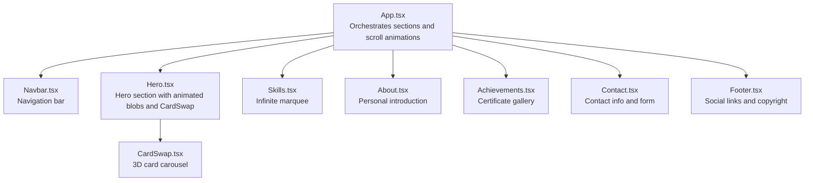

**Diagram sources**
- [App.tsx:12-59](file://src/App.tsx#L12-L59)
- [Hero.tsx:4-83](file://src/components/Hero.tsx#L4-L83)
- [CardSwap.tsx:49-230](file://src/components/CardSwap.tsx#L49-L230)
- [Skills.tsx:20-55](file://src/components/Skills.tsx#L20-L55)
- [About.tsx:3-124](file://src/components/About.tsx#L3-L124)
- [Achievements.tsx:64-116](file://src/components/Achievements.tsx#L64-L116)
- [Contact.tsx:19-130](file://src/components/Contact.tsx#L19-L130)
- [Footer.tsx:3-30](file://src/components/Footer.tsx#L3-L30)

**Section sources**
- [App.tsx:12-59](file://src/App.tsx#L12-L59)
- [App.css:1-404](file://src/App.css#L1-L404)

## Core Components
This section summarizes each component’s role, props, state, and integration points.

- Navbar
  - Role: Fixed navigation bar with logo, links, and CTA. Adds a scrolled class based on scroll position.
  - Props: None.
  - State: Local state for scroll detection and mobile menu open state.
  - Events: Scroll listener; mobile toggle button click.
  - Accessibility: Uses aria-label on the mobile toggle button.
  - Integration: Consumed by App.tsx.

- Hero
  - Role: Hero section with animated background blobs, headline, subtitle, buttons, and a right-side CardSwap carousel.
  - Props: None.
  - State: None.
  - Events: None.
  - Integration: Renders CardSwap and applies styles from App.css.

- CardSwap
  - Role: 3D card carousel with GSAP-driven transitions, configurable timing, easing, and hover pause.
  - Props: width, height, cardDistance, verticalDistance, delay, pauseOnHover, onCardClick, skewAmount, easing, children.
  - State: Internal order tracking, timeline and interval references, and memoized child refs.
  - Events: Mouse enter/leave for pause/resume; click propagation to child and parent callback.
  - Accessibility: No explicit ARIA attributes; relies on focusable children if present.
  - Integration: Used inside Hero.

- Skills
  - Role: Infinite horizontal marquee of tech skill chips.
  - Props: None.
  - State: None.
  - Events: None.
  - Integration: Rendered by App.tsx.

- About
  - Role: Personal introduction with avatar placeholder, feature cards, and stats.
  - Props: None.
  - State: None.
  - Events: None.
  - Integration: Rendered by App.tsx.

- Achievements
  - Role: Grid of certificate cards with lightbox overlay.
  - Props: None.
  - State: Local state for selected image.
  - Events: Click handlers for thumbnail and close button.
  - Accessibility: Lightbox overlay captures clicks to close; ensure focus management if needed.
  - Integration: Rendered by App.tsx.

- Contact
  - Role: Contact info links and social quick links, plus a contact form.
  - Props: None.
  - State: None.
  - Events: Hover effects on social links; form submit prevented.
  - Accessibility: Links and buttons use semantic anchors and buttons.
  - Integration: Rendered by App.tsx.

- Footer
  - Role: Social links and copyright notice.
  - Props: None.
  - State: None.
  - Events: None.
  - Accessibility: Uses aria-label on social links.
  - Integration: Rendered by App.tsx.

**Section sources**
- [Navbar.tsx:11-54](file://src/components/Navbar.tsx#L11-L54)
- [Hero.tsx:4-83](file://src/components/Hero.tsx#L4-L83)
- [CardSwap.tsx:49-230](file://src/components/CardSwap.tsx#L49-L230)
- [Skills.tsx:20-55](file://src/components/Skills.tsx#L20-L55)
- [About.tsx:3-124](file://src/components/About.tsx#L3-L124)
- [Achievements.tsx:64-116](file://src/components/Achievements.tsx#L64-L116)
- [Contact.tsx:19-130](file://src/components/Contact.tsx#L19-L130)
- [Footer.tsx:3-30](file://src/components/Footer.tsx#L3-L30)

## Architecture Overview
The application composes components in App.tsx and applies scroll-triggered fade-in animations via IntersectionObserver and GSAP. Hero integrates CardSwap to deliver a visually engaging focal point, while Skills provides a lightweight, performant marquee.

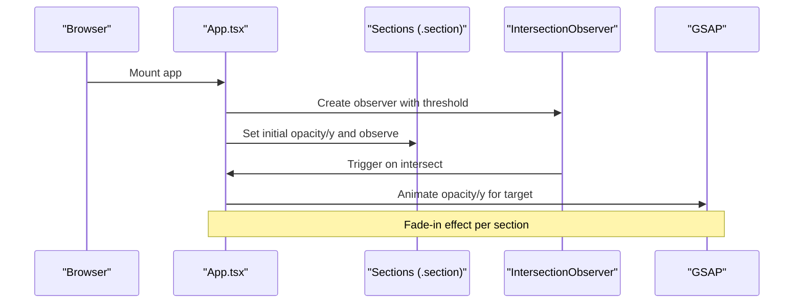

**Diagram sources**
- [App.tsx:13-42](file://src/App.tsx#L13-L42)

**Section sources**
- [App.tsx:12-59](file://src/App.tsx#L12-L59)

## Detailed Component Analysis

### Navbar
- Implementation highlights
  - Maintains two local states: scrolled and mobileOpen.
  - Adds a scrolled class to the nav element when scroll threshold is exceeded.
  - Provides a mobile toggle button with aria-label.
  - Uses a static navLinks array for anchor targets.
- Props interface
  - None.
- Internal state management
  - scrolled: derived from scroll position.
  - mobileOpen: toggled by the mobile button.
- Event handlers
  - Scroll handler updates scrolled.
  - Button click toggles mobileOpen.
- Integration patterns
  - Consumed by App.tsx; contributes to page layout and navigation.
- Usage examples
  - Place Navbar at the top of the page; ensure links match section IDs.
- Customization options
  - Adjust scroll threshold by changing the comparison value.
  - Modify styles via CSS variables and nav classes.
- Inter-component interactions
  - Works with Hero and other sections via anchor links.
- Accessibility
  - aria-label on mobile toggle improves screen reader support.

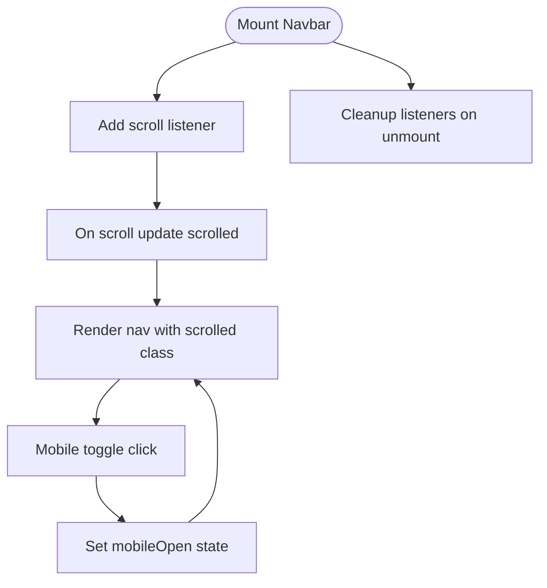

**Diagram sources**
- [Navbar.tsx:15-19](file://src/components/Navbar.tsx#L15-L19)
- [Navbar.tsx:36-48](file://src/components/Navbar.tsx#L36-L48)

**Section sources**
- [Navbar.tsx:11-54](file://src/components/Navbar.tsx#L11-L54)

### Hero
- Implementation highlights
  - Renders animated blob backgrounds and hero content.
  - Embeds CardSwap with three Cards and carousel configuration.
  - Provides primary and secondary call-to-action buttons.
- Props interface
  - None.
- Internal state management
  - None.
- Event handlers
  - None.
- Integration patterns
  - Consumed by App.tsx; serves as the landing area.
- Usage examples
  - Wrap CardSwap children with Card components for consistent styling.
- Customization options
  - Adjust cardDistance, verticalDistance, delay, and pauseOnHover in CardSwap.
  - Modify gradient text and badge styles via CSS.
- Inter-component interactions
  - CardSwap depends on CardSwap.tsx; Hero is styled via App.css.

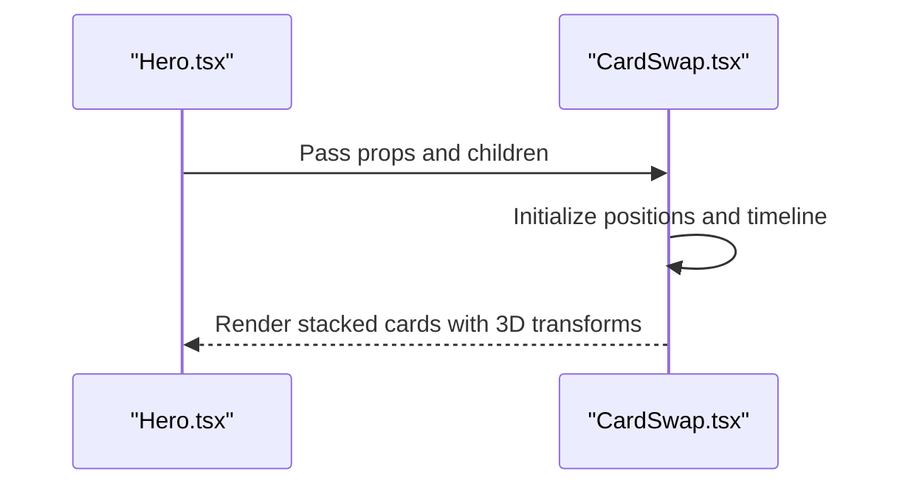

**Diagram sources**
- [Hero.tsx:42-74](file://src/components/Hero.tsx#L42-L74)
- [CardSwap.tsx:63-230](file://src/components/CardSwap.tsx#L63-L230)

**Section sources**
- [Hero.tsx:4-83](file://src/components/Hero.tsx#L4-L83)

### CardSwap
- Implementation highlights
  - Exports a Card component and a CardSwap container.
  - Uses GSAP for smooth 3D transitions and timelines.
  - Supports elastic or smooth easing modes.
  - Handles hover pause and click propagation to children and parent.
- Props interface
  - width, height, cardDistance, verticalDistance, delay, pauseOnHover, onCardClick, skewAmount, easing, children.
- Internal state management
  - order: tracks current front-to-back order.
  - tlRef: holds the GSAP timeline reference.
  - intervalRef: manages periodic swaps.
  - container: ref to the carousel container.
- Event handlers
  - mouseenter/mouseleave for pause/resume.
  - onClick on each card bubbles to child and parent callbacks.
- Integration patterns
  - Used inside Hero; expects Card children.
- Usage examples
  - Provide multiple Card children; configure delay and easing.
- Customization options
  - Adjust cardDistance and verticalDistance for spacing.
  - Change skewAmount for visual depth.
  - Switch easing to 'smooth' for subtle motion.
- Inter-component interactions
  - Communicates with GSAP and DOM nodes; relies on refs and clones.
- Accessibility
  - No explicit ARIA roles; ensure clickable children are keyboard accessible if needed.

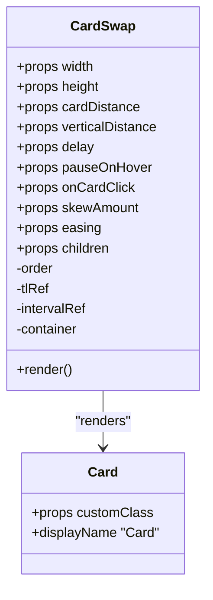

**Diagram sources**
- [CardSwap.tsx:13-27](file://src/components/CardSwap.tsx#L13-L27)
- [CardSwap.tsx:49-230](file://src/components/CardSwap.tsx#L49-L230)

**Section sources**
- [CardSwap.tsx:49-230](file://src/components/CardSwap.tsx#L49-L230)

### Skills
- Implementation highlights
  - Duplicates the skills list to create a seamless infinite loop.
  - Uses CSS animation to move the marquee horizontally.
  - Hover pauses the animation.
- Props interface
  - None.
- Internal state management
  - None.
- Event handlers
  - None.
- Integration patterns
  - Consumed by App.tsx; styled via App.css.
- Usage examples
  - Extend the skills array to add more items.
- Customization options
  - Adjust animation duration and speed via CSS.
  - Modify chip styles and hover behavior in CSS.
- Inter-component interactions
  - Standalone component; no external dependencies.

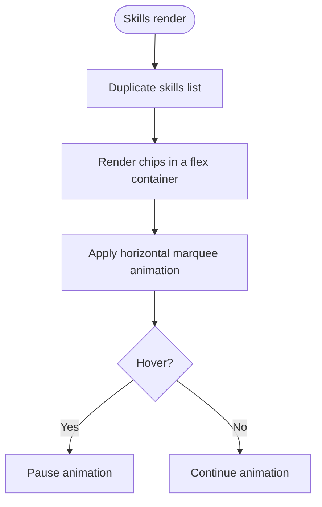

**Diagram sources**
- [Skills.tsx:20-55](file://src/components/Skills.tsx#L20-L55)
- [App.css:294-315](file://src/App.css#L294-L315)

**Section sources**
- [Skills.tsx:20-55](file://src/components/Skills.tsx#L20-L55)

### About
- Implementation highlights
  - Grid layout with an avatar placeholder and feature cards.
  - Stats section with gradient numbers.
  - Uses icons from lucide-react.
- Props interface
  - None.
- Internal state management
  - None.
- Event handlers
  - None.
- Integration patterns
  - Consumed by App.tsx; styled via App.css.
- Usage examples
  - Replace avatar placeholder with a real image if desired.
- Customization options
  - Adjust grid columns and spacing via CSS.
  - Modify feature card icons and content.
- Inter-component interactions
  - Standalone component.

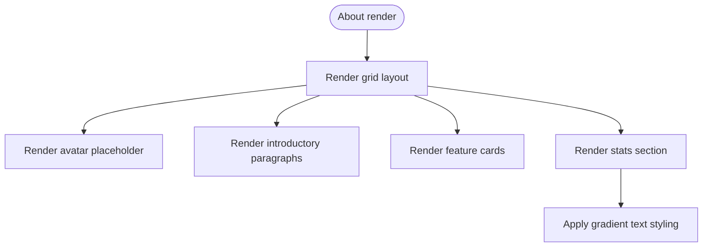

**Diagram sources**
- [About.tsx:3-124](file://src/components/About.tsx#L3-L124)
- [App.css:179-213](file://src/App.css#L179-L213)

**Section sources**
- [About.tsx:3-124](file://src/components/About.tsx#L3-L124)

### Achievements
- Implementation highlights
  - Grid of achievement cards with lazy-loaded images.
  - Overlay with award icon and “View Certificate” prompt.
  - Lightbox modal for enlarged certificate images.
  - Uses useState to track selected image.
- Props interface
  - None.
- Internal state management
  - selectedImage: currently opened certificate image.
- Event handlers
  - Thumbnail click sets selectedImage.
  - Close button and overlay click clear selectedImage.
- Integration patterns
  - Consumed by App.tsx; styled via App.css.
- Usage examples
  - Add new achievements to the achievements array.
- Customization options
  - Adjust grid template columns and card hover effects.
  - Customize lightbox styles and close button.
- Inter-component interactions
  - Standalone component with local state.

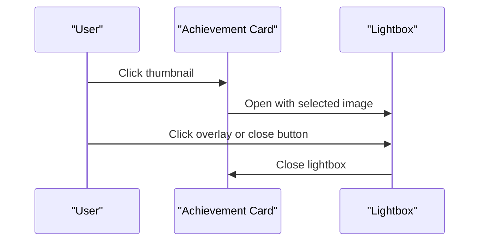

**Diagram sources**
- [Achievements.tsx:64-116](file://src/components/Achievements.tsx#L64-L116)
- [App.css:272-292](file://src/App.css#L272-L292)

**Section sources**
- [Achievements.tsx:64-116](file://src/components/Achievements.tsx#L64-L116)

### Contact
- Implementation highlights
  - Contact info links with icons and labels.
  - Social quick links with hover effects.
  - Contact form with grouped inputs and textarea.
  - Prevents default form submission.
- Props interface
  - None.
- Internal state management
  - None.
- Event handlers
  - Hover effects on social links change border and color.
  - Form submit is prevented.
- Integration patterns
  - Consumed by App.tsx; styled via App.css.
- Usage examples
  - Update socialLinks and contact info to reflect your profile.
- Customization options
  - Adjust form layout and input styles via CSS.
  - Modify hover effects and transitions.
- Inter-component interactions
  - Standalone component.

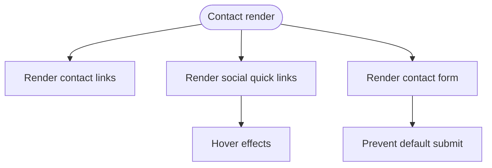

**Diagram sources**
- [Contact.tsx:19-130](file://src/components/Contact.tsx#L19-L130)
- [App.css:316-366](file://src/App.css#L316-L366)

**Section sources**
- [Contact.tsx:19-130](file://src/components/Contact.tsx#L19-L130)

### Footer
- Implementation highlights
  - Social links with hover animations.
  - Copyright notice with heart emoji.
- Props interface
  - None.
- Internal state management
  - None.
- Event handlers
  - None.
- Integration patterns
  - Consumed by App.tsx; styled via App.css.
- Usage examples
  - Update social links to point to your profiles.
- Customization options
  - Adjust hover styles and spacing.
- Inter-component interactions
  - Standalone component.

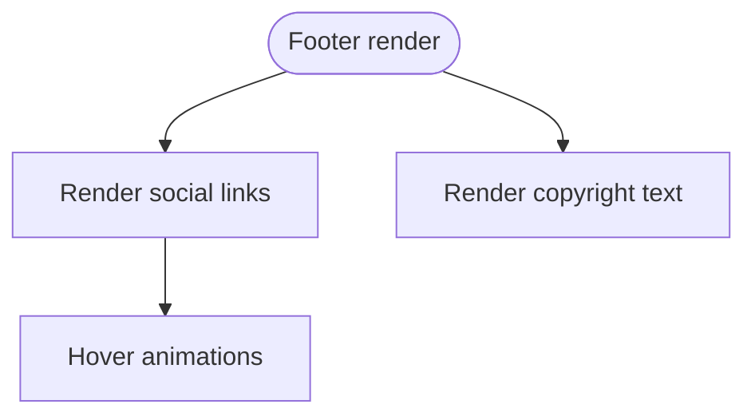

**Diagram sources**
- [Footer.tsx:3-30](file://src/components/Footer.tsx#L3-L30)
- [App.css:367-384](file://src/App.css#L367-L384)

**Section sources**
- [Footer.tsx:3-30](file://src/components/Footer.tsx#L3-L30)

## Dependency Analysis
External libraries and their roles:
- gsap: Provides 3D animations and timelines for CardSwap and App-level scroll-triggered animations.
- lucide-react: Icons used across components (e.g., Navbar, Hero, Skills, Contact, Footer).
- react and react-dom: Core framework.
- tailwindcss: Utility-first CSS framework; styles are defined in App.css.

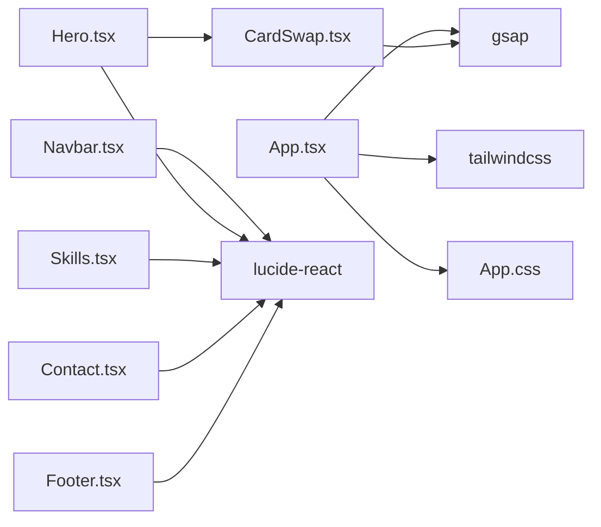

**Diagram sources**
- [App.tsx:12-59](file://src/App.tsx#L12-L59)
- [Hero.tsx:1-2](file://src/components/Hero.tsx#L1-L2)
- [CardSwap.tsx:10](file://src/components/CardSwap.tsx#L10)
- [package.json:12-18](file://package.json#L12-L18)

**Section sources**
- [package.json:12-18](file://package.json#L12-L18)
- [App.tsx:12-59](file://src/App.tsx#L12-L59)

## Performance Considerations
- CardSwap
  - Uses GSAP timelines and memoization to minimize re-renders.
  - Skips expensive work when fewer than two children exist.
  - Pause-on-hover reduces CPU usage during idle periods.
- Skills
  - Infinite marquee relies on CSS animation; hover pause prevents unnecessary movement.
- App-level animations
  - IntersectionObserver with a low threshold triggers GSAP animations only when sections become visible.
- General
  - Prefer CSS transforms and opacity for animations.
  - Avoid heavy computations in render; use useMemo and refs where appropriate.

[No sources needed since this section provides general guidance]

## Troubleshooting Guide
- Navbar does not show scrolled class
  - Ensure scroll listener is attached and the scroll threshold is met.
  - Verify CSS class names and theme variables.
- CardSwap not animating
  - Confirm GSAP is loaded and CardSwap receives children.
  - Check that delay and easing are valid.
  - Inspect hover pause behavior if configured.
- Skills marquee not moving
  - Verify CSS animation property and marquee container width.
  - Ensure the duplicated list is rendered.
- Achievements lightbox not closing
  - Ensure click handlers on overlay and close button are firing.
  - Check z-index and click propagation.
- Contact form submit action
  - Confirm preventDefault is invoked on submit.
- Footer social links
  - Ensure aria-labels are present for accessibility.

**Section sources**
- [Navbar.tsx:15-19](file://src/components/Navbar.tsx#L15-L19)
- [CardSwap.tsx:106-202](file://src/components/CardSwap.tsx#L106-L202)
- [Skills.tsx:20-55](file://src/components/Skills.tsx#L20-L55)
- [Achievements.tsx:103-110](file://src/components/Achievements.tsx#L103-L110)
- [Contact.tsx:98-123](file://src/components/Contact.tsx#L98-L123)
- [Footer.tsx:14](file://src/components/Footer.tsx#L14)

## Conclusion
The portfolio components are designed for clarity, performance, and maintainability. They leverage GSAP for compelling animations, Tailwind CSS for consistent styling, and React hooks for minimal state management. The composition patterns keep components reusable and easy to customize, while accessibility features are built-in where applicable. Together, they deliver a polished, modern personal portfolio experience.