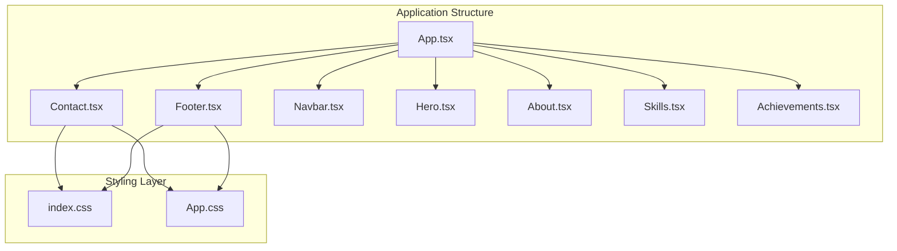
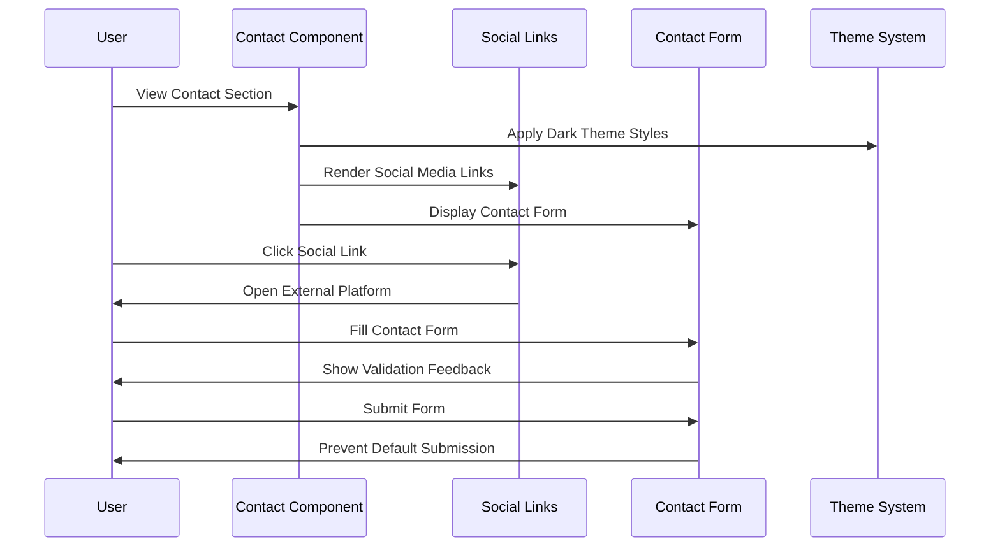
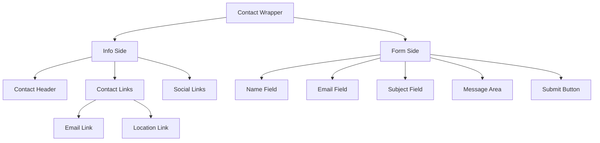
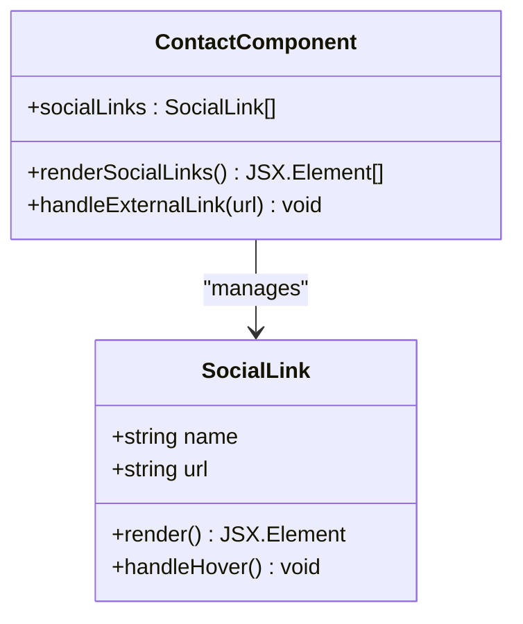
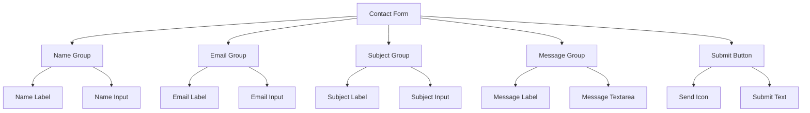
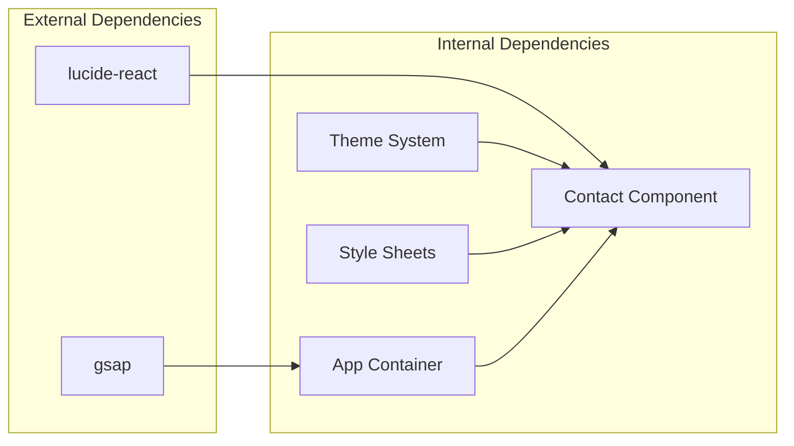

# Contact Component

<cite>
**Referenced Files in This Document**
- [Contact.tsx](file://src/components/Contact.tsx)
- [App.tsx](file://src/App.tsx)
- [index.css](file://src/index.css)
- [App.css](file://src/App.css)
- [Footer.tsx](file://src/components/Footer.tsx)
</cite>

## Table of Contents
1. [Introduction](#introduction)
2. [Project Structure](#project-structure)
3. [Core Components](#core-components)
4. [Architecture Overview](#architecture-overview)
5. [Detailed Component Analysis](#detailed-component-analysis)
6. [Dependency Analysis](#dependency-analysis)
7. [Performance Considerations](#performance-considerations)
8. [Troubleshooting Guide](#troubleshooting-guide)
9. [Conclusion](#conclusion)

## Introduction
The Contact component serves as the primary gateway for user engagement and professional networking on the portfolio website. It presents contact information, integrates social media platforms, and provides a functional contact form. The component follows modern design principles with a dark theme aesthetic, responsive layout patterns, and accessibility-conscious implementation.

The component plays a crucial role in facilitating user interactions by offering multiple communication channels and enabling seamless contact submissions. Its design emphasizes professionalism while maintaining an approachable interface that encourages visitors to initiate conversations and explore collaboration opportunities.

## Project Structure
The Contact component is organized within the components directory alongside other page sections. The implementation leverages a modular architecture where each section (Hero, About, Skills, Achievements, Contact, Footer) contributes to the overall user experience.

**Diagram sources**
- [App.tsx:12-59](file://src/App.tsx#L12-L59)
- [Contact.tsx:19-127](file://src/components/Contact.tsx#L19-L127)
- [index.css:1-87](file://src/index.css#L1-L87)
- [App.css:316-365](file://src/App.css#L316-L365)

**Section sources**
- [App.tsx:12-59](file://src/App.tsx#L12-L59)
- [Contact.tsx:19-127](file://src/components/Contact.tsx#L19-L127)

## Core Components
The Contact component consists of three primary sections: contact information display, social media integration, and contact form submission. Each section serves a distinct purpose in the user engagement ecosystem.

### Contact Information Display
The contact information section presents essential communication channels through interactive link elements. The implementation uses a structured approach with iconography and hover effects to enhance user experience.

### Social Media Integration
The social media section provides quick access to professional profiles through styled anchor elements. The implementation includes dynamic hover effects and external link handling for secure navigation.

### Contact Form System
The contact form offers a comprehensive submission interface with field validation, responsive layout, and visual feedback mechanisms. The form maintains focus on user experience while providing essential functionality for message submission.

**Section sources**
- [Contact.tsx:37-93](file://src/components/Contact.tsx#L37-L93)
- [Contact.tsx:98-123](file://src/components/Contact.tsx#L98-L123)

## Architecture Overview
The Contact component operates within a larger architectural framework that emphasizes modularity, responsiveness, and accessibility. The component integrates seamlessly with the application's theme system and responsive design patterns.

**Diagram sources**
- [Contact.tsx:4-17](file://src/components/Contact.tsx#L4-L17)
- [Contact.tsx:98-123](file://src/components/Contact.tsx#L98-L123)
- [index.css:3-30](file://src/index.css#L3-L30)

## Detailed Component Analysis

### Layout Structure and Grid System
The Contact component employs a sophisticated grid-based layout that adapts to various screen sizes. The implementation utilizes CSS Grid for the main wrapper and Flexbox for internal components.

**Diagram sources**
- [Contact.tsx:28-124](file://src/components/Contact.tsx#L28-L124)
- [App.css:317-365](file://src/App.css#L317-L365)

### Social Media Link Implementation
The social media integration uses a centralized configuration array that defines platform names and URLs. The implementation includes dynamic rendering with hover effects and external link security measures.

**Diagram sources**
- [Contact.tsx:4-17](file://src/components/Contact.tsx#L4-L17)
- [Contact.tsx:63-93](file://src/components/Contact.tsx#L63-L93)

### Contact Form Placeholder Functionality
The contact form implements a comprehensive field system with placeholder text and validation-ready structure. The form maintains consistent styling with the overall theme while providing clear user guidance.

**Diagram sources**
- [Contact.tsx:98-123](file://src/components/Contact.tsx#L98-L123)

### Responsive Design Patterns
The component implements a mobile-first responsive design that adapts from a two-column desktop layout to a single-column mobile layout. The responsive breakpoints ensure optimal viewing experience across all device sizes.

**Section sources**
- [Contact.tsx:19-127](file://src/components/Contact.tsx#L19-L127)
- [App.css:392-403](file://src/App.css#L392-L403)

### Accessibility Features
The component incorporates several accessibility enhancements including proper semantic markup, focus management, and screen reader support. The implementation follows WCAG guidelines for color contrast and interactive element visibility.

**Section sources**
- [Footer.tsx:14](file://src/components/Footer.tsx#L14)
- [index.css:56-64](file://src/index.css#L56-L64)

## Dependency Analysis
The Contact component relies on several external dependencies and internal systems to function effectively. Understanding these dependencies is crucial for maintenance and extension.

**Diagram sources**
- [Contact.tsx:1](file://src/components/Contact.tsx#L1)
- [App.tsx:2](file://src/App.tsx#L2)

### Integration Points
The Contact component integrates with multiple system components including the theme system, animation library, and navigation structure. These integration points ensure cohesive user experience across the application.

**Section sources**
- [Contact.tsx:19-127](file://src/components/Contact.tsx#L19-L127)
- [App.tsx:12-59](file://src/App.tsx#L12-L59)

## Performance Considerations
The Contact component is designed with performance optimization in mind. The implementation minimizes unnecessary re-renders through efficient state management and leverages CSS transitions for smooth animations.

### Rendering Optimization
The component uses memoization-friendly patterns and avoids heavy computations during render cycles. Social media links and contact information are rendered statically, reducing computational overhead.

### Animation Performance
The integration with GSAP provides smooth scroll-triggered animations without impacting the Contact component's performance. The animation system is isolated to prevent cascading performance issues.

## Troubleshooting Guide
Common issues and solutions for the Contact component implementation:

### Social Media Link Issues
- **Problem**: External links not opening in new tabs
- **Solution**: Verify target and rel attributes are properly set for external links

### Form Submission Problems
- **Problem**: Form submits despite validation
- **Solution**: Ensure preventDefault is called in form submission handler

### Styling Conflicts
- **Problem**: Contact section styles conflicting with other components
- **Solution**: Check CSS specificity and ensure proper class scoping

### Responsive Layout Breaks
- **Problem**: Grid layout not adapting to mobile screens
- **Solution**: Verify media query breakpoints and grid template configurations

**Section sources**
- [Contact.tsx:63-93](file://src/components/Contact.tsx#L63-L93)
- [Contact.tsx:98-123](file://src/components/Contact.tsx#L98-L123)

## Conclusion
The Contact component represents a well-architected solution for user engagement and professional networking. Its implementation demonstrates best practices in responsive design, accessibility, and performance optimization. The component successfully balances functionality with aesthetics, providing users with multiple pathways for communication while maintaining a cohesive brand experience.

The modular design allows for easy customization and extension, supporting future enhancements such as contact form integrations, additional social media platforms, and advanced validation systems. The component's foundation provides a solid base for evolving user engagement strategies while maintaining technical excellence.