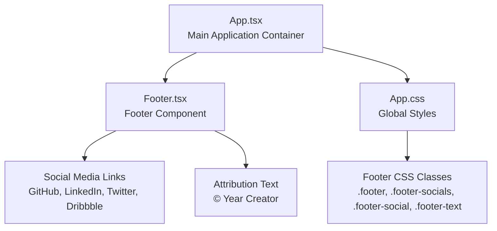
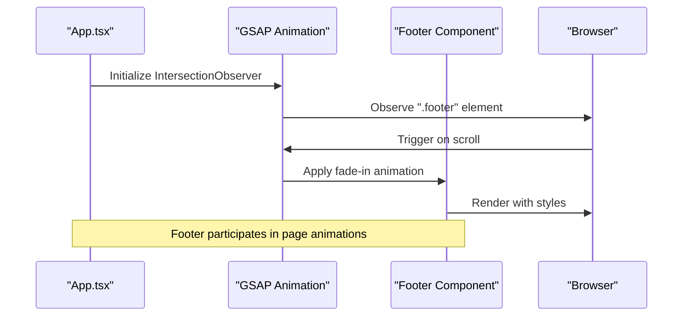
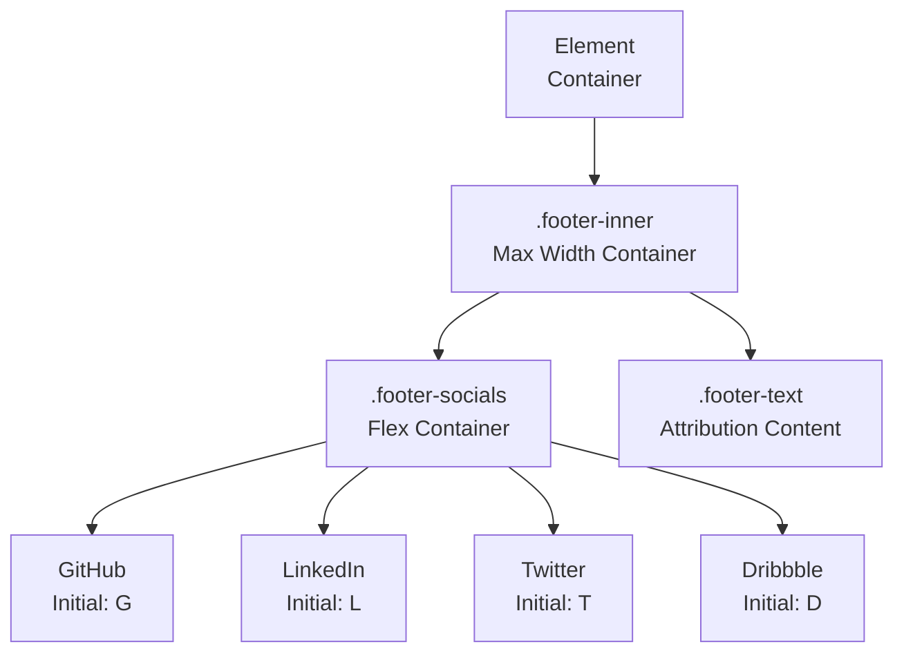
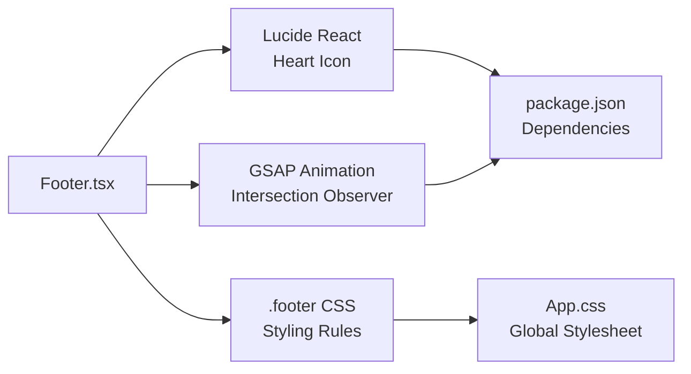

# Footer Component

<cite>
**Referenced Files in This Document**
- [Footer.tsx](file://src/components/Footer.tsx)
- [App.tsx](file://src/App.tsx)
- [App.css](file://src/App.css)
- [Contact.tsx](file://src/components/Contact.tsx)
- [package.json](file://package.json)
</cite>

## Table of Contents
1. [Introduction](#introduction)
2. [Project Structure](#project-structure)
3. [Core Components](#core-components)
4. [Architecture Overview](#architecture-overview)
5. [Detailed Component Analysis](#detailed-component-analysis)
6. [Dependency Analysis](#dependency-analysis)
7. [Performance Considerations](#performance-considerations)
8. [Troubleshooting Guide](#troubleshooting-guide)
9. [Conclusion](#conclusion)

## Introduction
The Footer component serves as the final navigation and branding element in the portfolio site, displaying social media links and attribution information. It maintains consistent branding across all pages while providing essential external navigation points for visitors to connect with the creator's professional profiles.

## Project Structure
The Footer component is integrated into the main application layout and styled using centralized CSS rules. The component follows a simple, accessible design pattern that emphasizes usability and visual consistency.

**Diagram sources**
- [App.tsx:55](file://src/App.tsx#L55)
- [Footer.tsx:5](file://src/components/Footer.tsx#L5)
- [App.css:367](file://src/App.css#L367)

**Section sources**
- [App.tsx:55](file://src/App.tsx#L55)
- [Footer.tsx:5](file://src/components/Footer.tsx#L5)
- [App.css:367](file://src/App.css#L367)

## Core Components
The Footer component consists of two primary sections: social media link containers and attribution text. Both sections are designed with accessibility and responsive behavior in mind.

### Social Media Links Container
The social media links are rendered as a flexible container that centers multiple interactive elements. Each link displays the platform's initial character and includes proper accessibility labeling.

### Attribution Information
The attribution section displays the current year, creator name, and technology acknowledgments using a heart icon from the Lucide React icon library.

**Section sources**
- [Footer.tsx:7](file://src/components/Footer.tsx#L7)
- [Footer.tsx:19](file://src/components/Footer.tsx#L19)

## Architecture Overview
The Footer component integrates seamlessly with the application's layout system and participates in the page's intersection observer animations.

**Diagram sources**
- [App.tsx:15](file://src/App.tsx#L15)
- [App.tsx:36](file://src/App.tsx#L36)
- [Footer.tsx:5](file://src/components/Footer.tsx#L5)

**Section sources**
- [App.tsx:15](file://src/App.tsx#L15)
- [App.tsx:36](file://src/App.tsx#L36)

## Detailed Component Analysis

### Layout Structure
The Footer follows a clean, centered layout pattern that ensures consistent presentation across different screen sizes.

**Diagram sources**
- [Footer.tsx:5](file://src/components/Footer.tsx#L5)
- [Footer.tsx:7](file://src/components/Footer.tsx#L7)
- [Footer.tsx:19](file://src/components/Footer.tsx#L19)

### Social Media Icon Integration
The component currently uses text initials for social media platforms rather than vector icons. This approach provides simplicity and reduces bundle size while maintaining visual consistency.

### Copyright Information Display
The attribution text dynamically generates the current year and includes a heart icon with custom styling to match the site's aesthetic.

### Responsive Design Patterns
The Footer implements mobile-first responsive design through CSS media queries that adjust spacing and layout for smaller screens.

**Section sources**
- [Footer.tsx:1](file://src/components/Footer.tsx#L1)
- [Footer.tsx:14](file://src/components/Footer.tsx#L14)

### Accessibility Features
The component includes proper ARIA labeling for screen readers and semantic HTML structure for optimal accessibility.

**Section sources**
- [Footer.tsx:14](file://src/components/Footer.tsx#L14)

## Dependency Analysis
The Footer component relies on external dependencies for enhanced functionality and styling.

**Diagram sources**
- [Footer.tsx:1](file://src/components/Footer.tsx#L1)
- [package.json:14](file://package.json#L14)
- [App.css:367](file://src/App.css#L367)

**Section sources**
- [Footer.tsx:1](file://src/components/Footer.tsx#L1)
- [package.json:14](file://package.json#L14)
- [App.css:367](file://src/App.css#L367)

## Performance Considerations
The Footer component is lightweight and performs well due to its minimal DOM structure and efficient CSS styling. The use of text initials instead of complex icons reduces rendering overhead.

## Troubleshooting Guide
Common issues and solutions for the Footer component:

### Social Media Links Not Working
- Verify href attributes contain valid URLs
- Ensure external links use appropriate target and rel attributes
- Check that social media platform names match expected patterns

### Styling Issues
- Confirm CSS class names match the component structure
- Verify global styles are properly loaded
- Check for conflicting CSS rules in other components

### Accessibility Concerns
- Ensure aria-label attributes are descriptive
- Verify keyboard navigation works properly
- Test screen reader compatibility

**Section sources**
- [Footer.tsx:14](file://src/components/Footer.tsx#L14)

## Conclusion
The Footer component successfully provides essential navigation and branding elements for the portfolio site. Its simple, accessible design ensures consistent user experience across all pages while maintaining the site's visual identity. The component's integration with the application's animation system and responsive design patterns demonstrates thoughtful implementation of modern web development practices.