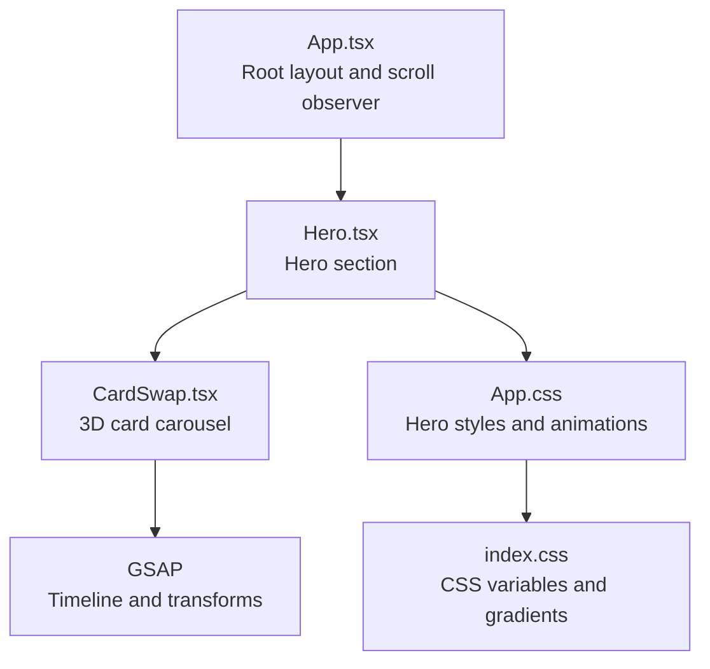
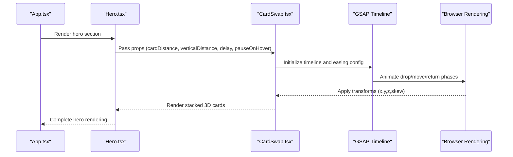
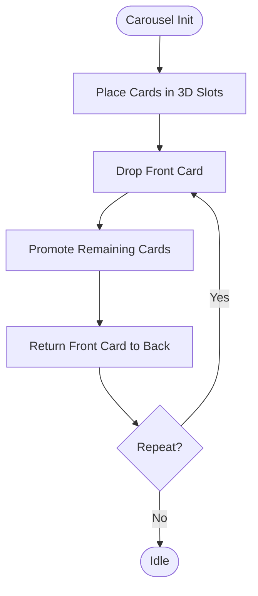
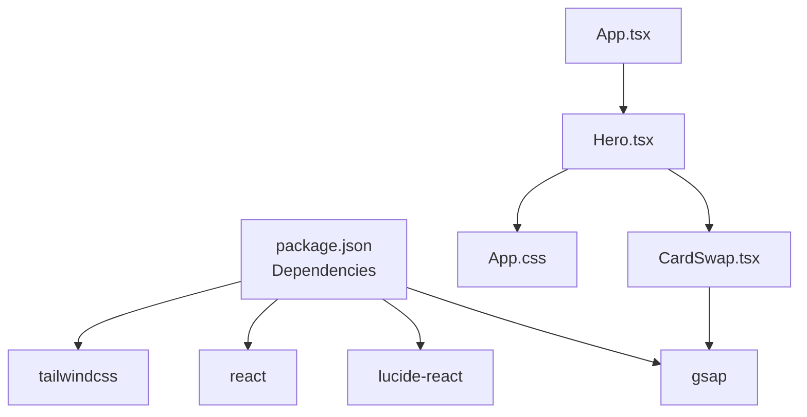

# Hero Component

<cite>
**Referenced Files in This Document**
- [Hero.tsx](file://src/components/Hero.tsx)
- [CardSwap.tsx](file://src/components/CardSwap.tsx)
- [App.tsx](file://src/App.tsx)
- [App.css](file://src/App.css)
- [index.css](file://src/index.css)
- [package.json](file://package.json)
</cite>

## Table of Contents
1. [Introduction](#introduction)
2. [Project Structure](#project-structure)
3. [Core Components](#core-components)
4. [Architecture Overview](#architecture-overview)
5. [Detailed Component Analysis](#detailed-component-analysis)
6. [Dependency Analysis](#dependency-analysis)
7. [Performance Considerations](#performance-considerations)
8. [Troubleshooting Guide](#troubleshooting-guide)
9. [Conclusion](#conclusion)
10. [Appendices](#appendices)

## Introduction
The Hero component establishes the visual tone for the entire portfolio site by combining animated floating blobs, a dynamic gradient color scheme, and an interactive 3D card carousel powered by GSAP timelines. It integrates seamlessly with the CardSwap component to deliver a polished, performant hero section that captures attention while maintaining responsiveness across devices.

## Project Structure
The Hero component resides within the components directory alongside other page sections. It imports and composes the CardSwap component to render a rotating set of cards with 3D transforms and coordinated animations. Global styles define the theme, gradients, and responsive breakpoints that unify the hero’s visual identity with the rest of the site.

**Diagram sources**
- [App.tsx:12-62](file://src/App.tsx#L12-L62)
- [Hero.tsx:1-84](file://src/components/Hero.tsx#L1-L84)
- [CardSwap.tsx:1-230](file://src/components/CardSwap.tsx#L1-L230)
- [App.css:31-156](file://src/App.css#L31-L156)
- [index.css:3-30](file://src/index.css#L3-L30)

**Section sources**
- [Hero.tsx:1-84](file://src/components/Hero.tsx#L1-L84)
- [App.tsx:12-62](file://src/App.tsx#L12-L62)
- [App.css:31-156](file://src/App.css#L31-L156)
- [index.css:3-30](file://src/index.css#L3-L30)

## Core Components
- Hero: Renders the hero section with floating blobs, animated content, and the CardSwap carousel.
- CardSwap: Provides a 3D card carousel with GSAP-driven animations and hover pausing.
- App: Orchestrates global scroll animations and mounts the Hero component.

Key responsibilities:
- Hero: Compose hero content, apply floating blob animations, and embed the CardSwap carousel with configurable parameters.
- CardSwap: Manage card stacking, 3D transforms, timeline sequencing, and responsive scaling.
- App: Initialize scroll-triggered fade-ins for sections.

**Section sources**
- [Hero.tsx:4-81](file://src/components/Hero.tsx#L4-L81)
- [CardSwap.tsx:50-229](file://src/components/CardSwap.tsx#L50-L229)
- [App.tsx:12-42](file://src/App.tsx#L12-L42)

## Architecture Overview
The Hero component integrates three primary systems:
- Floating blob effects: CSS animations on three semi-transparent blurred circles positioned absolutely behind the hero content.
- Animated gradient backgrounds: CSS variables and gradient definitions provide a cohesive color palette used across hero elements and cards.
- Interactive 3D card carousel: GSAP timelines coordinate drop, promotion, and return phases for smooth transitions.

**Diagram sources**
- [Hero.tsx:42-74](file://src/components/Hero.tsx#L42-L74)
- [CardSwap.tsx:63-202](file://src/components/CardSwap.tsx#L63-L202)
- [App.tsx:12-42](file://src/App.tsx#L12-L42)

## Detailed Component Analysis

### Hero Component
The Hero component renders:
- Three floating blob elements with distinct sizes and animation delays.
- A content area with availability badge, headline, subtitle, and call-to-action buttons.
- A right-side CardSwap carousel configured with distance, vertical spacing, delay, and hover behavior.

Props and customization:
- The CardSwap component receives props that control the carousel’s motion and timing.
- Content strings and button links are defined directly in the component for quick customization.

Responsive behavior:
- On smaller screens, the hero switches to a stacked layout, and the CardSwap container scales down to fit the viewport.

Accessibility and UX:
- Buttons use semantic anchors and icons for clarity.
- Scroll indicator provides navigation cues.

**Section sources**
- [Hero.tsx:4-81](file://src/components/Hero.tsx#L4-L81)
- [App.css:392-403](file://src/App.css#L392-L403)

### CardSwap Component
CardSwap implements a 3D card carousel with the following mechanics:
- Props interface defines dimensions, distances, delay, hover behavior, easing mode, and click callbacks.
- Internal helpers compute 3D positions and apply initial placements.
- A GSAP timeline coordinates:
  - Drop phase: front card moves downward.
  - Promotion phase: subsequent cards shift into position with staggered timing.
  - Return phase: front card repositions to the back with z-index adjustments.
- Hover pause toggles timeline playback and intervals.

Animation configuration options:
- Easing modes: elastic or smooth with differing durations and overlaps.
- Timing parameters: drop, move, and return durations; overlap ratios; return delays.
- Transform controls: card distances, vertical spacing, skew amount.

Performance optimizations:
- Uses memoized child arrays and refs to minimize re-renders.
- Applies will-change and preserve-3d for GPU-accelerated transforms.
- Skips animation when fewer than two cards are present.

**Section sources**
- [CardSwap.tsx:50-229](file://src/components/CardSwap.tsx#L50-L229)

### Floating Blob Effects
The hero employs three floating blobs:
- Positioned absolutely with blurred edges and low opacity.
- Animated with a continuous alternate-direction float using keyframes.
- Styled with distinct colors and animation delays to create depth and motion.

Visual customization:
- Adjust sizes, colors, blur radius, and animation timing to match brand themes.

**Section sources**
- [Hero.tsx:7-10](file://src/components/Hero.tsx#L7-L10)
- [App.css:71-86](file://src/App.css#L71-L86)

### Animated Gradient Backgrounds
The hero leverages CSS variables for gradients:
- Root-level gradients define primary, secondary, and tertiary color schemes.
- Hero elements and cards use these variables for consistent color application.
- Text and backgrounds utilize background-clip for gradient text effects.

Customization:
- Modify CSS variables to change the entire site’s color palette.
- Override card gradient classes for unique card visuals.

**Section sources**
- [index.css:13-16](file://src/index.css#L13-L16)
- [App.css:68-70](file://src/App.css#L68-L70)
- [App.css:111-114](file://src/App.css#L111-L114)

### Interactive 3D Card Carousel System
The carousel system integrates GSAP timelines to orchestrate smooth transitions:
- Initial placement computes 3D slots with x, y, z, and z-index values.
- Timeline labels synchronize drop, promotion, and return phases.
- Staggered timing ensures fluid motion across multiple cards.
- Hover pause temporarily halts animations and resets intervals.

**Diagram sources**
- [CardSwap.tsx:106-177](file://src/components/CardSwap.tsx#L106-L177)

## Dependency Analysis
External libraries and their roles:
- GSAP: Provides timeline orchestration and 3D transforms for the carousel.
- lucide-react: Supplies SVG icons for buttons.
- Tailwind CSS: Utility-first styling framework integrated via Vite plugin.

Internal dependencies:
- Hero depends on CardSwap and local styles.
- CardSwap depends on GSAP and React hooks.
- App initializes scroll animations and renders Hero.

**Diagram sources**
- [package.json:12-19](file://package.json#L12-L19)
- [Hero.tsx:1-2](file://src/components/Hero.tsx#L1-L2)
- [CardSwap.tsx:10](file://src/components/CardSwap.tsx#L10)
- [App.tsx:2-4](file://src/App.tsx#L2-L4)

**Section sources**
- [package.json:12-19](file://package.json#L12-L19)
- [Hero.tsx:1-2](file://src/components/Hero.tsx#L1-L2)
- [CardSwap.tsx:10](file://src/components/CardSwap.tsx#L10)
- [App.tsx:2-4](file://src/App.tsx#L2-L4)

## Performance Considerations
- GPU acceleration: CardSwap applies preserve-3d and will-change to leverage hardware acceleration for transforms.
- Memoization: Child arrays and refs are memoized to reduce unnecessary computations.
- Minimal DOM updates: GSAP sets transforms directly, minimizing layout thrashing.
- Responsive scaling: The carousel container scales down on small screens to prevent heavy animations on lower-powered devices.
- Hover pause: Disables intervals and pauses timelines during hover to conserve resources.

Best practices:
- Keep animation durations reasonable to avoid jank on slower devices.
- Limit the number of concurrent animations when adding more cards.
- Prefer CSS transforms over layout-affecting properties.

**Section sources**
- [CardSwap.tsx:22, 46-47](file://src/components/CardSwap.tsx#L22,L46-L47)
- [CardSwap.tsx:94-99](file://src/components/CardSwap.tsx#L94-L99)
- [CardSwap.tsx:182-199](file://src/components/CardSwap.tsx#L182-L199)
- [App.css:219-226](file://src/App.css#L219-L226)

## Troubleshooting Guide
Common issues and resolutions:
- Cards not animating:
  - Verify GSAP is loaded and timelines are initialized.
  - Ensure there are at least two cards passed to CardSwap.
- Hover pause not working:
  - Confirm mouseenter/mouseleave events are attached to the container ref.
  - Check that pauseOnHover prop is enabled.
- Blobs not visible:
  - Ensure CSS variables for gradients and colors are defined.
  - Verify animation keyframes are applied to blob elements.
- Responsive scaling anomalies:
  - Review media queries and container transforms for small screens.
  - Confirm aspect ratio and scaling factors are appropriate.

**Section sources**
- [CardSwap.tsx:106-202](file://src/components/CardSwap.tsx#L106-L202)
- [App.css:392-403](file://src/App.css#L392-L403)

## Conclusion
The Hero component delivers a visually striking, performant hero section by combining floating blob animations, a cohesive gradient theme, and a sophisticated 3D card carousel. Its modular design allows easy customization of content, animation timing, and visual effects while maintaining responsiveness and accessibility. Together with the global theme and scroll animations, it establishes a strong visual foundation for the entire portfolio site.

## Appendices

### Props Reference

- Hero component props
  - None (renders static content and passes props to CardSwap)

- CardSwap props
  - width: number (default 500)
  - height: number (default 400)
  - cardDistance: number (default 60)
  - verticalDistance: number (default 70)
  - delay: number (default 2000)
  - pauseOnHover: boolean (default false)
  - onCardClick: (index: number) => void
  - skewAmount: number (default 6)
  - easing: 'elastic' | 'smooth' (default 'elastic')
  - children: React.ReactNode

- Card props
  - customClass: string

**Section sources**
- [CardSwap.tsx:50-61](file://src/components/CardSwap.tsx#L50-L61)
- [CardSwap.tsx:13-15](file://src/components/CardSwap.tsx#L13-L15)

### Animation Configuration Options
- Easing modes:
  - Elastic: 'elastic.out(0.6,0.9)' with durations 2s for drop/move/return
  - Smooth: 'power1.inOut' with durations 0.8s for drop/move/return
- Timing overlaps and delays:
  - promoteOverlap: 0.9 (elastic) or 0.45 (smooth)
  - returnDelay: 0.05 (elastic) or 0.2 (smooth)
- Transform parameters:
  - cardDistance: horizontal spacing between cards
  - verticalDistance: vertical offset per card
  - skewAmount: skew applied to cards for 3D effect

**Section sources**
- [CardSwap.tsx:75-92](file://src/components/CardSwap.tsx#L75-L92)

### Customization Examples
- Customize hero content:
  - Modify headline, subtitle, and button text within the Hero component.
  - Add or remove cards inside the CardSwap component.
- Adjust animation timing:
  - Change delay prop to control rotation speed.
  - Switch easing mode to 'smooth' for subtle transitions.
- Visual effects:
  - Update CSS variables in index.css to alter the gradient palette.
  - Override card-gradient-* classes for custom card backgrounds.

**Section sources**
- [Hero.tsx:19-38](file://src/components/Hero.tsx#L19-L38)
- [Hero.tsx:49-72](file://src/components/Hero.tsx#L49-L72)
- [index.css:13-16](file://src/index.css#L13-L16)
- [App.css:68-70](file://src/App.css#L68-L70)