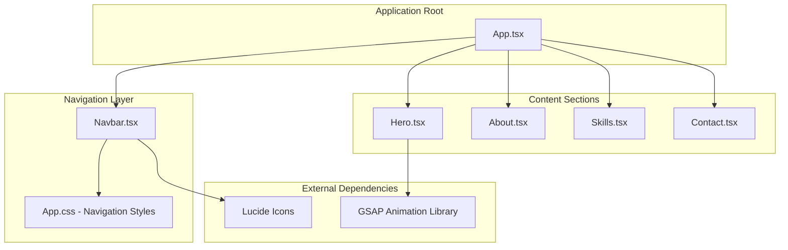
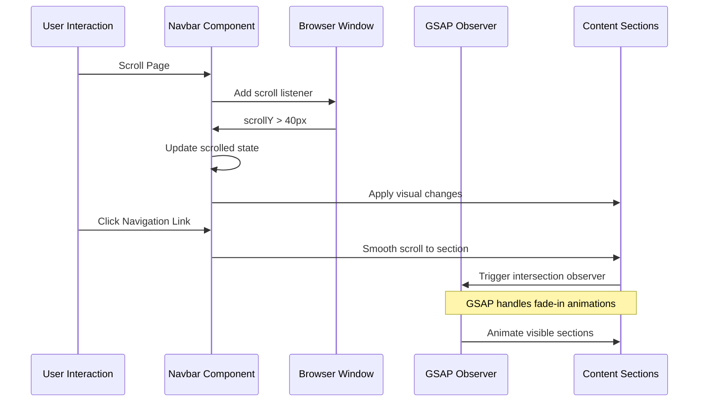
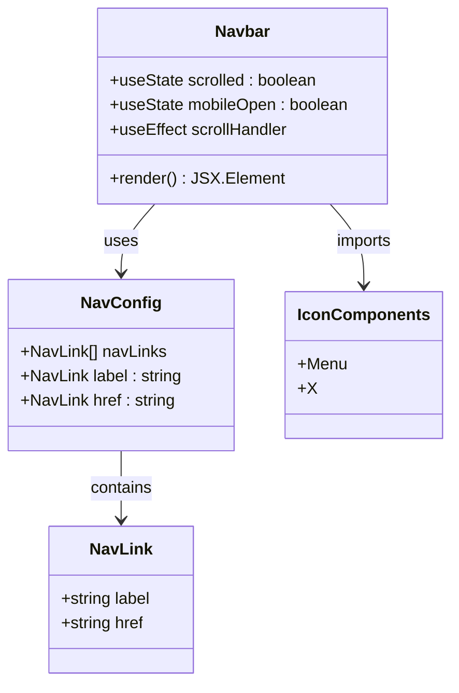
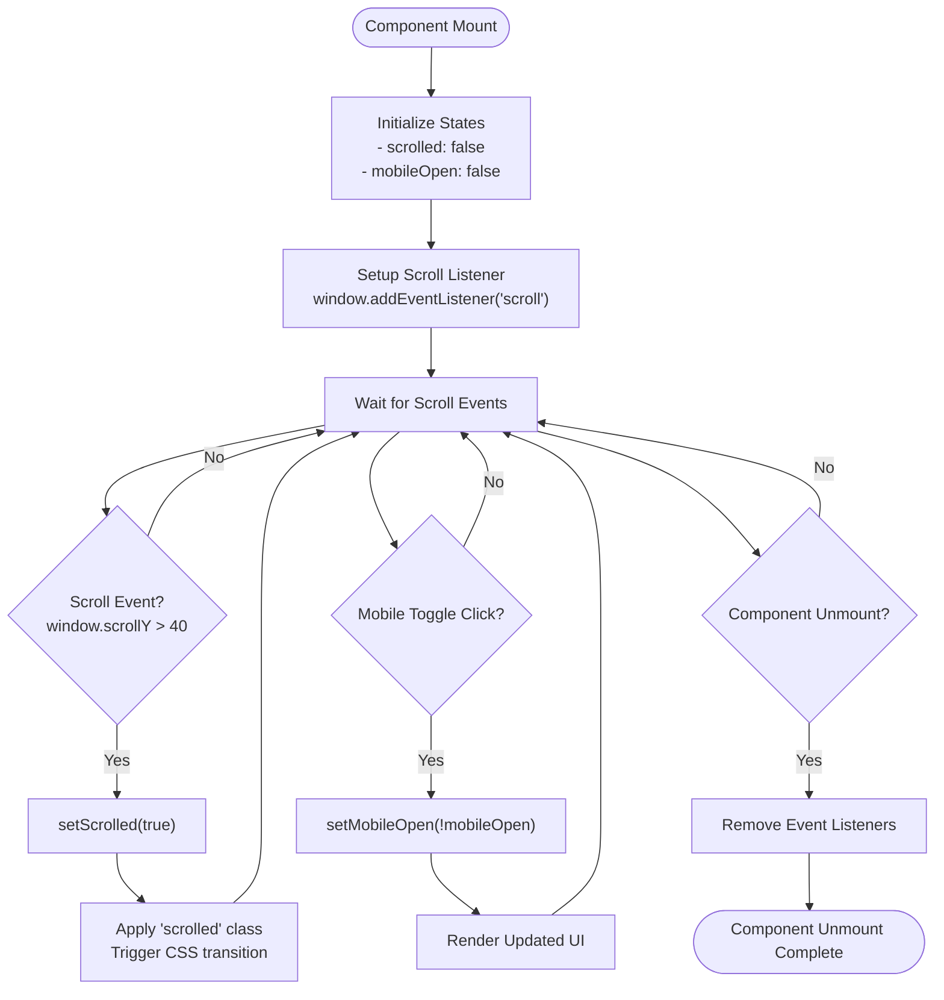
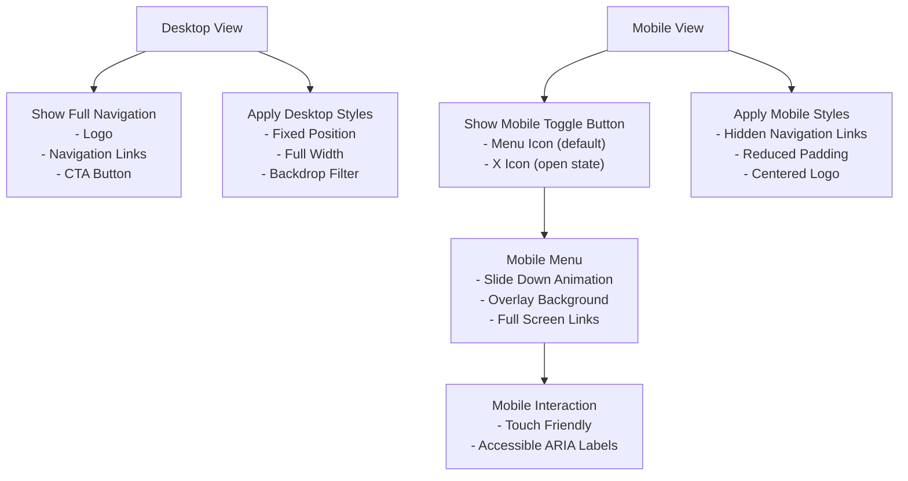
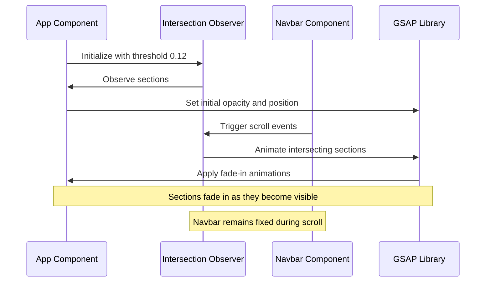
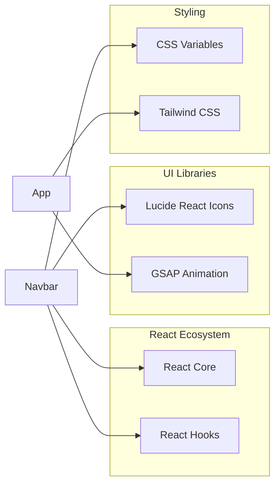
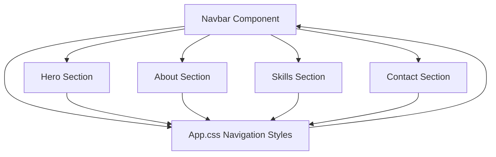

# Navbar Component

<cite>
**Referenced Files in This Document**
- [Navbar.tsx](file://src/components/Navbar.tsx)
- [App.tsx](file://src/App.tsx)
- [App.css](file://src/App.css)
- [Hero.tsx](file://src/components/Hero.tsx)
- [About.tsx](file://src/components/About.tsx)
- [Skills.tsx](file://src/components/Skills.tsx)
- [Contact.tsx](file://src/components/Contact.tsx)
- [package.json](file://package.json)
</cite>

## Table of Contents
1. [Introduction](#introduction)
2. [Project Structure](#project-structure)
3. [Core Components](#core-components)
4. [Architecture Overview](#architecture-overview)
5. [Detailed Component Analysis](#detailed-component-analysis)
6. [Dependency Analysis](#dependency-analysis)
7. [Performance Considerations](#performance-considerations)
8. [Troubleshooting Guide](#troubleshooting-guide)
9. [Conclusion](#conclusion)

## Introduction
The Navbar component is a sticky navigation system that provides smooth scrolling to page sections, responsive mobile menu functionality, and scroll-aware styling. It serves as the primary navigation hub for the portfolio website, coordinating with the main App component's scroll observer system to create a cohesive user experience.

## Project Structure
The Navbar component is part of a React-based portfolio application with the following structure:

**Diagram sources**
- [App.tsx:12-62](file://src/App.tsx#L12-L62)
- [Navbar.tsx:1-54](file://src/components/Navbar.tsx#L1-L54)
- [App.css:1-404](file://src/App.css#L1-L404)

**Section sources**
- [App.tsx:12-62](file://src/App.tsx#L12-L62)
- [package.json:12-19](file://package.json#L12-L19)

## Core Components
The Navbar component consists of several key elements:

### Navigation Links Configuration
The component defines a static navigation configuration with four primary sections:
- About section with anchor reference `#about`
- Projects section with anchor reference `#projects` (currently mapped to skills)
- Skills section with anchor reference `#skills`
- Contact section with anchor reference `#contact`

### State Management
The component maintains two primary state variables:
- `scrolled`: Boolean flag indicating whether the user has scrolled past 40 pixels
- `mobileOpen`: Boolean flag controlling the mobile menu visibility

### Scroll Detection System
The component implements a scroll listener that updates the `scrolled` state when the user scrolls beyond a 40-pixel threshold, triggering visual changes in the navigation styling.

**Section sources**
- [Navbar.tsx:4-9](file://src/components/Navbar.tsx#L4-L9)
- [Navbar.tsx:11-19](file://src/components/Navbar.tsx#L11-L19)

## Architecture Overview
The Navbar integrates with the broader application through a coordinated scroll system:

**Diagram sources**
- [Navbar.tsx:15-19](file://src/components/Navbar.tsx#L15-L19)
- [App.tsx:19-42](file://src/App.tsx#L19-L42)

## Detailed Component Analysis

### Component Structure and Implementation

**Diagram sources**
- [Navbar.tsx:1-54](file://src/components/Navbar.tsx#L1-L54)

### State Management System

The component employs React's useState and useEffect hooks for state management:

**Diagram sources**
- [Navbar.tsx:11-19](file://src/components/Navbar.tsx#L11-L19)

### Responsive Design Implementation

The component includes mobile-responsive functionality through CSS media queries:

**Diagram sources**
- [App.css:393-403](file://src/App.css#L393-L403)
- [Navbar.tsx:35-48](file://src/components/Navbar.tsx#L35-L48)

### Integration with Scroll Observer System

The Navbar coordinates with the App component's Intersection Observer for scroll-aware animations:

**Diagram sources**
- [App.tsx:19-42](file://src/App.tsx#L19-L42)

**Section sources**
- [Navbar.tsx:11-51](file://src/components/Navbar.tsx#L11-L51)
- [App.tsx:12-62](file://src/App.tsx#L12-L62)

## Dependency Analysis

### External Dependencies
The Navbar component relies on several external libraries:

**Diagram sources**
- [package.json:12-19](file://package.json#L12-L19)
- [Navbar.tsx:1](file://src/components/Navbar.tsx#L1)

### Internal Dependencies
The component interacts with other application components through shared styling and navigation patterns:

**Diagram sources**
- [App.css:1-404](file://src/App.css#L1-L404)
- [Navbar.tsx:21-50](file://src/components/Navbar.tsx#L21-L50)

**Section sources**
- [package.json:12-19](file://package.json#L12-L19)
- [App.css:1-404](file://src/App.css#L1-L404)

## Performance Considerations

### Scroll Performance Optimization
The Navbar component implements efficient scroll handling through a single event listener with cleanup:

- **Event Listener Cleanup**: Properly removes scroll listeners on component unmount to prevent memory leaks
- **Debounced Updates**: Scroll events trigger minimal re-renders through state updates
- **Fixed Positioning**: Uses CSS fixed positioning to avoid layout recalculations during scroll

### Mobile Performance
The mobile menu implementation prioritizes performance:
- **Conditional Rendering**: Mobile menu only renders on smaller screens
- **CSS Transitions**: Uses hardware-accelerated CSS transitions for smooth animations
- **Touch-Friendly**: Optimized touch targets and gestures for mobile devices

### Bundle Size Impact
The component has minimal bundle impact:
- **Icon Imports**: Uses tree-shaking friendly imports from lucide-react
- **CSS Integration**: Leverages existing CSS variables and Tailwind utilities
- **No Heavy Dependencies**: Relies on lightweight React hooks and browser APIs

## Troubleshooting Guide

### Common Issues and Solutions

#### Navigation Links Not Working
**Problem**: Clicking navigation links doesn't scroll to sections
**Solution**: Verify that section IDs match navigation href attributes
- Ensure sections have corresponding `id` attributes (e.g., `id="about"`)
- Check that navigation href values match section IDs exactly

#### Sticky Navigation Not Appearing
**Problem**: Navigation doesn't stick to the top during scroll
**Solution**: Verify CSS positioning and z-index values
- Confirm `.nav` class has `position: fixed` and appropriate `z-index`
- Ensure backdrop filter and background properties are correctly applied

#### Mobile Menu Not Responding
**Problem**: Mobile toggle button doesn't open/close menu
**Solution**: Check CSS media query conditions and button styling
- Verify media query breakpoint matches responsive design
- Ensure button has proper `display: none` styling for desktop
- Confirm click handler is properly bound to state update

#### Scroll Detection Not Triggering
**Problem**: Scrolled state doesn't change during navigation
**Solution**: Validate scroll threshold and event listener setup
- Check that scroll threshold (40px) matches CSS transition timing
- Verify event listener is properly attached and cleaned up
- Ensure component is mounted before scroll events occur

**Section sources**
- [Navbar.tsx:15-19](file://src/components/Navbar.tsx#L15-L19)
- [App.css:1-404](file://src/App.css#L1-L404)

## Conclusion
The Navbar component provides a robust, performance-optimized navigation solution that seamlessly integrates with the portfolio's scroll-aware design system. Its implementation demonstrates best practices in React state management, responsive design, and performance optimization while maintaining accessibility and cross-browser compatibility.

The component's modular design allows for easy customization of colors, positioning, and menu items through CSS variables and configuration arrays, making it adaptable to various design systems and branding requirements. The coordination with the App component's scroll observer creates a cohesive user experience that enhances navigation fluidity and visual appeal.

Key strengths of the implementation include:
- Efficient scroll handling with proper cleanup
- Responsive design with mobile-first approach
- Integration with GSAP for smooth animations
- Clean separation of concerns between navigation and content
- Extensible architecture for future enhancements

The Navbar serves as a foundational element that establishes the overall navigation paradigm for the portfolio, setting expectations for smooth interactions and consistent visual feedback across all user journeys.