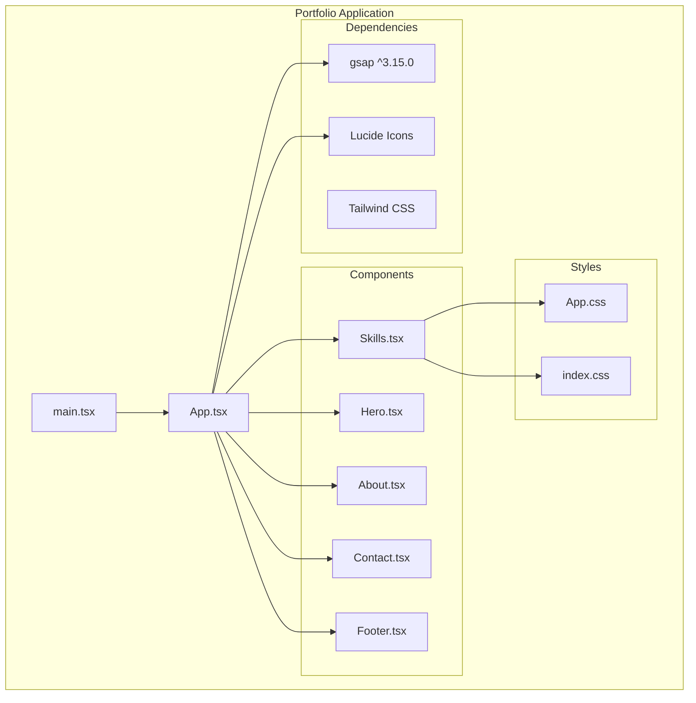
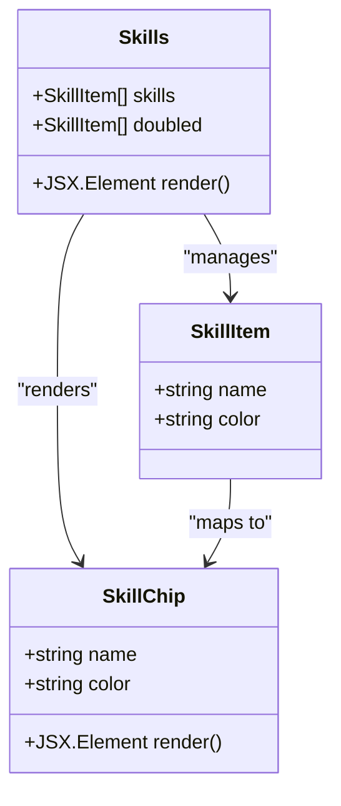
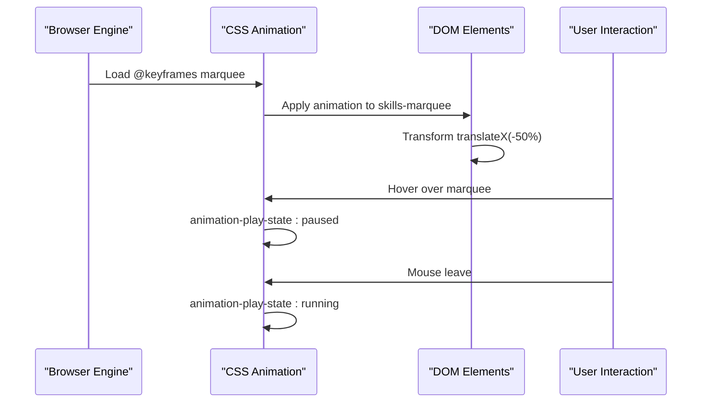
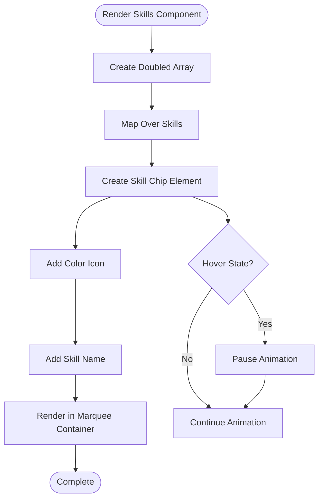
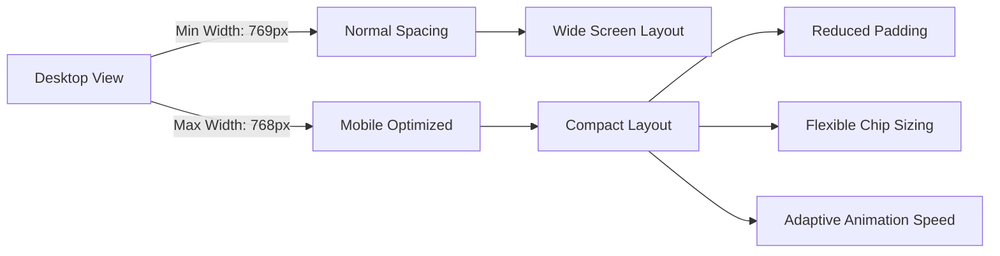
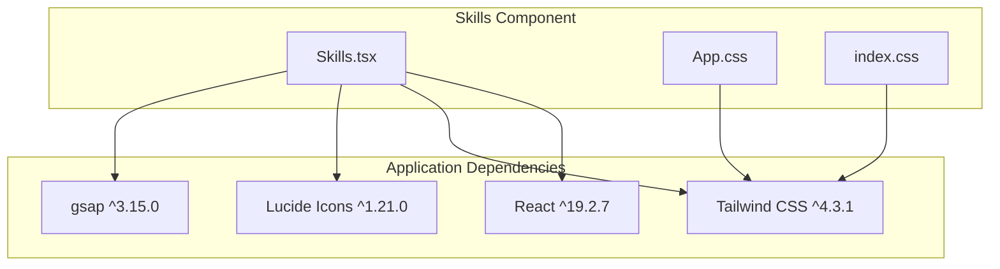

# Skills Component

<cite>
**Referenced Files in This Document**
- [Skills.tsx](file://src/components/Skills.tsx)
- [App.tsx](file://src/App.tsx)
- [App.css](file://src/App.css)
- [index.css](file://src/index.css)
- [package.json](file://package.json)
- [index.html](file://index.html)
</cite>

## Table of Contents
1. [Introduction](#introduction)
2. [Project Structure](#project-structure)
3. [Core Components](#core-components)
4. [Architecture Overview](#architecture-overview)
5. [Detailed Component Analysis](#detailed-component-analysis)
6. [Dependency Analysis](#dependency-analysis)
7. [Performance Considerations](#performance-considerations)
8. [Troubleshooting Guide](#troubleshooting-guide)
9. [Conclusion](#conclusion)

## Introduction

The Skills component showcases a sophisticated infinite horizontal scrolling marquee technology display system. This component demonstrates advanced React patterns for creating seamless looping animations, responsive design implementations, and performance-optimized rendering techniques. The implementation features a dual-array duplication strategy for infinite loops, CSS keyframe animations for smooth transitions, and a comprehensive skill chip display system with customizable color schemes.

The component serves as a technology showcase that dynamically presents a portfolio of development skills and tools in an engaging, continuous scrolling format. It integrates seamlessly with the broader portfolio application while maintaining its own distinct visual identity and interactive capabilities.

## Project Structure

The Skills component is part of a larger React portfolio application built with modern web technologies. The component follows a modular architecture pattern where each major section of the portfolio is encapsulated in its own component file.

**Diagram sources**
- [main.tsx:1-12](file://src/main.tsx#L1-L12)
- [App.tsx:1-62](file://src/App.tsx#L1-L62)
- [Skills.tsx:1-55](file://src/components/Skills.tsx#L1-L55)

**Section sources**
- [main.tsx:1-12](file://src/main.tsx#L1-L12)
- [App.tsx:1-62](file://src/App.tsx#L1-L62)

## Core Components

### Skills Component Implementation

The Skills component implements a sophisticated infinite scrolling marquee system using React state management and CSS animations. The component maintains a static skill database with 17 technology entries, each containing a name and associated brand color.

**Diagram sources**
- [Skills.tsx:1-55](file://src/components/Skills.tsx#L1-L55)

The component utilizes a strategic duplication technique where the original skill array is concatenated with itself to create seamless infinite loops. This approach eliminates the need for complex state management or external libraries for animation control.

**Section sources**
- [Skills.tsx:1-55](file://src/components/Skills.tsx#L1-L55)

## Architecture Overview

The Skills component architecture demonstrates several key design patterns and implementation strategies:

### State Management Strategy

The component employs a minimal state approach, relying on React's built-in state management for the duplicated array while delegating animation control to CSS keyframes. This hybrid approach optimizes performance by reducing unnecessary re-renders.

### Animation Architecture

**Diagram sources**
- [App.css:294-314](file://src/App.css#L294-L314)

### Responsive Design Integration

The component seamlessly integrates with the application's responsive design system, utilizing CSS clamp functions and flexible units to adapt to various screen sizes while maintaining visual consistency.

**Section sources**
- [Skills.tsx:20-52](file://src/components/Skills.tsx#L20-L52)
- [App.css:294-314](file://src/App.css#L294-L314)

## Detailed Component Analysis

### Marquee Implementation

The marquee system utilizes CSS keyframe animations combined with React's array manipulation techniques to create seamless infinite loops. The implementation consists of three primary elements:

#### Animation Control Mechanism

The marquee animation operates through a combination of CSS transforms and JavaScript array duplication:

1. **Array Duplication**: The original skill array is duplicated using spread operator concatenation
2. **CSS Animation**: A 30-second linear animation moves the container 50% of its width
3. **Hover Pause**: Mouse interaction temporarily halts animation for user control

#### Skill Chip Display System

Each skill is rendered as an individual chip containing both visual and textual elements:

**Diagram sources**
- [Skills.tsx:20-52](file://src/components/Skills.tsx#L20-L52)

**Section sources**
- [Skills.tsx:20-52](file://src/components/Skills.tsx#L20-L52)
- [App.css:294-314](file://src/App.css#L294-L314)

### Responsive Design Patterns

The component implements comprehensive responsive design patterns that adapt to various screen sizes:

#### Mobile Responsiveness

The skills section includes specific mobile optimizations that adjust spacing, typography, and layout characteristics for smaller screens:

**Diagram sources**
- [App.css:392-404](file://src/App.css#L392-L404)

#### Typography Scaling

The component utilizes CSS clamp functions for fluid typography that adapts smoothly across device sizes while maintaining readability standards.

**Section sources**
- [App.css:392-404](file://src/App.css#L392-L404)

### Performance Optimizations

The implementation incorporates several performance optimization strategies:

#### Animation Performance

- **Hardware Acceleration**: CSS transforms utilize GPU acceleration for smooth 60fps animations
- **Efficient Repaints**: Minimal DOM manipulation reduces layout thrashing
- **Animation Control**: Hover pause prevents unnecessary animation during user interaction

#### Memory Management

- **Static Data**: Skill data remains constant, eliminating dynamic memory allocation
- **Component Isolation**: Self-contained component reduces cross-component interference
- **CSS-Based Animation**: Delegation of animation logic to CSS reduces JavaScript overhead

**Section sources**
- [Skills.tsx:20-52](file://src/components/Skills.tsx#L20-L52)
- [App.css:294-314](file://src/App.css#L294-L314)

## Dependency Analysis

### External Dependencies

The Skills component relies on several key dependencies that contribute to its functionality:

**Diagram sources**
- [package.json:12-18](file://package.json#L12-L18)
- [Skills.tsx:1-55](file://src/components/Skills.tsx#L1-L55)

### Internal Dependencies

The component integrates with the broader application ecosystem through shared styling and layout systems:

#### Global Styling Integration

The component leverages the application's global CSS variables and theme system for consistent visual presentation across all sections.

#### Animation System Coordination

The Skills component participates in the application's scroll-triggered animation system, benefiting from the centralized GSAP configuration.

**Section sources**
- [package.json:12-18](file://package.json#L12-L18)
- [App.tsx:12-42](file://src/App.tsx#L12-L42)

## Performance Considerations

### Animation Performance Metrics

The marquee animation achieves optimal performance through several key strategies:

#### Hardware Acceleration

CSS transforms utilize GPU acceleration, ensuring smooth 60fps animations even on lower-powered devices. The animation leverages transform properties rather than layout-affecting properties like left/top positioning.

#### Memory Efficiency

The component maintains a constant memory footprint through static data structures and efficient rendering patterns. The duplicated array approach ensures seamless loops without additional computational overhead.

#### Browser Compatibility

The implementation uses widely supported CSS animation properties and React's established rendering patterns, ensuring broad browser compatibility across modern web browsers.

### Optimization Opportunities

While the current implementation is highly optimized, potential enhancements could include:

- **Dynamic Skill Loading**: Implement lazy loading for large skill databases
- **Animation Configurability**: Add runtime controls for animation speed and behavior
- **Accessibility Enhancements**: Implement ARIA attributes for screen reader compatibility

## Troubleshooting Guide

### Common Issues and Solutions

#### Animation Not Starting

**Symptoms**: Skills marquee appears static without movement
**Causes**: CSS animation not loading or conflicting styles
**Solutions**: 
- Verify CSS keyframe definitions are present
- Check for conflicting animation properties
- Ensure proper CSS class application

#### Hover Pause Not Working

**Symptoms**: Animation continues despite mouse interaction
**Causes**: CSS hover state not properly applied
**Solutions**:
- Verify `:hover` pseudo-class implementation
- Check CSS specificity conflicts
- Ensure proper event handling

#### Mobile Responsiveness Issues

**Symptoms**: Skills display incorrectly on mobile devices
**Causes**: Responsive breakpoints not properly configured
**Solutions**:
- Verify media query implementation
- Check viewport meta tag configuration
- Test on actual mobile devices

### Debugging Strategies

#### Performance Monitoring

Monitor animation performance using browser developer tools:
- Check for paint and composite bottlenecks
- Monitor frame rate during animation
- Verify GPU acceleration utilization

#### Style Inspection

Inspect element styles to ensure proper CSS application:
- Verify animation property inheritance
- Check transform matrix calculations
- Confirm responsive breakpoint activation

**Section sources**
- [App.css:294-314](file://src/App.css#L294-L314)
- [Skills.tsx:20-52](file://src/components/Skills.tsx#L20-L52)

## Conclusion

The Skills component represents a sophisticated implementation of infinite horizontal scrolling technology showcasing modern React patterns and CSS animation techniques. The component successfully balances performance optimization with visual appeal, creating an engaging user experience while maintaining excellent accessibility and responsive design characteristics.

The implementation demonstrates key principles of efficient React development, including minimal state management, hardware-accelerated animations, and comprehensive responsive design patterns. The component serves as both a functional portfolio element and a technical demonstration of advanced web development practices.

Future enhancements could focus on expanding the skill database management system, implementing configurable animation parameters, and adding enhanced accessibility features for improved user experience across diverse audiences.