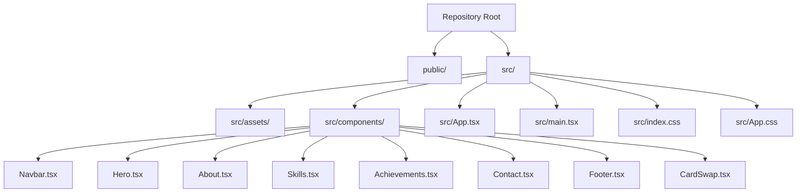
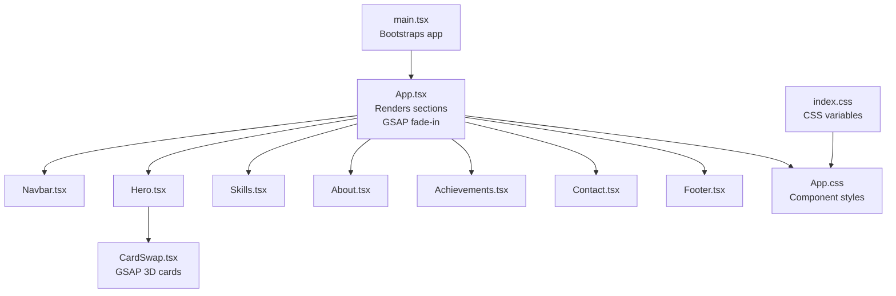
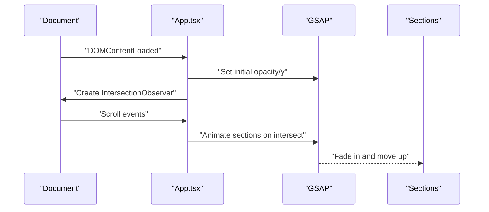
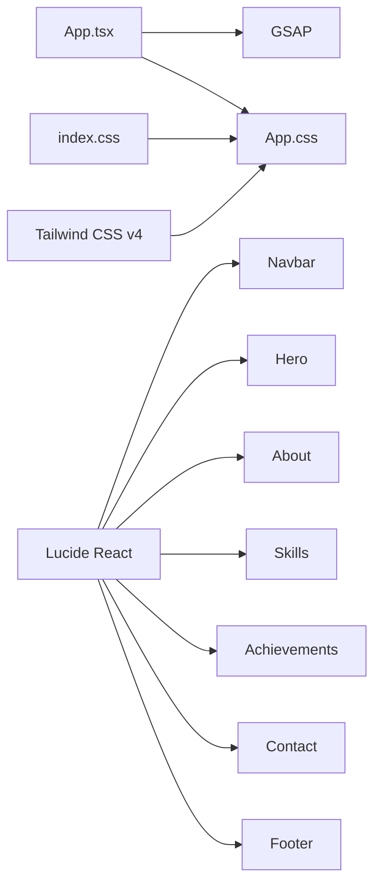

# Customization Guide

<cite>
**Referenced Files in This Document**
- [README.md](file://README.md)
- [package.json](file://package.json)
- [index.html](file://index.html)
- [src/main.tsx](file://src/main.tsx)
- [src/App.tsx](file://src/App.tsx)
- [src/App.css](file://src/App.css)
- [src/index.css](file://src/index.css)
- [src/components/Navbar.tsx](file://src/components/Navbar.tsx)
- [src/components/Hero.tsx](file://src/components/Hero.tsx)
- [src/components/About.tsx](file://src/components/About.tsx)
- [src/components/Skills.tsx](file://src/components/Skills.tsx)
- [src/components/Achievements.tsx](file://src/components/Achievements.tsx)
- [src/components/Contact.tsx](file://src/components/Contact.tsx)
- [src/components/Footer.tsx](file://src/components/Footer.tsx)
- [src/components/CardSwap.tsx](file://src/components/CardSwap.tsx)
</cite>

## Table of Contents
1. [Introduction](#introduction)
2. [Project Structure](#project-structure)
3. [Core Components](#core-components)
4. [Architecture Overview](#architecture-overview)
5. [Detailed Component Analysis](#detailed-component-analysis)
6. [Dependency Analysis](#dependency-analysis)
7. [Performance Considerations](#performance-considerations)
8. [Troubleshooting Guide](#troubleshooting-guide)
9. [Conclusion](#conclusion)
10. [Appendices](#appendices)

## Introduction
This guide explains how to customize the portfolio website for different users and use cases. It covers modifying personal information, updating skills and achievements, customizing color schemes, adding new sections, managing assets in the public directory, integrating new animations, adjusting existing components, and extending functionality. It also provides step-by-step instructions for common tasks such as changing the hero background, updating social media links, and configuring contact forms. Finally, it outlines TypeScript interface modifications for new data structures and component props, along with best practices to preserve animations and responsive design.

## Project Structure
The project is a React + TypeScript + Vite application using Tailwind CSS v4 and GSAP for animations. The site is composed of modular components under src/components, styled via src/index.css (CSS variables) and src/App.css. Static assets live under the public directory, organized by type (e.g., certificates, project screenshots).

**Diagram sources**
- [src/App.tsx:1-62](file://src/App.tsx#L1-L62)
- [src/main.tsx:1-12](file://src/main.tsx#L1-L12)
- [src/index.css:1-87](file://src/index.css#L1-L87)
- [src/App.css:1-404](file://src/App.css#L1-L404)
- [src/components/Navbar.tsx:1-54](file://src/components/Navbar.tsx#L1-L54)
- [src/components/Hero.tsx:1-84](file://src/components/Hero.tsx#L1-L84)
- [src/components/About.tsx:1-124](file://src/components/About.tsx#L1-L124)
- [src/components/Skills.tsx:1-55](file://src/components/Skills.tsx#L1-L55)
- [src/components/Achievements.tsx:1-116](file://src/components/Achievements.tsx#L1-L116)
- [src/components/Contact.tsx:1-130](file://src/components/Contact.tsx#L1-L130)
- [src/components/Footer.tsx:1-30](file://src/components/Footer.tsx#L1-L30)
- [src/components/CardSwap.tsx:1-230](file://src/components/CardSwap.tsx#L1-L230)

**Section sources**
- [README.md:1-76](file://README.md#L1-L76)
- [package.json:1-35](file://package.json#L1-L35)
- [index.html:1-17](file://index.html#L1-L17)
- [src/main.tsx:1-12](file://src/main.tsx#L1-L12)
- [src/App.tsx:1-62](file://src/App.tsx#L1-L62)
- [src/index.css:1-87](file://src/index.css#L1-L87)
- [src/App.css:1-404](file://src/App.css#L1-L404)

## Core Components
This section highlights the primary building blocks and their customization touchpoints:
- Navigation: Modify branding, navigation items, and CTA.
- Hero: Adjust headline, badges, buttons, and animated card stack.
- About: Personal bio, stats, and feature highlights.
- Skills: Tech stack list and marquee behavior.
- Achievements: Certificates grid with lightbox.
- Contact: Contact info, social links, and form.
- Footer: Social links and copyright.
- Animations: GSAP-driven fade-ins and CardSwap transitions.

Key customization locations:
- Personal information and branding: Navbar, Hero, About, Footer.
- Skills and achievements data: Skills.tsx, Achievements.tsx.
- Color scheme: CSS variables in index.css.
- Animations: App.tsx (fade-in), CardSwap.tsx (3D card flip).
- Assets: public/certificates and public/project directories.

**Section sources**
- [src/components/Navbar.tsx:1-54](file://src/components/Navbar.tsx#L1-L54)
- [src/components/Hero.tsx:1-84](file://src/components/Hero.tsx#L1-L84)
- [src/components/About.tsx:1-124](file://src/components/About.tsx#L1-L124)
- [src/components/Skills.tsx:1-55](file://src/components/Skills.tsx#L1-L55)
- [src/components/Achievements.tsx:1-116](file://src/components/Achievements.tsx#L1-L116)
- [src/components/Contact.tsx:1-130](file://src/components/Contact.tsx#L1-L130)
- [src/components/Footer.tsx:1-30](file://src/components/Footer.tsx#L1-L30)
- [src/App.tsx:1-62](file://src/App.tsx#L1-L62)
- [src/components/CardSwap.tsx:1-230](file://src/components/CardSwap.tsx#L1-L230)
- [src/index.css:1-87](file://src/index.css#L1-L87)

## Architecture Overview
The app initializes in main.tsx, renders App.tsx, which composes all sections. Animations are orchestrated via GSAP in App.tsx and CardSwap.tsx. Styles rely on CSS variables defined in index.css and component-specific styles in App.css.

**Diagram sources**
- [src/main.tsx:1-12](file://src/main.tsx#L1-L12)
- [src/App.tsx:1-62](file://src/App.tsx#L1-L62)
- [src/components/Navbar.tsx:1-54](file://src/components/Navbar.tsx#L1-L54)
- [src/components/Hero.tsx:1-84](file://src/components/Hero.tsx#L1-L84)
- [src/components/Skills.tsx:1-55](file://src/components/Skills.tsx#L1-L55)
- [src/components/About.tsx:1-124](file://src/components/About.tsx#L1-L124)
- [src/components/Achievements.tsx:1-116](file://src/components/Achievements.tsx#L1-L116)
- [src/components/Contact.tsx:1-130](file://src/components/Contact.tsx#L1-L130)
- [src/components/Footer.tsx:1-30](file://src/components/Footer.tsx#L1-L30)
- [src/components/CardSwap.tsx:1-230](file://src/components/CardSwap.tsx#L1-L230)
- [src/index.css:1-87](file://src/index.css#L1-L87)
- [src/App.css:1-404](file://src/App.css#L1-L404)

## Detailed Component Analysis

### Personal Information and Branding
- Navbar
  - Customize logo text and navigation links.
  - Adjust hover effects and CTA button styling.
  - Scroll behavior and mobile toggle are built-in.
- Hero
  - Update headline, subtitle, badge, and buttons.
  - Replace animated cards with your own content.
- About
  - Change avatar placeholder text and role.
  - Update bio paragraphs and feature highlights.
  - Modify stats numbers and labels.
- Footer
  - Update social links and copyright year.

Step-by-step customization examples:
- Change hero headline and subtitle
  - Edit the title and subtitle elements in Hero.tsx.
  - Keep the gradient text class for consistent theming.
- Update navbar branding
  - Modify the logo text and nav links array in Navbar.tsx.
- Adjust about stats
  - Edit the stat array in About.tsx.
- Update footer social links
  - Change the social list in Footer.tsx.

Best practices:
- Preserve class names and IDs to keep animations intact.
- Use CSS variables for colors to maintain theme consistency.

**Section sources**
- [src/components/Navbar.tsx:1-54](file://src/components/Navbar.tsx#L1-L54)
- [src/components/Hero.tsx:1-84](file://src/components/Hero.tsx#L1-L84)
- [src/components/About.tsx:1-124](file://src/components/About.tsx#L1-L124)
- [src/components/Footer.tsx:1-30](file://src/components/Footer.tsx#L1-L30)

### Skills and Achievements
- Skills
  - Add or remove technologies in the skills array.
  - Each item requires a name and color for the chip.
- Achievements
  - Define achievement entries with title, issuer, date, image path, tags, and description.
  - Images are loaded from the public directory (e.g., /certificates/<file>).

Step-by-step:
- Add a new skill
  - Append an object with name and color to the skills array in Skills.tsx.
- Add a new certificate
  - Place the image under public/certificates.
  - Add a new achievement entry in Achievements.tsx with the correct image path.

Notes:
- The marquee duplicates the list to create a seamless loop.
- The lightbox opens images from the selected achievement.

**Section sources**
- [src/components/Skills.tsx:1-55](file://src/components/Skills.tsx#L1-L55)
- [src/components/Achievements.tsx:1-116](file://src/components/Achievements.tsx#L1-L116)

### Color Scheme and Theming
- Global variables
  - Modify CSS variables in index.css to change the palette (backgrounds, text, accents, gradients).
- Component styles
  - Many components use var(--...) for colors, ensuring consistent theming.
- Gradients
  - Gradient definitions are centralized in index.css and referenced across components.

Step-by-step:
- Change primary accent color
  - Update --accent and related variants in index.css.
- Switch dark/light mode
  - Swap all --bg-* and --text-* variables in index.css.

Validation tip:
- Preview after changes to ensure contrast and readability remain acceptable.

**Section sources**
- [src/index.css:1-87](file://src/index.css#L1-L87)
- [src/App.css:1-404](file://src/App.css#L1-L404)

### Asset Management (Images, Certificates, Screenshots)
- Location
  - public/certificates for certificate images.
  - public/project for project screenshots.
- Loading
  - References are absolute paths starting with "/".
- Replacement
  - Drop new images into the appropriate folder and update the image property in the data source (Achievements.tsx for certificates; adjust Hero or About as needed for placeholders).

Guidelines:
- Use appropriate image sizes for performance.
- Keep filenames lowercase and hyphenated for consistency.

**Section sources**
- [src/components/Achievements.tsx:1-116](file://src/components/Achievements.tsx#L1-L116)
- [src/components/About.tsx:1-124](file://src/components/About.tsx#L1-L124)
- [src/components/Hero.tsx:1-84](file://src/components/Hero.tsx#L1-L84)

### Animations and Interactions
- Fade-in on scroll
  - Implemented in App.tsx using GSAP to animate sections when they enter the viewport.
- CardSwap 3D flip
  - CardSwap.tsx manages a stack of cards with GSAP timelines for drop/move/return sequences.
  - Props include dimensions, distances, delay, easing, and hover behavior.

Step-by-step:
- Adjust fade-in timing
  - Modify durations and easing in App.tsx.
- Tune CardSwap
  - Adjust cardDistance, verticalDistance, delay, skewAmount, and easing in Hero.tsx.
- Pause on hover
  - Toggle pauseOnHover in Hero.tsx to control behavior.

**Diagram sources**
- [src/App.tsx:1-62](file://src/App.tsx#L1-L62)

**Section sources**
- [src/App.tsx:1-62](file://src/App.tsx#L1-L62)
- [src/components/CardSwap.tsx:1-230](file://src/components/CardSwap.tsx#L1-L230)
- [src/components/Hero.tsx:1-84](file://src/components/Hero.tsx#L1-L84)

### Adding New Sections
Steps:
- Create a new component under src/components.
- Import and render it in App.tsx within the page flow.
- Add section dividers if desired.
- Style using App.css and index.css variables.

Considerations:
- Maintain the section class and ID conventions for animations and navigation.
- Use responsive breakpoints already defined in App.css.

**Section sources**
- [src/App.tsx:1-62](file://src/App.tsx#L1-L62)
- [src/App.css:1-404](file://src/App.css#L1-L404)

### Modifying Existing Components
Common modifications:
- Change layout grids (About.tsx, Achievements.tsx).
- Update static lists (Navbar.tsx, Contact.tsx).
- Adjust hover/focus states in App.css.

Guidelines:
- Keep class names consistent to preserve animations.
- Prefer CSS variables for colors to maintain theme coherence.

**Section sources**
- [src/components/About.tsx:1-124](file://src/components/About.tsx#L1-L124)
- [src/components/Achievements.tsx:1-116](file://src/components/Achievements.tsx#L1-L116)
- [src/components/Navbar.tsx:1-54](file://src/components/Navbar.tsx#L1-L54)
- [src/components/Contact.tsx:1-130](file://src/components/Contact.tsx#L1-L130)
- [src/App.css:1-404](file://src/App.css#L1-L404)

### Extending Functionality (e.g., Contact Form)
Current state:
- The contact form exists but does not submit data.
- Social links are external anchors.

Recommended steps:
- Integrate a backend service or email API.
- Replace the form submission handler with a fetch call.
- Add client-side validation and success/error messaging.

Security and UX tips:
- Sanitize inputs.
- Use HTTPS endpoints.
- Provide user feedback on submission.

**Section sources**
- [src/components/Contact.tsx:1-130](file://src/components/Contact.tsx#L1-L130)

### TypeScript Interfaces and Props
When introducing new data structures or props:
- Define interfaces near their consumers (e.g., Achievement in Achievements.tsx).
- Extend component props with optional or required fields.
- Ensure default values or guards in components to handle missing data gracefully.

Examples to reference:
- Achievement interface in Achievements.tsx.
- Card and CardSwap props in CardSwap.tsx.

**Section sources**
- [src/components/Achievements.tsx:1-116](file://src/components/Achievements.tsx#L1-L116)
- [src/components/CardSwap.tsx:1-230](file://src/components/CardSwap.tsx#L1-L230)

## Dependency Analysis
External libraries and integrations:
- GSAP: Used for scroll-triggered fade-ins and CardSwap animations.
- Lucide icons: Icons imported in components.
- Tailwind CSS v4: Utility-first styling with CSS variables.

**Diagram sources**
- [package.json:1-35](file://package.json#L1-L35)
- [src/App.tsx:1-62](file://src/App.tsx#L1-L62)
- [src/index.css:1-87](file://src/index.css#L1-L87)
- [src/App.css:1-404](file://src/App.css#L1-L404)
- [src/components/Navbar.tsx:1-54](file://src/components/Navbar.tsx#L1-L54)
- [src/components/Hero.tsx:1-84](file://src/components/Hero.tsx#L1-L84)
- [src/components/About.tsx:1-124](file://src/components/About.tsx#L1-L124)
- [src/components/Skills.tsx:1-55](file://src/components/Skills.tsx#L1-L55)
- [src/components/Achievements.tsx:1-116](file://src/components/Achievements.tsx#L1-L116)
- [src/components/Contact.tsx:1-130](file://src/components/Contact.tsx#L1-L130)
- [src/components/Footer.tsx:1-30](file://src/components/Footer.tsx#L1-L30)

**Section sources**
- [package.json:1-35](file://package.json#L1-L35)

## Performance Considerations
- Lazy-loading images: Already using lazy loading for certificate thumbnails.
- Minimize reflows: CSS transforms and opacity changes are hardware-accelerated.
- Reduce bundle size: Keep icon imports scoped to components.
- Optimize assets: Compress images placed in public/.
- Avoid layout thrashing: Batch DOM reads/writes in animations.

[No sources needed since this section provides general guidance]

## Troubleshooting Guide
- Animations not triggering
  - Verify sections have the expected class names and IDs.
  - Ensure GSAP is imported and initialized in App.tsx.
- Cards not flipping
  - Confirm CardSwap props are passed correctly in Hero.tsx.
  - Check that refs and timeline are created without errors.
- Links not working
  - Review anchor hrefs and external URLs in Navbar.tsx, Contact.tsx, and Footer.tsx.
- Colors look incorrect
  - Re-check CSS variable overrides in index.css.
- Images not appearing
  - Confirm absolute paths in data match public directory structure.

**Section sources**
- [src/App.tsx:1-62](file://src/App.tsx#L1-L62)
- [src/components/CardSwap.tsx:1-230](file://src/components/CardSwap.tsx#L1-L230)
- [src/components/Navbar.tsx:1-54](file://src/components/Navbar.tsx#L1-L54)
- [src/components/Contact.tsx:1-130](file://src/components/Contact.tsx#L1-L130)
- [src/components/Footer.tsx:1-30](file://src/components/Footer.tsx#L1-L30)
- [src/index.css:1-87](file://src/index.css#L1-L87)
- [src/components/Achievements.tsx:1-116](file://src/components/Achievements.tsx#L1-L116)

## Conclusion
With this guide, you can tailor the portfolio to reflect your identity and showcase your work effectively. Focus on updating data arrays and CSS variables for branding, manage assets in the public directory, and preserve animations by keeping class names and IDs consistent. When extending functionality, introduce TypeScript interfaces thoughtfully and validate changes across devices.

[No sources needed since this section summarizes without analyzing specific files]

## Appendices

### Step-by-Step Customization Recipes

- Change the hero background and floating blobs
  - Modify gradient backgrounds and blob colors in App.css.
  - Adjust blob sizes and animation delays as needed.
  - Keep the hero-blob classes intact to preserve animations.

- Update social media links
  - Edit the socialLinks array in Contact.tsx.
  - Update the footer social list in Footer.tsx.
  - Ensure external URLs are valid.

- Configure contact form submission
  - Replace the form submission handler in Contact.tsx with a real endpoint.
  - Add basic validation and user feedback.

- Add a new section
  - Create a new component under src/components.
  - Import and render it in App.tsx.
  - Apply section classes and IDs for animations.

- Add new animations
  - Use GSAP in App.tsx for scroll-triggered effects.
  - Or integrate new animations in existing components via CardSwap.tsx patterns.

- Maintain responsive design
  - Test changes against existing media queries in App.css.
  - Avoid overriding responsive classes; prefer utility classes where possible.

**Section sources**
- [src/App.css:1-404](file://src/App.css#L1-L404)
- [src/components/Contact.tsx:1-130](file://src/components/Contact.tsx#L1-L130)
- [src/components/Footer.tsx:1-30](file://src/components/Footer.tsx#L1-L30)
- [src/App.tsx:1-62](file://src/App.tsx#L1-L62)
- [src/components/CardSwap.tsx:1-230](file://src/components/CardSwap.tsx#L1-L230)