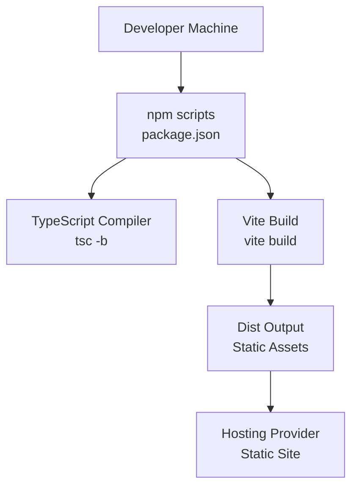
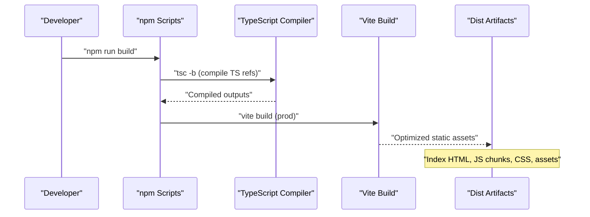
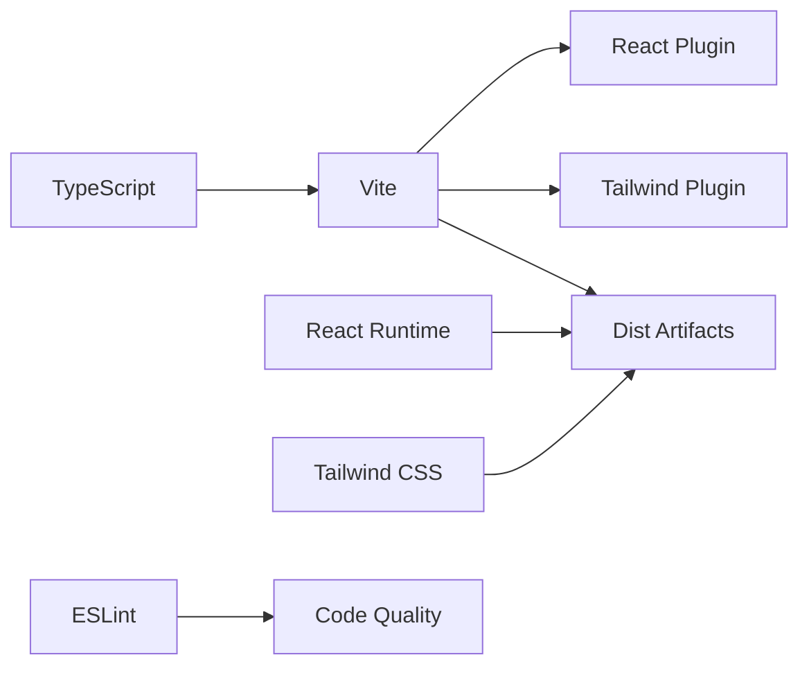

# Deployment and Production

<cite>
**Referenced Files in This Document**
- [package.json](file://package.json)
- [vite.config.ts](file://vite.config.ts)
- [index.html](file://index.html)
- [src/main.tsx](file://src/main.tsx)
- [src/App.tsx](file://src/App.tsx)
- [tsconfig.json](file://tsconfig.json)
- [tsconfig.app.json](file://tsconfig.app.json)
- [tsconfig.node.json](file://tsconfig.node.json)
- [eslint.config.js](file://eslint.config.js)
- [README.md](file://README.md)
</cite>

## Table of Contents
1. [Introduction](#introduction)
2. [Project Structure](#project-structure)
3. [Core Components](#core-components)
4. [Architecture Overview](#architecture-overview)
5. [Detailed Component Analysis](#detailed-component-analysis)
6. [Dependency Analysis](#dependency-analysis)
7. [Performance Considerations](#performance-considerations)
8. [Troubleshooting Guide](#troubleshooting-guide)
9. [Conclusion](#conclusion)
10. [Appendices](#appendices)

## Introduction
This document provides comprehensive deployment and production guidance for the portfolio website built with React, TypeScript, and Vite. It covers the build pipeline, optimization strategies for production bundles, hosting options for static sites, CDN integration, environment configuration, preview server setup, platform-specific deployment workflows, performance monitoring and bundle analysis, security considerations, and Progressive Web App readiness.

## Project Structure
The project follows a conventional React + TypeScript + Vite setup with a single-page application architecture. Build-time assets are processed via Vite and TypeScript, while runtime dependencies include React, Tailwind CSS, and animation utilities. The repository includes configuration files for Vite, TypeScript, ESLint, and HTML entry points.

**Diagram sources**
- [package.json:6-11](file://package.json#L6-L11)
- [vite.config.ts:1-9](file://vite.config.ts#L1-L9)
- [tsconfig.app.json:1-26](file://tsconfig.app.json#L1-L26)

**Section sources**
- [package.json:1-35](file://package.json#L1-L35)
- [vite.config.ts:1-9](file://vite.config.ts#L1-L9)
- [tsconfig.json:1-8](file://tsconfig.json#L1-L8)
- [tsconfig.app.json:1-26](file://tsconfig.app.json#L1-L26)
- [tsconfig.node.json:1-24](file://tsconfig.node.json#L1-L24)

## Core Components
- Build scripts:
  - Development: runs Vite’s dev server.
  - Production build: compiles TypeScript references and executes Vite build.
  - Preview: serves the production build locally.
- Vite configuration:
  - Plugins: React Fast Refresh and Tailwind CSS integration.
- TypeScript configuration:
  - Dual tsconfig references for application and Node tooling contexts.
- Linting:
  - Shared ESLint flat config with recommended presets.

Key implications for production:
- The build chain ensures type-safe transpilation and optimized bundling.
- Vite’s plugin ecosystem supports modern frontend tooling out of the box.
- ESLint configuration supports strict type-checked linting for improved reliability.

**Section sources**
- [package.json:6-11](file://package.json#L6-L11)
- [vite.config.ts:6-8](file://vite.config.ts#L6-L8)
- [tsconfig.json:1-8](file://tsconfig.json#L1-L8)
- [tsconfig.app.json:10-16](file://tsconfig.app.json#L10-L16)
- [eslint.config.js:8-22](file://eslint.config.js#L8-L22)

## Architecture Overview
The production build pipeline transforms source code into a static site optimized for distribution. The diagram below illustrates the end-to-end flow from source to deployable artifacts.

**Diagram sources**
- [package.json:8](file://package.json#L8)
- [tsconfig.app.json:10-16](file://tsconfig.app.json#L10-L16)
- [vite.config.ts:6-8](file://vite.config.ts#L6-L8)

## Detailed Component Analysis

### Build Pipeline and Optimization Strategies
- TypeScript compilation:
  - Dual tsconfig references ensure separate configurations for application and Node tooling, enabling precise control over module resolution and emit behavior.
  - Bundler mode and module detection settings optimize for Vite’s bundling pipeline.
- Vite build:
  - Plugins enable React Fast Refresh and Tailwind CSS processing.
  - Production builds minimize and split code for optimal loading.
- Asset handling:
  - HTML entry defines preconnected fonts and favicon, reducing render-blocking resources.
  - Script entry mounts the React root component.

Recommended production optimizations:
- Code splitting: leverage dynamic imports for route-level or feature-level lazy loading.
- Asset compression: enable gzip or brotli on the server or CDN.
- Caching: set long cache TTLs for immutable hashed assets; short for index.html.
- Minification: rely on Vite defaults; consider manual tuning if needed.
- Tree shaking: keep ES modules and avoid side-effectful imports.

**Section sources**
- [tsconfig.app.json:10-16](file://tsconfig.app.json#L10-L16)
- [vite.config.ts:6-8](file://vite.config.ts#L6-L8)
- [index.html:4-16](file://index.html#L4-L16)
- [src/main.tsx:1-12](file://src/main.tsx#L1-L12)

### Environment Variables and Secrets
- No explicit environment variable usages were identified in the provided files.
- For production deployments, define environment variables at the platform level (CI/CD, hosting provider console, or CDN settings).
- Keep secrets out of client-side code; expose only non-sensitive configuration via environment variables.

[No sources needed since this section provides general guidance]

### Preview Server Setup
- Local preview: serve the production build locally to validate performance and correctness.
- Use-case: simulate production behavior before deploying.

**Section sources**
- [package.json:10](file://package.json#L10)

### Hosting Options and CDN Integration
Suitable static hosting providers:
- Netlify: one-command deploys from Git; supports redirects, headers, and functions.
- Vercel: seamless Git integration; ISR, SWR, and edge functions.
- GitHub Pages: simplest option for repositories; requires publishing to gh-pages branch or configured folder.
- Traditional hosts: upload dist output to shared hosting or cloud storage with proper MIME types.

CDN integration tips:
- Serve static assets from a CDN for reduced latency.
- Configure origin pull or push depending on provider capabilities.
- Set cache policies per asset type.

[No sources needed since this section provides general guidance]

### Platform-Specific Deployment Workflows
- Netlify:
  - Connect repository; set build command to the project’s build script and output directory to the dist folder.
  - Configure environment variables in the Netlify UI.
- Vercel:
  - Connect repository; set framework preset to static export or custom build as needed.
  - Add environment variables in the project settings.
- GitHub Pages:
  - Publish dist to gh-pages branch or configure the actions workflow to deploy after build.
- Traditional web hosts:
  - Upload dist contents to the public_html or designated web root.
  - Ensure proper MIME types and caching headers.

[No sources needed since this section provides general guidance]

### Performance Monitoring and Bundle Analysis
- Bundle analysis:
  - Use Vite’s built-in reporter or third-party tools to inspect bundle composition.
  - Identify large dependencies and optimize imports.
- Metrics collection:
  - Measure Core Web Vitals (LCP, FID, CLS) in production.
  - Track Time to Interactive and First Contentful Paint.
- Observability:
  - Integrate analytics or APM tools to monitor real-user performance.

[No sources needed since this section provides general guidance]

### Security Considerations
- HTTPS enforcement:
  - Ensure the host or CDN serves content over TLS.
  - Redirect HTTP to HTTPS at the edge or origin.
- Security headers:
  - Add Content-Security-Policy, X-Frame-Options, X-Content-Type-Options, and Referrer-Policy via headers or CDN rules.
- Subresource Integrity (optional):
  - Consider SRI for critical third-party scripts.
- Content delivery:
  - Prefer CDNs with DDoS protection and WAF features.

[No sources needed since this section provides general guidance]

### Progressive Web App (PWA) Features and Offline Capability
- Current state:
  - No service worker or manifest were found in the provided files.
- Recommended additions:
  - Register a service worker for offline caching and background sync.
  - Provide a web app manifest for installability.
  - Implement caching strategies (cache-first or stale-while-revalidate) for static assets and API responses.
- Validation:
  - Test offline behavior using browser devtools and Lighthouse PWA checks.

[No sources needed since this section provides general guidance]

## Dependency Analysis
The build depends on Vite and TypeScript for bundling and type checking, with React powering the UI and Tailwind CSS for styling. ESLint enforces code quality and type safety.

**Diagram sources**
- [vite.config.ts:6-8](file://vite.config.ts#L6-L8)
- [tsconfig.app.json:10-16](file://tsconfig.app.json#L10-L16)
- [eslint.config.js:8-22](file://eslint.config.js#L8-L22)

**Section sources**
- [vite.config.ts:1-9](file://vite.config.ts#L1-L9)
- [tsconfig.app.json:10-16](file://tsconfig.app.json#L10-L16)
- [eslint.config.js:1-23](file://eslint.config.js#L1-L23)

## Performance Considerations
- Optimize images and fonts:
  - Compress images and serve modern formats (AVIF/WEBP) via CDN.
  - Subset fonts and preload critical font faces.
- Reduce JavaScript payload:
  - Split vendor and application bundles.
  - Defer non-critical features until after initial load.
- Improve rendering:
  - Use React.lazy and Suspense for large components.
  - Avoid layout thrashing; prefer transform-based animations.
- Network efficiency:
  - Enable HTTP/2 or HTTP/3.
  - Use brotli/gzip compression.
  - Set appropriate cache-control headers.

[No sources needed since this section provides general guidance]

## Troubleshooting Guide
Common issues and resolutions:
- Build fails due to type errors:
  - Run type checks locally and fix reported issues before building.
- Missing assets in production:
  - Verify base path and asset URLs; ensure assets are copied or referenced correctly.
- Lint failures blocking CI:
  - Run the linter locally and address warnings or errors.
- Preview differs from production:
  - Confirm environment differences and ensure consistent configuration.

**Section sources**
- [package.json:9](file://package.json#L9)
- [eslint.config.js:8-22](file://eslint.config.js#L8-L22)
- [README.md:14-44](file://README.md#L14-L44)

## Conclusion
This guide outlined the build and deployment process for the portfolio site, emphasizing a robust production pipeline, optimization strategies, and platform-agnostic hosting options. By leveraging Vite and TypeScript, applying CDN and caching best practices, and implementing security and observability measures, you can deliver a fast, reliable, and secure portfolio experience.

## Appendices

### Appendix A: Build and Preview Commands
- Development: starts the Vite dev server.
- Production build: compiles TypeScript references and produces optimized static assets.
- Preview: serves the production build locally for validation.

**Section sources**
- [package.json:6-11](file://package.json#L6-L11)

### Appendix B: TypeScript Configuration Highlights
- Application tsconfig:
  - Bundler mode and module detection tailored for Vite.
  - JSX runtime configured for React.
- Node tsconfig:
  - Separate configuration for tooling and Vite config.

**Section sources**
- [tsconfig.app.json:10-16](file://tsconfig.app.json#L10-L16)
- [tsconfig.node.json:9-14](file://tsconfig.node.json#L9-L14)

### Appendix C: HTML Entry and Root Mount
- HTML entry sets up the document head, preconnects fonts, and mounts the React root.
- Root mount initializes the React application.

**Section sources**
- [index.html:4-16](file://index.html#L4-L16)
- [src/main.tsx:7-11](file://src/main.tsx#L7-L11)

### Appendix D: Animation and Layout Effects
- The application uses a layout effect to animate sections on scroll, which impacts initial page weight and interactivity.

**Section sources**
- [src/App.tsx:12-42](file://src/App.tsx#L12-L42)