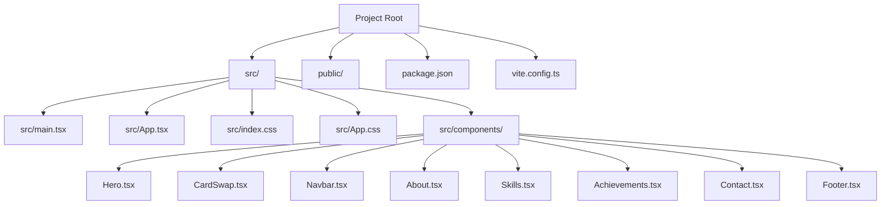
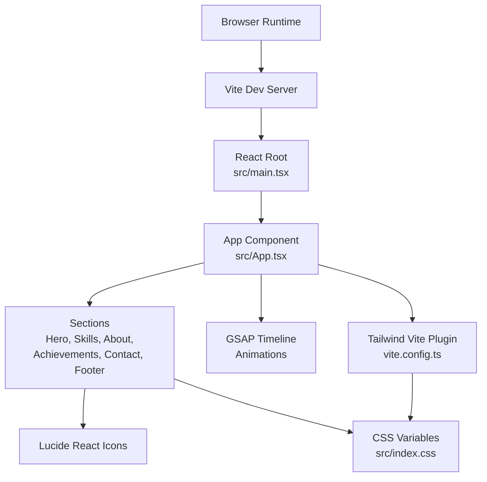
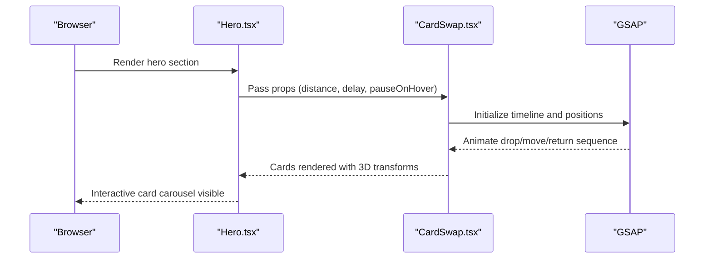
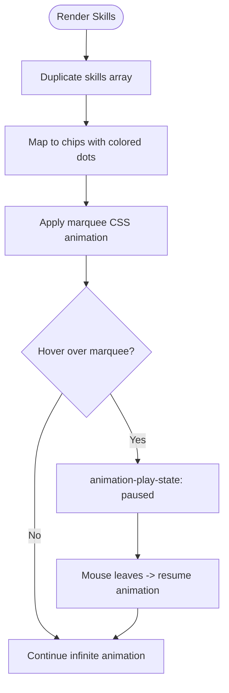
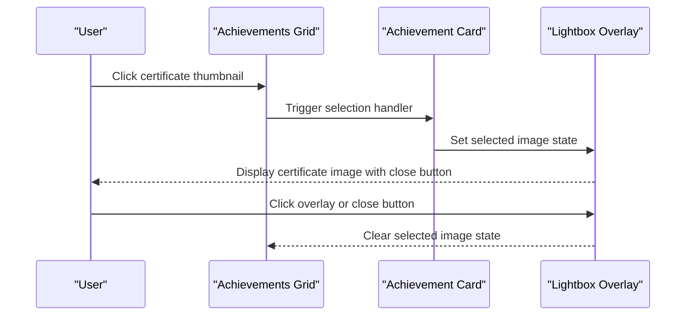
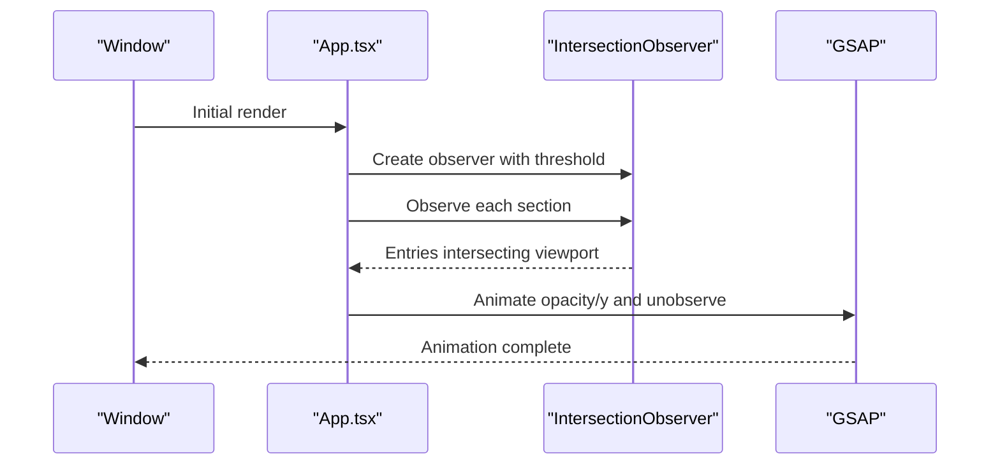
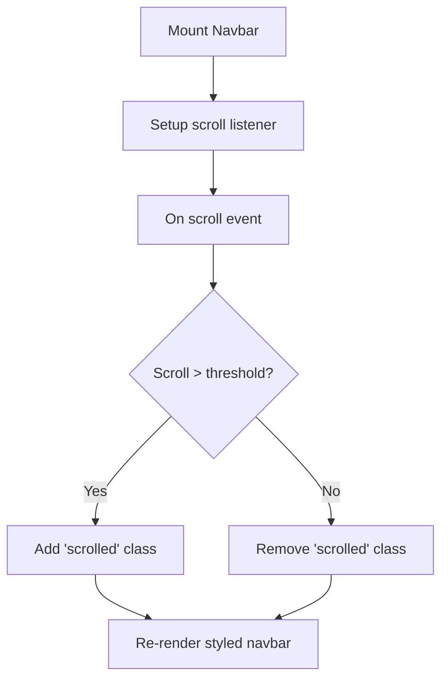
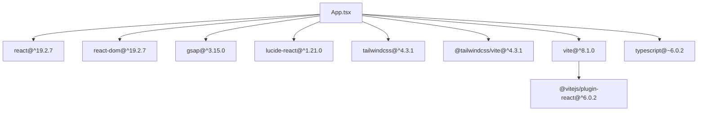

# Project Overview

<cite>
**Referenced Files in This Document**
- [package.json](file://package.json)
- [vite.config.ts](file://vite.config.ts)
- [src/main.tsx](file://src/main.tsx)
- [src/App.tsx](file://src/App.tsx)
- [src/index.css](file://src/index.css)
- [src/App.css](file://src/App.css)
- [src/components/Hero.tsx](file://src/components/Hero.tsx)
- [src/components/CardSwap.tsx](file://src/components/CardSwap.tsx)
- [src/components/Navbar.tsx](file://src/components/Navbar.tsx)
- [src/components/About.tsx](file://src/components/About.tsx)
- [src/components/Skills.tsx](file://src/components/Skills.tsx)
- [src/components/Achievements.tsx](file://src/components/Achievements.tsx)
- [src/components/Contact.tsx](file://src/components/Contact.tsx)
- [src/components/Footer.tsx](file://src/components/Footer.tsx)
</cite>

## Table of Contents
1. [Introduction](#introduction)
2. [Project Structure](#project-structure)
3. [Core Components](#core-components)
4. [Architecture Overview](#architecture-overview)
5. [Detailed Component Analysis](#detailed-component-analysis)
6. [Dependency Analysis](#dependency-analysis)
7. [Performance Considerations](#performance-considerations)
8. [Troubleshooting Guide](#troubleshooting-guide)
9. [Conclusion](#conclusion)
10. [Appendices](#appendices)

## Introduction
This personal portfolio website showcases a full-stack developer’s professional identity using modern web technologies. It presents a visually engaging, responsive, and interactive experience powered by React 19.2.7, TypeScript, GSAP 3.15.0 for animations, Lucide React for icons, TailwindCSS 4.3.1 via the Tailwind Vite plugin, and Vite 8.1.0 for fast builds and development. The site emphasizes storytelling through sections like an animated hero, a skills marquee, and a certificate gallery, while maintaining a cohesive design system and smooth user interactions.

## Project Structure
The project follows a component-driven structure with a small number of focused UI sections and shared styles. The entry point initializes the app, and the main App orchestrates page sections with scroll-triggered animations. Styles are split between a global theme and component-scoped CSS for layout and effects.

**Diagram sources**
- [src/main.tsx:1-12](file://src/main.tsx#L1-L12)
- [src/App.tsx:1-62](file://src/App.tsx#L1-L62)
- [src/App.css:1-404](file://src/App.css#L1-L404)
- [src/index.css:1-87](file://src/index.css#L1-L87)
- [vite.config.ts:1-9](file://vite.config.ts#L1-L9)

**Section sources**
- [src/main.tsx:1-12](file://src/main.tsx#L1-L12)
- [src/App.tsx:1-62](file://src/App.tsx#L1-L62)
- [src/index.css:1-87](file://src/index.css#L1-L87)
- [src/App.css:1-404](file://src/App.css#L1-L404)
- [vite.config.ts:1-9](file://vite.config.ts#L1-L9)
- [package.json:1-35](file://package.json#L1-L35)

## Core Components
- Hero: Presents a dynamic hero area with animated background blobs, a “available for work” badge, headline copy, CTA buttons, and a rotating card showcase.
- CardSwap: A reusable animated card carousel powered by GSAP timelines and transforms.
- Navbar: A sticky navigation bar with scroll-aware styling and mobile affordances.
- About: A biographical section with avatar placeholder, feature highlights, and stats.
- Skills: A horizontally scrolling marquee of tech skills with color-coded indicators.
- Achievements: A grid of certificate cards with lightbox preview and tag filtering.
- Contact: A contact info panel with links and a form layout, plus social quick links.
- Footer: A minimalist footer with social links and branding.

Key implementation highlights:
- Scroll-triggered fade-in animations for sections using IntersectionObserver and GSAP.
- Responsive design with media queries and Tailwind Vite plugin integration.
- Iconography via Lucide React and gradient theming via CSS variables.

**Section sources**
- [src/components/Hero.tsx:1-84](file://src/components/Hero.tsx#L1-L84)
- [src/components/CardSwap.tsx:1-230](file://src/components/CardSwap.tsx#L1-L230)
- [src/components/Navbar.tsx:1-54](file://src/components/Navbar.tsx#L1-L54)
- [src/components/About.tsx:1-124](file://src/components/About.tsx#L1-L124)
- [src/components/Skills.tsx:1-55](file://src/components/Skills.tsx#L1-L55)
- [src/components/Achievements.tsx:1-116](file://src/components/Achievements.tsx#L1-L116)
- [src/components/Contact.tsx:1-130](file://src/components/Contact.tsx#L1-L130)
- [src/components/Footer.tsx:1-30](file://src/components/Footer.tsx#L1-L30)

## Architecture Overview
The application is a single-page React app bootstrapped with Vite. The runtime lifecycle is straightforward: the root element mounts the StrictMode App, which renders a series of sections. Animations are coordinated via GSAP inside App, while Tailwind utilities and CSS variables provide styling and responsiveness.

**Diagram sources**
- [src/main.tsx:1-12](file://src/main.tsx#L1-L12)
- [src/App.tsx:1-62](file://src/App.tsx#L1-L62)
- [vite.config.ts:1-9](file://vite.config.ts#L1-L9)
- [src/index.css:1-87](file://src/index.css#L1-L87)
- [src/App.css:1-404](file://src/App.css#L1-L404)

## Detailed Component Analysis

### Hero and Animated Background
The Hero section creates a visually rich landing area with floating animated blobs, a “available for work” badge with a pulsing dot, typographic hierarchy, and CTAs. On the right, a CardSwap component displays rotating cards with layered 3D transforms and elastic easing.

**Diagram sources**
- [src/components/Hero.tsx:1-84](file://src/components/Hero.tsx#L1-L84)
- [src/components/CardSwap.tsx:1-230](file://src/components/CardSwap.tsx#L1-L230)

Practical example demonstrations:
- Rotating cards showcase core strengths with elastic transitions and hover pause.
- Animated blobs provide ambient motion behind the hero content.

**Section sources**
- [src/components/Hero.tsx:1-84](file://src/components/Hero.tsx#L1-L84)
- [src/components/CardSwap.tsx:1-230](file://src/components/CardSwap.tsx#L1-L230)

### Skills Marquee
The Skills section duplicates the skill list to achieve a seamless infinite loop. Each chip includes a color-coded indicator and hover scaling effect. The marquee animation is implemented with CSS keyframes and pauses on hover.

**Diagram sources**
- [src/components/Skills.tsx:1-55](file://src/components/Skills.tsx#L1-L55)
- [src/App.css:294-315](file://src/App.css#L294-L315)

Practical example demonstrations:
- Hover over the marquee to pause the animation and inspect individual skills.
- Observe the color-coded indicators representing each technology’s brand color.

**Section sources**
- [src/components/Skills.tsx:1-55](file://src/components/Skills.tsx#L1-L55)
- [src/App.css:294-315](file://src/App.css#L294-L315)

### Certificate Gallery and Lightbox
The Achievements section renders a responsive grid of certificate cards. Clicking a thumbnail opens a lightbox overlay with the certificate image, allowing full-screen viewing and easy dismissal.

**Diagram sources**
- [src/components/Achievements.tsx:1-116](file://src/components/Achievements.tsx#L1-L116)
- [src/App.css:272-292](file://src/App.css#L272-L292)

Practical example demonstrations:
- Click any certificate thumbnail to open the lightbox.
- Close via the overlay or the close button; the page remains responsive.

**Section sources**
- [src/components/Achievements.tsx:1-116](file://src/components/Achievements.tsx#L1-L116)
- [src/App.css:214-292](file://src/App.css#L214-L292)

### Scroll-Fade Animations and IntersectionObserver
The App component sets up IntersectionObserver to trigger fade-in and subtle upward movement for each section as the user scrolls into view. GSAP handles the animation timing and easing.

**Diagram sources**
- [src/App.tsx:1-62](file://src/App.tsx#L1-L62)

Practical example demonstrations:
- Scroll down to reveal each section with a smooth entrance.
- Observe the threshold ensures animations trigger when sections enter the viewport.

**Section sources**
- [src/App.tsx:13-42](file://src/App.tsx#L13-L42)

### Navigation Bar Behavior
The Navbar adapts its appearance on scroll and includes mobile affordances. It links to key sections of the page.

**Diagram sources**
- [src/components/Navbar.tsx:1-54](file://src/components/Navbar.tsx#L1-L54)

Practical example demonstrations:
- Scroll down to see the navbar shrink and gain a subtle shadow.
- Use the mobile menu button to toggle the menu on small screens.

**Section sources**
- [src/components/Navbar.tsx:1-54](file://src/components/Navbar.tsx#L1-L54)

### Conceptual Overview
For beginners, this portfolio demonstrates:
- How to structure a React SPA with Vite and TypeScript.
- Using TailwindCSS via the Vite plugin for utility-first styling.
- Integrating Lucide React icons for crisp UI elements.
- Applying GSAP for performant, declarative animations.
- Building a responsive, accessible layout with CSS variables and media queries.

For experienced developers, this portfolio showcases:
- Composition of reusable components (e.g., CardSwap) with internal animation orchestration.
- Scroll-driven micro-interactions using IntersectionObserver and GSAP timelines.
- Theming with CSS variables and consistent gradients across sections.
- Lightweight, modular CSS with scoped animations and hover states.

[No sources needed since this section doesn't analyze specific files]

## Dependency Analysis
The project relies on a concise set of libraries configured through Vite and TypeScript. Dependencies are declared in package.json, with plugins enabling React and Tailwind integration.

**Diagram sources**
- [package.json:1-35](file://package.json#L1-L35)
- [vite.config.ts:1-9](file://vite.config.ts#L1-L9)

**Section sources**
- [package.json:1-35](file://package.json#L1-L35)
- [vite.config.ts:1-9](file://vite.config.ts#L1-L9)

## Performance Considerations
- Prefer lightweight animations: GSAP is used selectively for meaningful entrance effects; avoid heavy per-frame computations.
- Optimize images: Lazy-load certificate thumbnails and ensure asset sizes are appropriate for web delivery.
- Minimize reflows: Use transform and opacity for animations; CSS variables reduce style recalculation overhead.
- Bundle size: Keep third-party dependencies minimal; remove unused icons or components.
- Rendering: The marquee uses CSS animation; ensure long lists are virtualized if scaled.

[No sources needed since this section provides general guidance]

## Troubleshooting Guide
Common issues and resolutions:
- Icons not rendering: Verify Lucide React installation and ensure the icon components are imported correctly.
- Animations not triggering: Confirm IntersectionObserver thresholds and that section elements have the expected classes.
- Styles not applied: Ensure Tailwind Vite plugin is registered and CSS variables are defined in the root stylesheet.
- Build errors: Validate Vite and TypeScript configurations; confirm plugin compatibility.

**Section sources**
- [src/App.tsx:13-42](file://src/App.tsx#L13-L42)
- [src/App.css:1-404](file://src/App.css#L1-L404)
- [src/index.css:1-87](file://src/index.css#L1-L87)
- [vite.config.ts:1-9](file://vite.config.ts#L1-L9)
- [package.json:1-35](file://package.json#L1-L35)

## Conclusion
This portfolio exemplifies a modern, performance-conscious approach to personal branding. By combining React with GSAP, Lucide React, TailwindCSS, and Vite, it delivers a polished, responsive experience that highlights a developer’s skills and achievements. The architecture balances simplicity with powerful interactions, offering a strong foundation for iteration and expansion.

[No sources needed since this section summarizes without analyzing specific files]

## Appendices
- Technology stack summary:
  - React 19.2.7, TypeScript, Vite 8.1.0
  - GSAP 3.15.0 for animations
  - Lucide React for icons
  - TailwindCSS 4.3.1 via Tailwind Vite plugin
- Entry points:
  - Application mount: [src/main.tsx:1-12](file://src/main.tsx#L1-L12)
  - App composition: [src/App.tsx:1-62](file://src/App.tsx#L1-L62)
- Styling:
  - Global theme and variables: [src/index.css:1-87](file://src/index.css#L1-L87)
  - Component and layout styles: [src/App.css:1-404](file://src/App.css#L1-L404)
- Build configuration:
  - Plugins and server: [vite.config.ts:1-9](file://vite.config.ts#L1-L9)
  - Dependencies and scripts: [package.json:1-35](file://package.json#L1-L35)

[No sources needed since this section aggregates previously cited files]