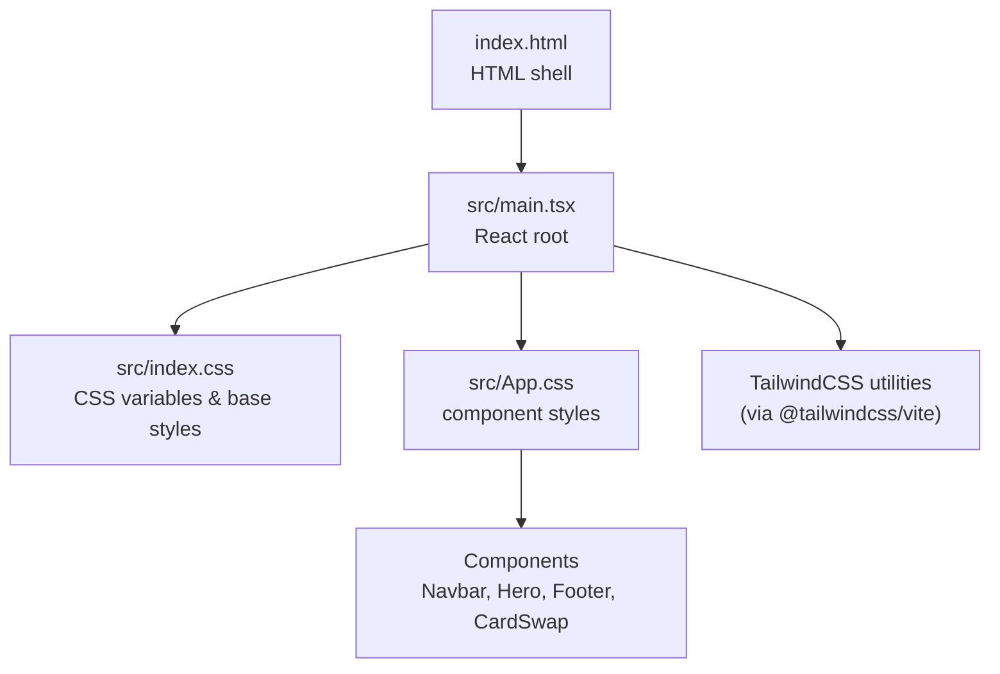
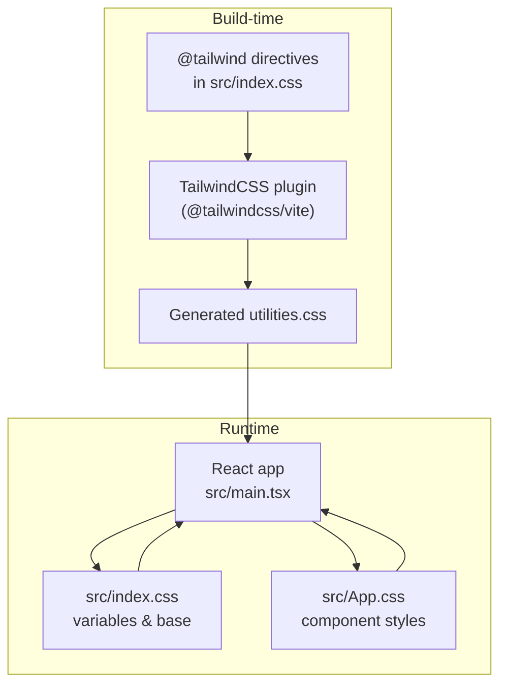
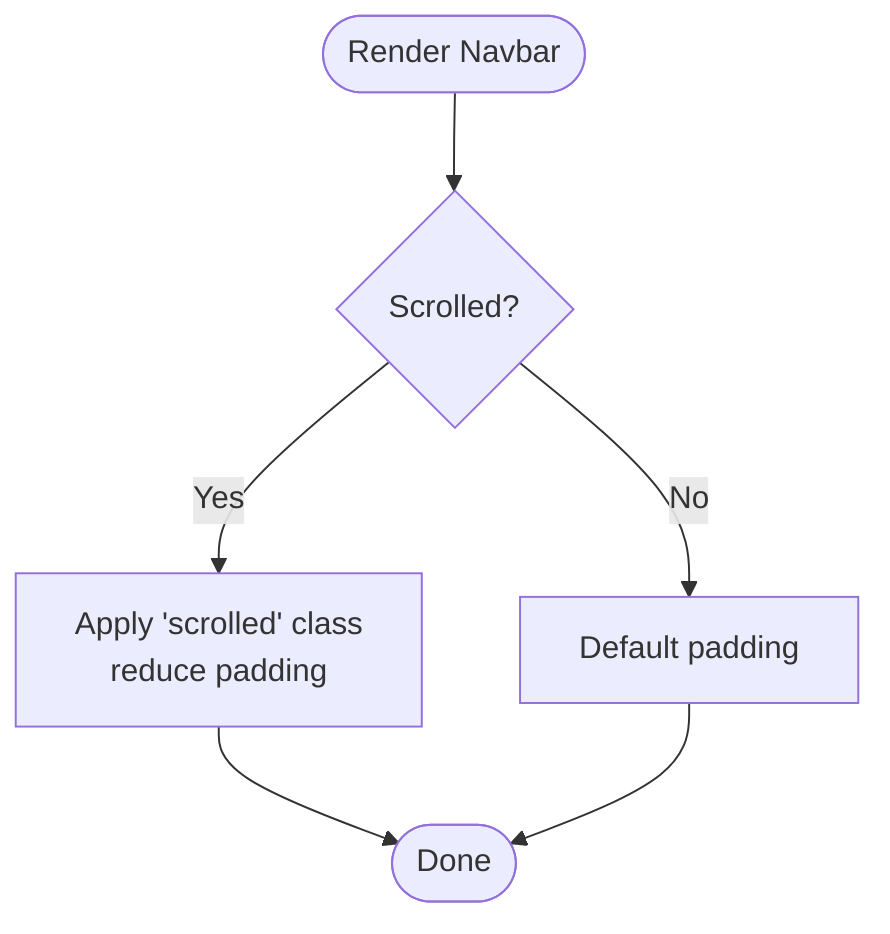
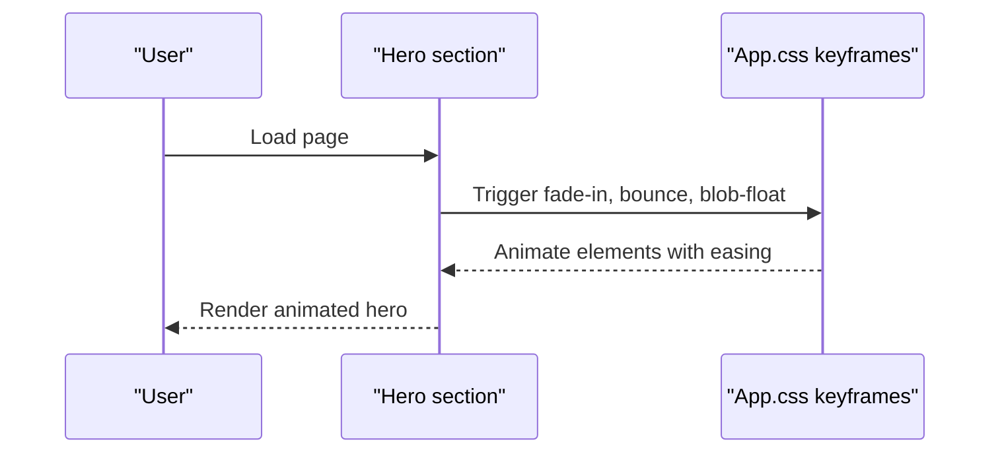
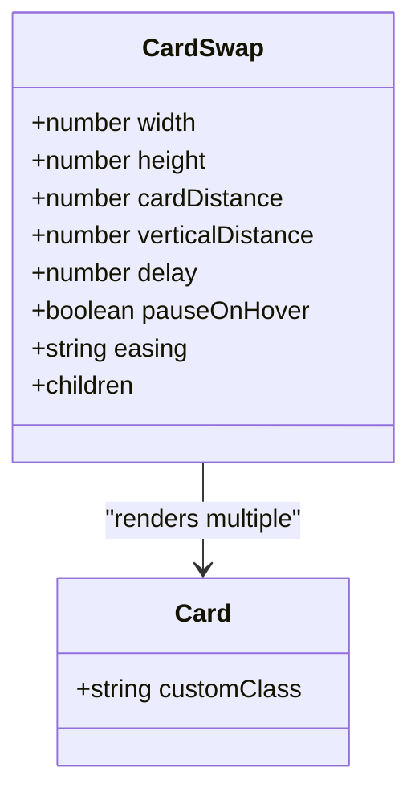
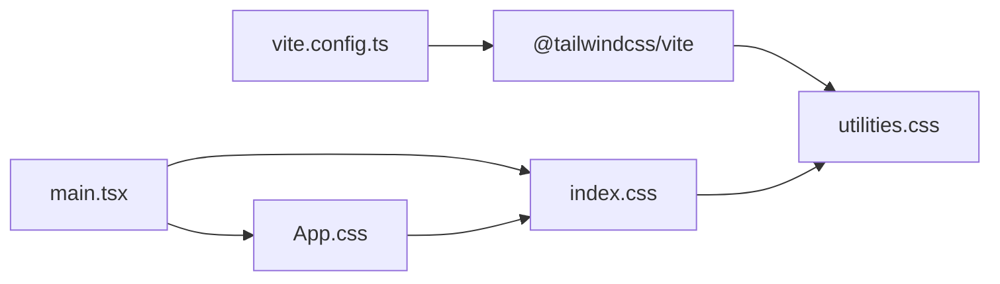

# Styling and Theming

<cite>
**Referenced Files in This Document**
- [index.css](file://src/index.css)
- [App.css](file://src/App.css)
- [main.tsx](file://src/main.tsx)
- [index.html](file://index.html)
- [vite.config.ts](file://vite.config.ts)
- [package.json](file://package.json)
- [Navbar.tsx](file://src/components/Navbar.tsx)
- [Hero.tsx](file://src/components/Hero.tsx)
- [Footer.tsx](file://src/components/Footer.tsx)
- [CardSwap.tsx](file://src/components/CardSwap.tsx)
</cite>

## Table of Contents
1. [Introduction](#introduction)
2. [Project Structure](#project-structure)
3. [Core Components](#core-components)
4. [Architecture Overview](#architecture-overview)
5. [Detailed Component Analysis](#detailed-component-analysis)
6. [Dependency Analysis](#dependency-analysis)
7. [Performance Considerations](#performance-considerations)
8. [Troubleshooting Guide](#troubleshooting-guide)
9. [Conclusion](#conclusion)
10. [Appendices](#appendices)

## Introduction
This document describes the styling and theming system of the portfolio website. It explains the CSS custom properties used for theming, the TailwindCSS integration pattern, dark theme behavior, responsive design strategies, gradient accents, animations, and transition effects. It also provides extension guidelines and performance recommendations for production builds.

## Project Structure
The styling system is organized around a small set of core files:
- Global baseline and theme variables live in the root stylesheet.
- Component-specific styles are grouped in a single stylesheet.
- TailwindCSS is integrated via Vite and the official plugin.
- React components apply utility classes and custom styles together.

**Diagram sources**
- [index.html:1-17](file://index.html#L1-L17)
- [main.tsx:1-12](file://src/main.tsx#L1-L12)
- [index.css:1-87](file://src/index.css#L1-L87)
- [App.css:1-404](file://src/App.css#L1-L404)
- [vite.config.ts:1-9](file://vite.config.ts#L1-L9)

**Section sources**
- [index.html:1-17](file://index.html#L1-L17)
- [main.tsx:1-12](file://src/main.tsx#L1-L12)
- [index.css:1-87](file://src/index.css#L1-L87)
- [App.css:1-404](file://src/App.css#L1-L404)
- [vite.config.ts:1-9](file://vite.config.ts#L1-L9)

## Core Components
- CSS custom properties: Centralized theme tokens in the root stylesheet define colors, gradients, borders, and global typography and layout defaults.
- TailwindCSS integration: Installed via the official Vite plugin; utilities are imported at the top of the root stylesheet and used alongside custom styles.
- Component styles: Modular CSS for each section and component, leveraging custom properties for consistency.
- Animations and transitions: Defined as named keyframes and applied to elements for motion design.

Key design system elements:
- Color scheme: A cohesive dark theme with vibrant accent colors and layered backgrounds.
- Typography: System font stack with Inter, controlled via CSS variables.
- Spacing: Consistent padding and gaps derived from rem units and clamp-based sizing.
- Gradients: Predefined gradient tokens for accent branding.
- Motion: Smooth transitions and keyframe animations for interactive elements.

**Section sources**
- [index.css:3-30](file://src/index.css#L3-L30)
- [index.css:50-64](file://src/index.css#L50-L64)
- [App.css:125-141](file://src/App.css#L125-L141)
- [App.css:152-155](file://src/App.css#L152-L155)

## Architecture Overview
The styling pipeline integrates Tailwind utilities with custom CSS and React components. Tailwind generates utility classes at build time; custom CSS applies theme tokens and component layouts; React components combine Tailwind classes with custom selectors.

**Diagram sources**
- [index.css:1](file://src/index.css#L1)
- [vite.config.ts:3](file://vite.config.ts#L3)
- [main.tsx:3](file://src/main.tsx#L3)

**Section sources**
- [index.css:1](file://src/index.css#L1)
- [vite.config.ts:1-9](file://vite.config.ts#L1-L9)
- [main.tsx:1-12](file://src/main.tsx#L1-L12)

## Detailed Component Analysis

### Theme Variables and Dark Mode
- Root variables define the dark theme palette: primary and secondary backgrounds, card backgrounds, text colors, accent hues, gradients, borders, and glow effects.
- The design system is built exclusively for a dark theme; there is no explicit dark/light toggle or media-query-based theme switching in the current codebase.

Guidelines for extending the theme:
- Add new tokens to the root variable block.
- Reference tokens consistently across components via var().
- Keep semantic names for colors and gradients to simplify future updates.

**Section sources**
- [index.css:3-30](file://src/index.css#L3-L30)

### TailwindCSS Integration Pattern
- Tailwind is included via a directive at the top of the root stylesheet.
- The Vite plugin compiles Tailwind utilities during the build process.
- Components use Tailwind utility classes for layout, spacing, and quick stylistic tweaks, while custom CSS handles complex layouts and animations.

Practical usage examples:
- Layout utilities: responsive grids, flex alignment, spacing.
- Color utilities: text and background colors aligned with theme variables.
- Motion utilities: transforms and transitions where appropriate.

**Section sources**
- [index.css:1](file://src/index.css#L1)
- [vite.config.ts:3](file://vite.config.ts#L3)
- [package.json:18](file://package.json#L18)

### Navigation Bar Styling
- Uses custom CSS for backdrop blur, border, and transitions.
- Applies theme variables for colors and gradients.
- Responsive behavior hides desktop links on smaller screens.

**Diagram sources**
- [Navbar.tsx:22](file://src/components/Navbar.tsx#L22)
- [App.css:2-11](file://src/App.css#L2-L11)

**Section sources**
- [Navbar.tsx:11-54](file://src/components/Navbar.tsx#L11-L54)
- [App.css:2-11](file://src/App.css#L2-L11)

### Hero Section and Animations
- Hero content uses clamp-based typography for scalability.
- Animated floating blobs and fade-in animations enhance motion design.
- Buttons and badges leverage gradient tokens and hover transitions.

**Diagram sources**
- [Hero.tsx:6-79](file://src/components/Hero.tsx#L6-L79)
- [App.css:81-155](file://src/App.css#L81-L155)

**Section sources**
- [Hero.tsx:4-84](file://src/components/Hero.tsx#L4-L84)
- [App.css:81-155](file://src/App.css#L81-L155)

### Footer and Social Links
- Footer uses theme variables for borders, backgrounds, and hover states.
- Social links adopt consistent sizing and transitions.

**Section sources**
- [Footer.tsx:3-30](file://src/components/Footer.tsx#L3-L30)
- [App.css:367-384](file://src/App.css#L367-L384)

### CardSwap Component and GSAP Animations
- CardSwap composes multiple cards with 3D transforms and GSAP-driven timelines.
- Uses theme variables for borders and backgrounds.
- Includes responsive overrides for smaller screens.

**Diagram sources**
- [CardSwap.tsx:50-230](file://src/components/CardSwap.tsx#L50-L230)

**Section sources**
- [CardSwap.tsx:1-230](file://src/components/CardSwap.tsx#L1-L230)
- [Hero.tsx:42-74](file://src/components/Hero.tsx#L42-L74)

## Dependency Analysis
- Build-time dependencies:
  - TailwindCSS plugin compiles utilities.
  - Vite orchestrates the build and plugin pipeline.
- Runtime dependencies:
  - Root stylesheet imports Tailwind utilities and defines theme variables.
  - Components import the root stylesheet and apply custom styles.

**Diagram sources**
- [vite.config.ts:1-9](file://vite.config.ts#L1-L9)
- [main.tsx:3](file://src/main.tsx#L3)
- [index.css:1](file://src/index.css#L1)

**Section sources**
- [vite.config.ts:1-9](file://vite.config.ts#L1-L9)
- [package.json:18](file://package.json#L18)
- [main.tsx:1-12](file://src/main.tsx#L1-L12)
- [index.css:1](file://src/index.css#L1)

## Performance Considerations
- Minimize paint and layout thrash by using transform and opacity for animations.
- Prefer hardware-accelerated properties (transform, opacity) for smoother motion.
- Keep keyframes scoped and reuse where possible to reduce CSS size.
- Use Tailwind utilities for common patterns to avoid duplicating custom CSS.
- Ensure fonts are optimized and preconnected for fast loading.
- Leverage Vite’s production bundling and minification for CSS delivery.

[No sources needed since this section provides general guidance]

## Troubleshooting Guide
- If gradients appear incorrect, verify the gradient tokens in the root variables and ensure custom property usage matches.
- If hover states look inconsistent, confirm that hover variants reference the same theme variables.
- If animations stutter, prefer transform/opacity and avoid animating layout-affecting properties.
- If utilities conflict with custom styles, scope custom styles carefully and avoid overusing !important.

**Section sources**
- [index.css:3-30](file://src/index.css#L3-L30)
- [App.css:125-141](file://src/App.css#L125-L141)

## Conclusion
The portfolio employs a clean, modular styling system centered on CSS custom properties for theming, Tailwind utilities for rapid layout and micro-styling, and targeted custom CSS for complex components and animations. The current design is optimized for a dark theme with vibrant accents and smooth motion. Extending the system involves adding tokens, reusing them consistently, and keeping animations performant.

[No sources needed since this section summarizes without analyzing specific files]

## Appendices

### Responsive Design Patterns
- Mobile-first approach: Base styles target small screens; media queries add enhancements for larger viewports.
- Breakpoint strategy: A single breakpoint governs major layout shifts for navigation, hero, and grid components.
- Typography scaling: clamp() ensures readable text across viewport widths.

**Section sources**
- [App.css:392-403](file://src/App.css#L392-L403)
- [index.css:20-22](file://src/index.css#L20-L22)

### Gradient Accent System
- Predefined gradient tokens are used for branding and interactive elements.
- Components reference gradients via custom properties for consistency.

**Section sources**
- [index.css:14-16](file://src/index.css#L14-L16)
- [App.css:125-132](file://src/App.css#L125-L132)

### Animation Timing Functions and Transitions
- Named keyframes encapsulate motion behaviors (fade-in, bounce, blob-float, pulse-dot).
- Transition durations and easing are standardized across interactive elements.

**Section sources**
- [App.css:81-155](file://src/App.css#L81-L155)

### Guidelines for Extending the Design System
- Add new tokens to the root variable block.
- Reference tokens via var() in both custom CSS and inline styles within components.
- Prefer Tailwind utilities for common spacing and layout tasks.
- Encapsulate reusable motion behaviors as keyframes and apply consistently.
- Maintain semantic naming for colors and gradients to simplify future maintenance.

**Section sources**
- [index.css:3-30](file://src/index.css#L3-L30)
- [App.css:125-141](file://src/App.css#L125-L141)